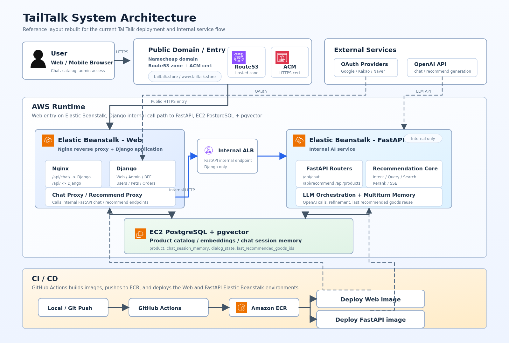
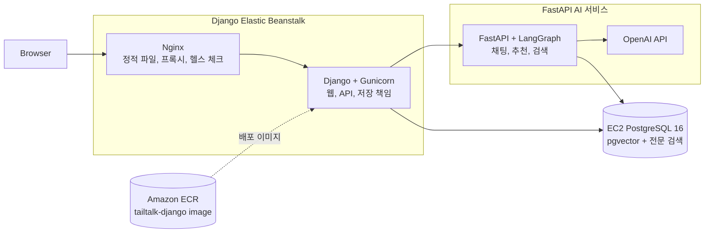
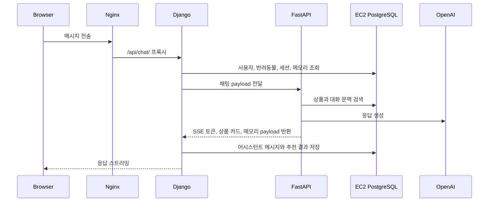
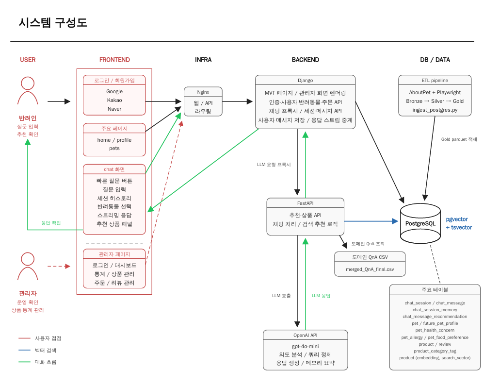
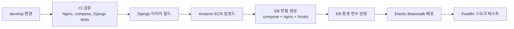

<p align="center">
  
</p>

<h1 align="center">TailTalk WEB</h1>

<p align="center">
  <strong>반려동물 프로필과 대화 메모리를 이해하는 AI 커머스 웹 서비스</strong>
  <br />
  Django는 사용자 경험과 데이터 저장을 책임지고, FastAPI는 추천 응답을 생성합니다.
</p>

<p align="center">
  <a href="#system-design">System Design</a>
  ·
  <a href="#deployment">Deployment</a>
  ·
  <a href="#service-contract">Service Contract</a>
  ·
  <a href="#tech-stack">Tech Stack</a>
  ·
  <a href="#local-preview">Local Preview</a>
</p>

<p align="center">
  
  
  
  
  
</p>

---

## 📌 What This Repository Owns

TailTalk은 웹 서비스와 AI 서비스가 분리된 구조입니다. 이 저장소는 사용자가 접속하는 **Django WEB 서비스와 AWS Elastic Beanstalk 배포 단위**를 관리합니다.

| 소유 범위 | 이 저장소에서 관리하는 것 | 관련 위치 |
|---|---|---|
| 웹 게이트웨이 | Nginx, Django, Gunicorn 기반 웹 진입점 | `deploy/eb/test-django/`, `services/django/` |
| 사용자 경험 | 회원, 반려동물, 채팅, 상품 탐색, 주문, 판매자 화면 | `services/django/users`, `pets`, `chat`, `orders` |
| AI 연결부 | Django에서 FastAPI로 전달하는 채팅/추천 프록시 | `/api/chat/`, `/api/recommend/` |
| 데이터 저장 | 사용자, 반려동물, 주문, 채팅 세션, 메시지, 추천 결과 저장 | Django 모델, EC2 PostgreSQL |
| 배포 단위 | Django Docker 이미지, ECR 업로드, EB 배포 번들 | `.github/workflows/ci-cd.yml` |

### 🧭 Core Responsibilities

| Django WEB 책임 | FastAPI AI 책임 |
|---|---|
| 사용자 인증과 세션 권한 확인 | LangGraph 기반 의도 분석과 응답 생성 |
| 반려동물/상품/주문/위시리스트 화면 | 상품 검색, rerank, 추천 카드 구성 |
| 채팅 세션, 메시지, 추천 결과 저장 | OpenAI API 호출과 AI 응답 스트리밍 |
| EB 배포 번들, Nginx, Gunicorn 운영 | 별도 AI 서비스 배포 흐름에서 운영 |

## 🏗️ System Design

<p align="center">
  
</p>

<details>
<summary><strong>Mermaid로 보는 핵심 배포 구조</strong></summary>



</details>

핵심 구조는 아래처럼 단순합니다.

```text
Browser
  -> Nginx
  -> Django
  -> EC2 PostgreSQL
  -> AI 작업이 필요할 때 FastAPI
```

채팅 세션, 메시지, 추천 결과, 사용자, 반려동물, 상품, 주문 데이터의 기준은 Django입니다. FastAPI는 AI 결과를 계산하고, 최종 사용자 상태는 Django가 저장합니다.

## 💬 One Chat Turn



## 🛒 Product Surface

<details>
<summary><strong>서비스 기능 흐름 구성도</strong></summary>

<p align="center">
  
</p>

</details>

| 화면/기능 | 경로 | 담당 |
|---|---|---|
| 홈, 로그인, 프로필 | `/`, `/login/`, `/profile/` | Django |
| 반려동물 등록/수정 | `/pets/`, `/pets/add/` | Django |
| 채팅 경험 | `/chat/`, `/api/chat/` | Django -> FastAPI |
| 상품 탐색 | `/products/`, `/catalog/` | Django |
| 주문/결제 | `/checkout/`, `/orders/` | Django |
| 판매자 대시보드 | `/vendor/dashboard/` | Django |
| 관리자 | `/admin/` | Django |
| 헬스 체크 | `/health/` | Nginx |

## 🗄️ Data That Matters

| 도메인 | 주요 테이블 |
|---|---|
| 대화 | `chat_session`, `chat_message`, `chat_session_memory` |
| 추천 결과 | `chat_message_recommendation` |
| 상품/검색 | `products_*`, pgvector embedding, 전문 검색 데이터 |
| 커머스 | `orders_*`, 장바구니, 위시리스트, 상품 상호작용 |
| 사용자 문맥 | `users_*`, `pets_*`, 소셜 계정 데이터 |

## 🚀 Deployment

이 저장소는 Django WEB 서비스를 배포합니다.



| AWS 리소스 | 현재 값 |
|---|---|
| 리전 | `ap-northeast-2` |
| ECR 저장소 | `027099020675.dkr.ecr.ap-northeast-2.amazonaws.com/test-tailtalk-django` |
| EB 애플리케이션 | `test-tailtalk-django` |
| EB 환경 | `test-tailtalk-django-env` |
| 헬스 체크 경로 | `/health/` |

<details>
<summary><strong>PR과 push에서 실행되는 작업</strong></summary>

| 트리거 | 동작 |
|---|---|
| `develop` 대상 Pull Request | Nginx 설정 검증, EB compose 번들 검증, Django 이미지 빌드, Django 테스트, 배포 번들 스모크 테스트 |
| `develop` push | EB 환경 변수 반영, ECR 이미지 빌드/업로드, EB 번들 생성, Elastic Beanstalk 배포, `/health/` 스모크 테스트 |

Workflow 파일: [`.github/workflows/ci-cd.yml`](.github/workflows/ci-cd.yml)

</details>

## 🔐 Service Contract

### ⚙️ Django EB Environment

| 구분 | 변수 |
|---|---|
| 데이터베이스 | `POSTGRES_DB`, `POSTGRES_USER`, `POSTGRES_PASSWORD`, `POSTGRES_HOST`, `POSTGRES_PORT` |
| Django | `DJANGO_SECRET_KEY`, `DJANGO_ALLOWED_HOSTS`, `APP_BASE_URL` |
| FastAPI 연결 | `FASTAPI_INTERNAL_CHAT_URL`, `FASTAPI_INTERNAL_RECOMMEND_URL`, `INTERNAL_SERVICE_TOKEN` |
| 보안 | `CORS_ALLOWED_ORIGINS`, `DJANGO_SECURE_SSL_REDIRECT`, `DJANGO_SESSION_COOKIE_SECURE`, `DJANGO_CSRF_COOKIE_SECURE`, `DJANGO_CSRF_TRUSTED_ORIGINS` |
| 외부 연동 | `GOOGLE_CLIENT_ID`, `NAVER_CLIENT_ID`, `KAKAO_CLIENT_ID`, `JUSO_CONFIRM_KEY` |
| 정적/미디어 | `AWS_S3_BUCKET_NAME`, `AWS_S3_REGION_NAME`, `AWS_S3_CUSTOM_DOMAIN`, `AWS_S3_ENDPOINT_URL` |
| 스트리밍 | `FASTAPI_STREAM_CONNECT_TIMEOUT`, `FASTAPI_STREAM_READ_TIMEOUT`, `FASTAPI_STREAM_WRITE_TIMEOUT`, `FASTAPI_STREAM_POOL_TIMEOUT` |

### 🔗 FastAPI Submodule

`services/fastapi`는 AI 저장소를 가리키는 Git submodule입니다.

| 항목 | 값 |
|---|---|
| 경로 | `services/fastapi` |
| 저장소 | `https://github.com/skn-ai22-251029/SKN22-Final-2Team-AI` |
| 추적 브랜치 | `develop` |

FastAPI 변경 사항은 [`sync-fastapi-submodule.yml`](.github/workflows/sync-fastapi-submodule.yml)을 통해 서브모듈 포인터 갱신 PR로 동기화됩니다.

## 🗺️ Code Map

```text
.
|-- deploy/
|   |-- eb/test-django/       EB compose, Nginx 설정, platform hooks
|   `-- local/                로컬 통합 검증 스택
|-- services/
|   |-- django/               Django WEB 서비스 본체
|   `-- fastapi/              AI 서비스 submodule
|-- .github/
|   |-- workflows/            CI/CD와 submodule 동기화 자동화
|   `-- assets/readme/        README 이미지 자료
|-- sql/                      스키마와 SQL 자료
|-- requirements.txt          Django 배포 이미지 의존성
`-- .env.example              공통 환경 변수 예시
```

### 🧩 Django Detail Map

```text
services/django/
|-- Dockerfile                         # Django WEB 서비스 Docker 이미지 정의
|-- .dockerignore                      # Docker 빌드 컨텍스트 제외 규칙
|-- .env.example                       # Django 서비스 환경 변수 예시
|-- manage.py                          # Django 관리 CLI
|-- requirements.txt                   # Django 서비스 Python 의존성
|
|-- config/                            # Django 프로젝트 전역 설정
|   |-- settings.py                    # DB, 앱, 미들웨어, 정적 파일, 보안 설정
|   |-- test_settings.py               # 테스트 실행용 설정 오버라이드
|   |-- urls.py                        # 프로젝트 루트 URL 라우터
|   |-- wsgi.py                        # Gunicorn/WSGI 엔트리포인트
|   |-- context_processors.py          # 템플릿 공통 컨텍스트 주입
|   `-- __init__.py                    # Python 패키지 표시
|
|-- chat/                              # 채팅 세션, 메시지, AI 스트리밍 연결 앱
|   |-- __init__.py                    # Python 패키지 표시
|   |-- models.py                      # ChatSession, ChatMessage, 추천 결과, 메모리 모델
|   |-- urls.py                        # 채팅 API URL
|   |-- page_urls.py                   # 채팅 화면 URL
|   |-- api_views.py                   # 레거시/호환용 API view
|   |-- page_views.py                  # 레거시/호환용 페이지 view
|   |-- apps.py                        # Django app 설정
|   |-- tests.py                       # 채팅 앱 테스트
|   |-- api/
|   |   |-- serializers.py             # 채팅 API 요청/응답 직렬화
|   |   |-- views.py                   # 채팅 REST API view
|   |   `-- __init__.py
|   |-- clients/
|   |   |-- fastapi_chat_client.py     # FastAPI 채팅 스트리밍 호출 클라이언트
|   |   `-- __init__.py
|   |-- dto/
|   |   |-- chat_payload.py            # FastAPI로 전달할 채팅 payload DTO
|   |   |-- chat_response.py           # FastAPI 응답 DTO
|   |   `-- __init__.py
|   |-- pages/
|   |   |-- context_builders.py        # 채팅 화면 렌더링용 컨텍스트 구성
|   |   |-- views.py                   # 채팅 페이지 view
|   |   `-- __init__.py
|   |-- policies/
|   |   |-- chat_access_policy.py      # 채팅 세션 접근 권한 정책
|   |   `-- __init__.py
|   |-- selectors/
|   |   |-- chat_selector.py           # 채팅 세션/메시지 조회 쿼리
|   |   |-- pet_selector.py            # 채팅 문맥용 반려동물 조회
|   |   `-- __init__.py
|   |-- services/
|   |   |-- chat_memory_service.py     # 멀티턴 메모리 저장/갱신
|   |   |-- chat_message_service.py    # 사용자/AI 메시지 저장 처리
|   |   |-- chat_session_service.py    # 채팅 세션 생성/조회/상태 관리
|   |   |-- chat_stream_service.py     # FastAPI SSE 스트림 중계와 저장 orchestration
|   |   `-- __init__.py
|   `-- migrations/                    # 채팅 앱 DB 마이그레이션
|
|-- recommendations/                   # 추천 API 프록시 앱
|   |-- __init__.py                    # Python 패키지 표시
|   |-- urls.py                        # 추천 API URL
|   |-- apps.py                        # Django app 설정
|   |-- tests.py                       # 추천 앱 테스트
|   |-- api/
|   |   |-- views.py                   # 추천 요청 API view
|   |   `-- __init__.py
|   `-- clients/
|       |-- fastapi_recommend_client.py # FastAPI 추천 엔드포인트 호출 클라이언트
|       `-- __init__.py
|
|-- users/                             # 사용자, 인증, OAuth, 판매자 화면 앱
|   |-- __init__.py                    # Python 패키지 표시
|   |-- models.py                      # 사용자 프로필, 소셜 계정, 선호/사용 상품 모델
|   |-- urls.py                        # 사용자 API URL
|   |-- auth_urls.py                   # 로그인/회원가입/OAuth URL
|   |-- page_urls.py                   # 사용자 페이지 URL
|   |-- page_views.py                  # 레거시/호환용 사용자 페이지 view
|   |-- views.py                       # 레거시/호환용 사용자 view
|   |-- oauth.py                       # OAuth 공통 처리
|   |-- social_auth.py                 # 소셜 로그인 연동 로직
|   |-- social_pipeline.py             # 소셜 로그인 후처리 파이프라인
|   |-- nickname_utils.py              # 닉네임 생성/검증 유틸
|   |-- onboarding.py                  # 가입/초기 설정 흐름
|   |-- quick_purchase.py              # 빠른 구매 설정 처리
|   |-- apps.py                        # Django app 설정
|   |-- tests.py                       # 사용자 앱 테스트
|   |-- api/
|   |   |-- serializers.py             # 사용자 API serializer
|   |   |-- views_auth.py              # 인증 API view
|   |   |-- views_profile.py           # 프로필 API view
|   |   `-- __init__.py
|   |-- pages/
|   |   |-- views_auth.py              # 로그인/회원가입 페이지 view
|   |   |-- views_profile.py           # 마이페이지/프로필 페이지 view
|   |   |-- views_vendor.py            # 판매자 대시보드 페이지 view
|   |   `-- __init__.py
|   |-- selectors/
|   |   |-- user_selector.py           # 사용자 조회 쿼리
|   |   `-- __init__.py
|   |-- services/
|   |   |-- auth_service.py            # 인증 비즈니스 로직
|   |   `-- __init__.py
|   `-- migrations/                    # 사용자 앱 DB 마이그레이션
|
|-- pets/                              # 반려동물 프로필과 온보딩 앱
|   |-- __init__.py                    # Python 패키지 표시
|   |-- models.py                      # 반려동물 프로필 모델
|   |-- urls.py                        # 반려동물 API URL
|   |-- page_urls.py                   # 반려동물 페이지 URL
|   |-- page_views.py                  # 레거시/호환용 페이지 view
|   |-- views.py                       # 레거시/호환용 view
|   |-- allergies.py                   # 알러지 선택지/보조 로직
|   |-- breeds.py                      # 품종 선택지/메타데이터
|   |-- future_profile.py              # 예비 반려동물 프로필 로직
|   |-- apps.py                        # Django app 설정
|   |-- tests.py                       # 반려동물 앱 테스트
|   |-- api/
|   |   |-- serializers.py             # 반려동물 API serializer
|   |   |-- views.py                   # 반려동물 REST API view
|   |   `-- __init__.py
|   |-- pages/
|   |   |-- core.py                    # 반려동물 페이지 공통 헬퍼
|   |   |-- views_manage.py            # 반려동물 목록/수정/삭제 페이지 view
|   |   |-- views_onboarding.py        # 반려동물 등록 단계 페이지 view
|   |   `-- __init__.py
|   `-- migrations/                    # 반려동물 앱 DB 마이그레이션
|
|-- products/                          # 상품, 임베딩, 검색 메타데이터 앱
|   |-- models.py                      # 상품, 임베딩, 가이드, 리뷰/속성 모델
|   |-- catalog_menu.py                # 카탈로그 메뉴/카테고리 구성
|   |-- review_metrics.py              # 리뷰 지표 계산 보조 로직
|   |-- apps.py                        # Django app 설정
|   |-- __init__.py
|   `-- migrations/                    # 상품 앱 DB 마이그레이션
|
|-- orders/                            # 장바구니, 주문, 위시리스트, 판매자 커머스 앱
|   |-- __init__.py                    # Python 패키지 표시
|   |-- models.py                      # 주문, 장바구니, 위시리스트, 사용자 상호작용 모델
|   |-- urls.py                        # 주문/커머스 API URL
|   |-- page_urls.py                   # 커머스 페이지 URL
|   |-- page_views.py                  # 레거시/호환용 페이지 view
|   |-- views.py                       # 레거시/호환용 view
|   |-- apps.py                        # Django app 설정
|   |-- tests.py                       # 주문 앱 테스트
|   |-- api/
|   |   |-- core.py                    # 주문 API 공통 헬퍼
|   |   |-- serializers.py             # 주문/장바구니/위시리스트 serializer
|   |   |-- views_cart.py              # 장바구니 API view
|   |   |-- views_order.py             # 주문/결제 API view
|   |   |-- views_wishlist.py          # 위시리스트 API view
|   |   `-- __init__.py
|   |-- pages/
|   |   |-- core.py                    # 커머스 페이지 공통 헬퍼
|   |   |-- detail_images.py           # 상품 상세 이미지 구성
|   |   |-- views_catalog.py           # 상품 목록/상세 페이지 view
|   |   |-- views_order_pages.py       # 주문/결제/완료 페이지 view
|   |   `-- __init__.py
|   |-- management/
|   |   |-- __init__.py                # management 패키지 표시
|   |   `-- commands/
|   |       |-- __init__.py            # management command 패키지 표시
|   `-- migrations/                    # 주문 앱 DB 마이그레이션
|
|-- templates/                         # Django 서버 렌더링 HTML
|   |-- base.html                      # 공통 레이아웃
|   |-- chat/index.html                # 채팅 화면
|   |-- pets/
|   |   |-- add_future.html            # 예비 반려동물 등록 화면
|   |   |-- add_step1.html             # 반려동물 등록 1단계
|   |   |-- add_step2.html             # 반려동물 등록 2단계
|   |   |-- add_step3.html             # 반려동물 등록 3단계
|   |   `-- list.html                  # 반려동물 목록 화면
|   |-- orders/
|   |   |-- catalog.html               # 상품 카탈로그 화면
|   |   |-- checkout.html              # 주문/결제 화면
|   |   |-- complete.html              # 주문 완료 화면
|   |   |-- list.html                  # 주문 목록 화면
|   |   |-- product_detail.html        # 상품 상세 화면
|   |   `-- products.html              # 상품 목록 화면
|   `-- users/
|       |-- login.html                 # 로그인 화면
|       |-- profile.html               # 사용자 프로필 화면
|       |-- signup.html                # 회원가입 화면
|       |-- vendor_analytics.html      # 판매자 분석 화면
|       |-- vendor_base.html           # 판매자 화면 공통 레이아웃
|       |-- vendor_dashboard.html      # 판매자 대시보드
|       |-- vendor_login.html          # 판매자 로그인 화면
|       |-- vendor_orders.html         # 판매자 주문 관리 화면
|       |-- vendor_product_create.html # 판매자 상품 등록 화면
|       |-- vendor_product_detail.html # 판매자 상품 상세/수정 화면
|       |-- vendor_products.html       # 판매자 상품 목록 화면
|       `-- vendor_reviews.html        # 판매자 리뷰 관리 화면
|
`-- static/                            # 정적 파일 소스
    |-- css/main.css                   # 전역 스타일
    |-- js/main.js                     # 전역 JavaScript
    `-- images/social/                 # 소셜 로그인 버튼 이미지
        |-- kakao_login_wide.png       # 카카오 로그인 와이드 버튼
        |-- naver_login_icon.png       # 네이버 로그인 아이콘 버튼
        `-- naver_login_wide.png       # 네이버 로그인 와이드 버튼
```

## 🛠️ Tech Stack

<table align="center" cellpadding="12" cellspacing="0" bgcolor="#0d1117">
  <tr>
    <td align="center" width="33%" bgcolor="#111820">
      <strong>Frontend</strong>
      <br /><br />
      
      <br />
      
      <br />
      
    </td>
    <td align="center" width="33%" bgcolor="#111820">
      <strong>Backend</strong>
      <br /><br />
      
      <br />
      
      <br />
      
      <br />
      
    </td>
    <td align="center" width="33%" bgcolor="#111820">
      <strong>AI / LLM</strong>
      <br /><br />
      
      <br />
      
      <br />
      
      <br />
      
    </td>
  </tr>
  <tr>
    <td align="center" width="33%" bgcolor="#111820">
      <strong>Data / Search</strong>
      <br /><br />
      
      <br />
      
      <br />
      
    </td>
    <td align="center" width="33%" bgcolor="#111820">
      <strong>Runtime</strong>
      <br /><br />
      
      <br />
      
      <br />
      
      <br />
      
    </td>
    <td align="center" width="33%" bgcolor="#111820">
      <strong>Infra / DevOps</strong>
      <br /><br />
      
      <br />
      
      <br />
      
      <br />
      
    </td>
  </tr>
</table>

## 💻 Local Preview

로컬 실행은 배포 전 통합 동작 확인용입니다.

```bash
git clone --recurse-submodules https://github.com/skn-ai22-251029/SKN22-Final-2Team-WEB.git
cd SKN22-Final-2Team-WEB

cp deploy/local/.env.example deploy/local/.env
# deploy/local/.env에서 POSTGRES_PASSWORD, OPENAI_API_KEY 등을 설정

docker compose -f deploy/local/docker-compose.yml up -d --build
```

| 서비스 | URL |
|---|---|
| 웹 | `http://localhost` |
| Django 직접 접속 | `http://localhost:8000` |
| FastAPI 직접 접속 | `http://localhost:8001` |
| PostgreSQL | `localhost:5432` |

AI 응답에는 `OPENAI_API_KEY`가 필요합니다. 추천 결과를 정상적으로 확인하려면 로컬 PostgreSQL에 상품/품종 데이터가 적재되어 있어야 합니다.

## 📄 License

MIT 라이선스 하에 배포됩니다. 자세한 내용은 [LICENSE](LICENSE)를 참고하세요.

<p align="center" style="font-size: 24px;">
  <strong>SKN22 Final Project · Team 2</strong>
</p>

<!-- 팀원 사진은 .github/assets/readme/team/ 경로에 아래 파일명으로 추가하면 README에 표시됩니다. -->
<table align="center" cellpadding="8" cellspacing="0">
  <tr>
    <td align="center" width="25%">
      
    </td>
    <td align="center" width="25%">
      
    </td>
    <td align="center" width="25%">
      
    </td>
    <td align="center" width="25%">
      
    </td>
  </tr>
  <tr>
    <td align="center"><strong>이준서</strong></td>
    <td align="center"><strong>황하령</strong></td>
    <td align="center"><strong>김희준</strong></td>
    <td align="center"><strong>이신재</strong></td>
  </tr>
  <tr>
    <td align="center" bgcolor="#4F46E5"><strong>PM / AI</strong></td>
    <td align="center" bgcolor="#4F46E5"><strong>Frontend / Backend</strong></td>
    <td align="center" bgcolor="#4F46E5"><strong>Backend / Infra / DevOps</strong></td>
    <td align="center" bgcolor="#4F46E5"><strong>Data / QA</strong></td>
  </tr>
  <tr>
    <td valign="top">
      <ul>
        <li>AI 추천 로직 및 LangGraph 파이프라인 고도화 담당</li>
        <li>의도 분류, 상태 관리, clarity 분기 로직 개선 담당</li>
        <li>PostgreSQL/pgvector 기반 하이브리드 검색 및 RRF 랭킹 구현 담당</li>
        <li>추천 엔진 정교화</li>
      </ul>
    </td>
    <td valign="top">
      <ul>
        <li>서비스 프론트엔드 및 UX 설계 담당</li>
        <li>채팅, 프로필, 반려동물, 카탈로그, 주문 화면 구현 담당</li>
        <li>추천형 채팅 UX 및 커머스 사용자 플로우 개선 담당</li>
        <li>관리자 화면 MVP 및 운영 UX 구성 담당</li>
      </ul>
    </td>
    <td valign="top">
      <ul>
        <li>백엔드 아키텍처 및 Django/FastAPI 통합 담당</li>
        <li>OAuth 인증 기능 구현</li>
        <li>데이터 모델링 및 PostgreSQL/pgvector 스키마 관리</li>
        <li>AWS 인프라, Docker 컨테이너, CI/CD 구축 및 운영 안정화</li>
      </ul>
    </td>
    <td valign="top">
      <ul>
        <li>Playwright 크롤링, 파이프라인 구축</li>
        <li>프로젝트 기반 시장 조사</li>
        <li>LLM 활용 데이터 정제</li>
        <li>LangGraph 파이프라인 점검</li>
        <li>하네스 응답 품질 검증 담당</li>
      </ul>
    </td>
  </tr>
  <tr>
    <td align="center">
      <a href="https://github.com/Leejunseo84">
        
      </a>
    </td>
    <td align="center">
      <a href="https://github.com/harry1749">
        
      </a>
    </td>
    <td align="center">
      <a href="https://github.com/heejoon-91">
        
      </a>
    </td>
    <td align="center">
      <a href="https://github.com/Codingcooker74">
        
      </a>
    </td>
  </tr>
</table>
