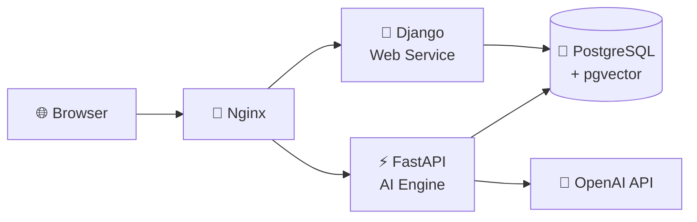

# 🐾 TailTalk

<div align="center">

**반려동물 맞춤 AI 챗봇 - 지능적인 상품 추천과 상담 서비스**

[](https://opensource.org/licenses/MIT)
[](https://www.python.org/downloads/)
[](https://www.djangoproject.com/)
[](https://fastapi.tiangolo.com/)
[](https://www.postgresql.org/)
[](https://www.docker.com/)

[🚀 데모 보기](#-데모--스크린샷) • [📚 문서](docs/) • [🐛 이슈](https://github.com/skn-ai22-251029/SKN22-Final-2Team-WEB/issues) • [💬 토론](https://github.com/skn-ai22-251029/SKN22-Final-2Team-WEB/discussions)


*강아지와 고양이를 위한 AI 파워드 챗봇. 자연어로 물어보세요!*

</div>

---

## ✨ 기능

<div align="center">

| 🐶 **개인화 추천** | 💬 **멀티턴 채팅** | 🔍 **실시간 검색** | 📱 **웹 인터페이스** |
|:---:|:---:|:---:|:---:|
| 반려동물 프로필 기반<br/>맞춤 상품 추천 | 대화 맥락 기억하는<br/>지능적 응답 | 어바웃펫 상품 DB<br/>실시간 검색 | 직관적인 ChatGPT<br/>스타일 UI |

</div>

### 🚀 주요 기능

- **🤖 AI 기반 추천**: LangGraph + OpenAI GPT로 스마트한 상품 추천
- **💾 세션 관리**: 채팅 기록과 추천 결과 자동 저장
- **🔄 실시간 동기화**: Django ↔ FastAPI 간 seamless 통합
- **🛡️ 보안 우선**: PostgreSQL + pgvector로 안전한 데이터 처리
- **⚡ 고성능**: Docker 기반 마이크로서비스 아키텍처

---

## 🏗️ 아키텍처



**시스템 구성 요소:**
- **Django**: 웹 인터페이스, 인증, 데이터 관리
- **FastAPI**: LangGraph 기반 AI 추천 파이프라인
- **PostgreSQL**: 관계형 + 벡터 데이터베이스 (pgvector)
- **Nginx**: 로드 밸런싱 및 정적 파일 서빙

---

## 🛠️ 기술 스택

<div align="center">

**Frontend** • Django Templates • Tailwind CSS • Vanilla JS
**Backend** • Django • FastAPI • LangGraph
**Database** • PostgreSQL 16 • pgvector • Full-text Search
**AI/ML** • OpenAI API • Vector Search
**Infra** • Docker Compose • Nginx • AWS EC2/EB

</div>

---

## 🚀 빠른 시작

### 1. Clone & Setup

```bash
git clone https://github.com/skn-ai22-251029/SKN22-Final-2Team-WEB.git
cd SKN22-Final-2Team-WEB
git submodule update --init --recursive
```

### 2. Environment

```bash
cd infra
cp .env.example .env
# Edit .env with your keys
```

**Required env vars:**
- `OPENAI_API_KEY` - OpenAI API 키
- `POSTGRES_PASSWORD` - 데이터베이스 비밀번호
- `DJANGO_SECRET_KEY` - Django 시크릿 키

### 3. Launch

```bash
docker compose up -d --build
```

**🎉 Done!** Visit [http://localhost](http://localhost)

---

## 📖 사용법

### 채팅 시작하기

1. **반려동물 프로필 등록** - 강아지/고양이 정보 입력
2. **자연어 질문** - "우리 강아지에게 맞는 장난감 추천해줘"
3. **AI 추천 받기** - 실시간 상품 검색 및 추천
4. **결과 확인** - 우측 패널에서 상품 카드 보기

### API 사용법

```python
# FastAPI 추천 엔드포인트
POST /api/recommend
{
  "message": "고양이 사료 추천",
  "pet_profile": {...}
}
```

---

## 🖼️ 데모 & 스크린샷

- **크롤링 시각화**: [docs/data/crawling_visual.html](docs/data/crawling_visual.html)
- **시스템 아키텍처**: 위 다이어그램 참고
- **실제 UI 스크린샷**: 추후 추가 예정

---

## 🔧 문제 해결

### Docker Issues
```bash
# Clean restart
docker compose down -v
docker compose up -d --build
```

### API Key Problems
- OpenAI API 키가 유효한지 확인
- `.env` 파일이 올바르게 로드되는지 검증

### Database Connection
- PostgreSQL 컨테이너 로그 확인: `docker compose logs postgres`
- SSH 터널 가이드: [docs/infra/09_dbeaver_rds_reconnect_runbook.md](docs/infra/09_dbeaver_rds_reconnect_runbook.md)

---

## 📈 로드맵

- ✅ **v1.0** - 프로토타입 챗봇
- 🔄 **v1.1** - 사용자 인증 시스템
- 🔄 **v1.2** - 모바일 앱 출시
- 🔄 **v2.0** - 멀티모달 AI 통합

---

## 🤝 기여하기

Contributions welcome! 🎉

1. Fork the repo
2. Create feature branch: `git checkout -b feature/amazing-feature`
3. Commit changes: `git commit -m 'Add amazing feature'`
4. Push: `git push origin feature/amazing-feature`
5. Open PR

**Development setup:**
```bash
# Local dev mode
docker compose up -d postgres
cd services/django && python manage.py runserver
cd services/fastapi && python main.py
```

---

## 👥 팀

**SKN22 Final Project Team 2**

- **Lead Developer**: [Leejunseo84](https://github.com/Leejunseo84)
- **Repository**: [skn-ai22-251029/SKN22-Final-2Team-WEB](https://github.com/skn-ai22-251029/SKN22-Final-2Team-WEB)

---

## 📄 라이선스

MIT 라이선스 하에 배포됩니다.

---

<div align="center">

**Made with ❤️ for pet lovers worldwide**

[🐱 GitHub](https://github.com/skn-ai22-251029/SKN22-Final-2Team-WEB) • [🐶 Issues](https://github.com/skn-ai22-251029/SKN22-Final-2Team-WEB/issues) • [🐕 Discussions](https://github.com/skn-ai22-251029/SKN22-Final-2Team-WEB/discussions)

</div>
- `/api/products/` -> FastAPI
- `/api/`, `/admin/`, `/` -> Django

즉, 채팅은 FastAPI 직통이 아니라 `Django -> FastAPI` 2단 구조입니다.

## 주요 기술 스택

| 영역 | 기술 |
|------|------|
| Frontend | Django Template, Tailwind CSS, Vanilla JS |
| Backend | Django, FastAPI |
| AI | LangGraph, OpenAI GPT 계열 모델, PostgreSQL Hybrid Search |
| Database | PostgreSQL 16, pgvector, Full-text Search |
| Infra | Docker Compose, Nginx, AWS EC2 / Elastic Beanstalk, GitHub Actions |

## 저장 구조

채팅 관련 source of truth는 Django DB입니다.

- `chat_session`
  - 사용자별 채팅 세션
- `chat_message`
  - 사용자/어시스턴트 메시지 원문
- `chat_message_recommendation`
  - 특정 assistant 메시지에 연결된 추천 상품
- `chat_session_memory`
  - 멀티턴을 위한 구조화 상태와 요약 메모리

FastAPI는 이 데이터를 직접 읽어 현재 턴의 문맥을 복원한 뒤 응답을 만듭니다.

## 프로젝트 구조

```text
services/
  django/        Django 앱 본체
  fastapi/       FastAPI AI 서비스 (Git submodule)
infra/
  docker-compose.yml
  nginx/
deploy/
  eb/            Elastic Beanstalk 관련 설정
docs/
  planning/      구조/리팩터링/멘토링 대응 문서
scripts/
  domain/        데이터 적재/복원 스크립트
sql/
  local/         로컬 DB 보조 SQL
tests/
  루트 레벨 검증 스크립트 및 테스트
```

## `services/fastapi` 서브모듈

`services/fastapi`는 별도 저장소를 서브모듈로 연결한 구조입니다.

- upstream: `https://github.com/skn-ai22-251029/SKN22-Final-2Team-AI`
- 경로: `services/fastapi`
- 기본 브랜치 추적: `develop`

처음 clone한 경우:

```bash
git submodule update --init --recursive
```

서브모듈을 최신으로 받고 싶다면:

```bash
git submodule update --remote services/fastapi
```

## 로컬 실행

### 1. 준비

- Docker / Docker Compose
- `infra/.env` 작성
- FastAPI 서브모듈 초기화

```bash
git submodule update --init --recursive
```

### 2. 실행

```bash
cd infra
docker compose up -d --build
```

기본 접속 주소:

- 서비스: `http://localhost`
- PostgreSQL: `localhost:5432`

### 3. 참고

- 채팅 응답 생성을 확인하려면 `OPENAI_API_KEY`가 필요합니다.
- 품종 자동완성/추천 결과를 제대로 확인하려면 로컬 PostgreSQL에 품종/상품 데이터가 적재되어 있어야 합니다.
- 데이터 적재/복원 스크립트는 `scripts/` 아래에 있습니다.

## 현재 추천 파이프라인

추천 의도일 때 FastAPI 내부 처리 순서는 아래와 같습니다.

```text
hydrate_chat_request
-> build_chat_execution_request
-> intent_node
-> profile_node
-> query_node
-> search_node
-> rerank_node
-> merge_node
-> respond_node
-> build_memory_payload
```

핵심 포인트:

- `intent_node`: 현재 질문의 의도, 필터, 펫 전환 여부를 분류
- `profile_node`: 펫 정보/품종 메타/건강 정보를 보강
- `query_node`: 검색어 생성
- `search_node`: PostgreSQL hybrid search 수행
- `rerank_node`: 점수 기반 재정렬
- `respond_node`: 최종 자연어 응답 생성
- `build_memory_payload`: 다음 턴용 `dialog_state`와 `memory_summary` 생성

## 팀

SKN22 Final Project · 2팀
