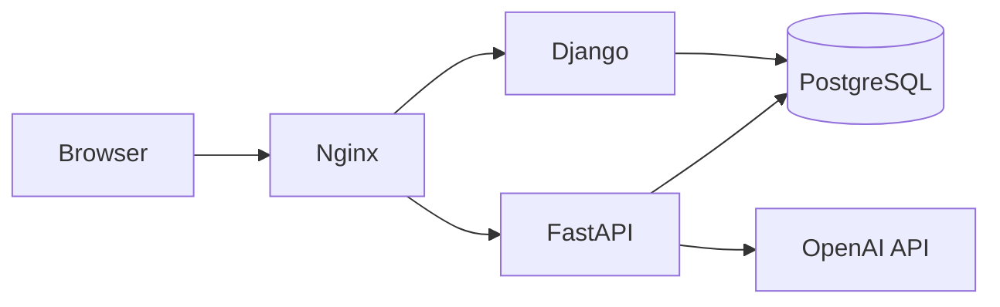

# TailTalk

TailTalk은 반려동물(강아지/고양이) 맞춤 상품 추천과 정보성 상담을 제공하는 대화형 서비스입니다.
웹 서비스와 사용자/반려동물/세션 관리는 Django가 담당하고, 추천 및 응답 생성 파이프라인은 FastAPI + LangGraph가 담당합니다.

## 주요 기능

- 반려동물 프로필 기반 상품 추천
- 대화 맥락을 반영한 멀티턴 채팅
- 상품 검색 및 추천 결과 카드 제공
- 반려동물 관련 정보성 질의응답
- 채팅 세션/메시지/추천 결과 저장

## 아키텍처



구성 역할은 다음과 같습니다.

- Django
  - 웹 페이지 렌더링
  - 사용자 인증
  - 반려동물/주문/채팅 세션 관리
  - 채팅 요청 프록시 및 저장
- FastAPI
  - 채팅/추천 파이프라인 실행
  - LangGraph 기반 state 처리
  - 검색, 리랭크, 응답 생성
- PostgreSQL
  - 서비스 데이터 저장
  - 채팅 세션/메시지/메모리 저장
  - 상품 검색용 데이터 저장

## 기술 스택

| 영역 | 기술 |
| --- | --- |
| Frontend | Django Template, Tailwind CSS, Vanilla JS |
| Backend | Django, FastAPI |
| AI | LangGraph, OpenAI API |
| Database | PostgreSQL 16, pgvector, Full-text Search |
| Infra | Docker Compose, Nginx, AWS EC2 / Elastic Beanstalk, GitHub Actions |

## 프로젝트 구조

```text
services/
  django/        Django 서비스
  fastapi/       FastAPI AI 서비스 (submodule)
infra/           로컬 실행용 Docker Compose 및 Nginx 설정
deploy/          배포 관련 설정
docs/            기획/설계/리팩터링 문서
scripts/         데이터 적재/복원 스크립트
sql/             로컬 DB 보조 SQL
tests/           루트 레벨 테스트/검증 스크립트
```

## 시작하기

### 1. 저장소 준비

```bash
git clone <repo-url>
cd SKN22-Final-2Team-WEB
git submodule update --init --recursive
```

`services/fastapi`는 별도 저장소를 연결한 Git submodule입니다.

### 2. 환경 변수 준비

로컬 실행 전 `infra/.env` 파일을 준비해야 합니다.

필수 항목 예시:

- `POSTGRES_DB`
- `POSTGRES_USER`
- `POSTGRES_PASSWORD`
- `OPENAI_API_KEY`
- `DJANGO_SECRET_KEY`

### 3. 로컬 실행

```bash
cd infra
docker compose up -d --build
```

실행 후 기본 접속 주소:

- 웹 서비스: `http://localhost`
- PostgreSQL: `localhost:5432`

## 채팅 동작 개요

현재 채팅 흐름은 아래와 같습니다.

1. 브라우저에서 채팅 요청을 Django로 전송
2. Django가 사용자 메시지를 저장
3. Django가 FastAPI에 내부 요청 전달
4. FastAPI가 세션 문맥을 복원해 LangGraph 파이프라인 실행
5. 추천 결과와 응답 문장을 생성
6. Django가 assistant 메시지와 추천 결과를 저장

즉, 채팅은 `Django -> FastAPI` 구조로 동작하며, 멀티턴 문맥은 DB에 저장된 세션 메모리를 기준으로 이어집니다.

## 데이터 및 추천 품질 확인

로컬에서 추천 기능까지 확인하려면 다음이 필요합니다.

- `OPENAI_API_KEY` 설정
- 품종/상품 관련 데이터 적재

데이터 적재/복원 스크립트는 `scripts/` 디렉토리에 있습니다.

## 문서

상세 설계와 리팩터링 문서는 `docs/` 아래에 정리되어 있습니다.

- `docs/planning/`
- `docs/`

## 팀

SKN22 Final Project · 2팀
