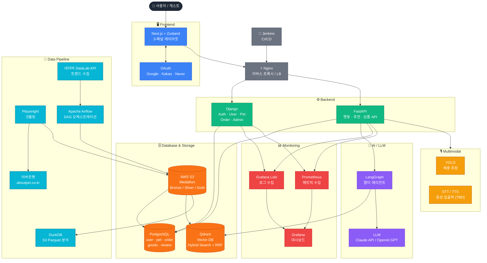

# 시스템 구성

> **프로젝트**: SKN22 Final Project · 2팀
> **작성일**: 2026-03-06

---

## 0. 전체 시스템 아키텍처 (Mermaid)



---

## 1. 전체 아키텍처

```
[사용자 / 게스트]
      │
      ▼
[Frontend]  Next.js + Zustand
  OAuth (Google / Kakao / Naver)
      │
      ▼
[Nginx]  리버스 프록시 / 로드 밸런싱
      │
      ├──► [Django]   Auth · User · Pet · Order · Admin API
      │         └── JWT 인증 / PostgreSQL
      │
      └──► [FastAPI]  챗봇 · 추천 · 상품 마이크로서비스 (RESTful)
                │
                ├── [LangGraph]  멀티 에이전트 오케스트레이션
                │       ├── 의도 분류 에이전트
                │       ├── 상품 검색 에이전트  ──► Qdrant (Hybrid Search + RRF)
                │       ├── 추천 에이전트
                │       └── 응답 생성 에이전트  ──► LLM (Claude API / OpenAI GPT)
                │
                ├── [PostgreSQL]  관계형 데이터
                │       user · pet · order · goods · review
                │
                └── [Qdrant]  Vector DB
                        Dense + Sparse Hybrid Search + RRF
```

---

## 2. 데이터 파이프라인

```
[어바웃펫 크롤링]
  Playwright
      │
      ▼
[Bronze Layer]  S3 (Parquet) ── 원시 데이터 보존
      │
      ▼
[Silver Layer]  S3 (Parquet) ── 정제 · 정규화
      │
      ▼
[Gold Layer]    S3 (Parquet) ── 메타데이터 증강
  (알레르기 태그, 건강 관심사 매핑, 리뷰 감성 점수, LLM 요약)
      │
      ├──► PostgreSQL  (관계형 서빙 DB)
      └──► Qdrant      (벡터 임베딩 인덱싱)

[Airflow DAG]  트렌드 수집 오케스트레이션
  daily_trend_dag    : 네이버 DataLab + 어바웃펫 인기 랭킹
  weekly_review_dag  : 신규 리뷰 + 리뷰 급증 상품 감지
  monthly_weight_dag : 계절성 가중치 갱신 + 추천 가중치 재계산

[DuckDB]  S3 Parquet 분석 쿼리 (어드민 대시보드 · 데이터 분석)
```

---

## 3. Infra / DevOps

```
[AWS]
  ├── EC2          앱 서버 (Docker Compose)
  ├── S3           데이터 레이크 (Medallion Bronze/Silver/Gold)
  ├── IAM          최소 권한 원칙
  └── Secrets Manager  API 키 · DB 접속 정보

[Docker Compose 서비스 구성]
  ├── frontend     Next.js
  ├── django       Django 백엔드
  ├── fastapi      FastAPI 마이크로서비스
  ├── nginx        리버스 프록시 / LB
  ├── postgres     PostgreSQL 16
  ├── qdrant       Vector DB
  ├── airflow      DAG 오케스트레이션
  ├── prometheus   메트릭 수집
  ├── grafana      모니터링 대시보드
  └── loki         로그 수집

[CI/CD]  Jenkins
  └── 테스트 자동화 → 빌드 → EC2 배포
```

---

## 4. Multimodal

```
[이미지 입력]
  MIME Type 검증 (프론트) → S3 업로드 → YOLO 분석 (체중 추정)

[음성 입력 / 출력]  (구현 여부 TBD)
  STT: 마이크 입력 → 텍스트 변환 → 챗봇 전달
  TTS: LLM 응답 → 음성 출력
```
