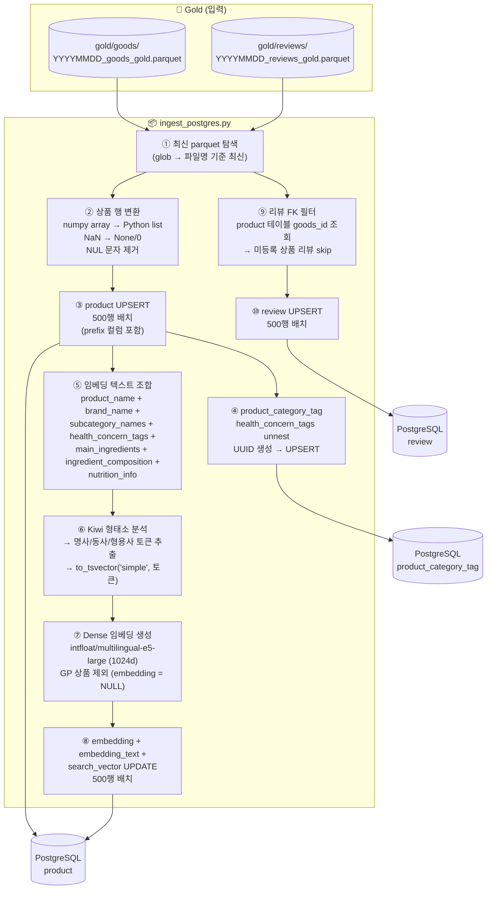

# Ingest 파이프라인 명세

> **범위**: Gold parquet → PostgreSQL 적재 단계 처리 로직 및 의존성
> 스크립트 위치: `scripts/ingest_postgres.py`
> 벡터 검색: pgvector 확장 (Qdrant에서 마이그레이션)

---

## 1. 파이프라인 흐름



---

## 2. ingest_postgres.py

### 입력 / 출력

| 구분 | 항목 |
|---|---|
| 입력 | `output/gold/goods/*_goods_gold.parquet` (최신 파일) |
| 입력 | `output/gold/reviews/*_reviews_gold.parquet` (최신 파일) |
| 출력 | PostgreSQL `product` 테이블 (메타데이터 + 벡터 + tsvector) |
| 출력 | PostgreSQL `product_category_tag` 테이블 |
| 출력 | PostgreSQL `review` 테이블 |

### 처리 로직

#### 상품 적재
1. **파일 탐색**: glob 정렬 후 마지막 파일 선택
2. **행 변환**:
   - `numpy array` → `Python list` (`to_list`)
   - `NaN` → `None` 또는 `0` (컬럼 타입별)
   - NUL 문자(`\x00`) 제거 (`clean_str`)
   - `dict/list` 컬럼 → `psycopg2.extras.Json`
3. **product UPSERT**: `ON CONFLICT (goods_id) DO UPDATE` — 500행 배치. `prefix` 컬럼 포함.
4. **product_category_tag UPSERT**: `health_concern_tags` 배열 unnest, UUID 생성, `ON CONFLICT (product_id, tag) DO NOTHING`

#### 벡터 적재 (pgvector + Kiwi tsvector)
5. **임베딩 텍스트 조합** (`build_product_text`):
   ```
   product_name + brand_name + subcategory_names +
   health_concern_tags + main_ingredients +
   ingredient_composition(k v 직렬화) + nutrition_info(k v 직렬화)
   ```
6. **Kiwi 형태소 분석** (kiwipiepy):
   - `embedding_text`를 Kiwi로 토큰화
   - 명사(`NN*`), 동사(`VV`), 형용사(`VA`) 품사만 추출
   - 토큰을 공백 결합 → `to_tsvector('simple', 토큰화된_텍스트)` 로 저장
7. **Dense 임베딩 생성** (fastembed):
   - 모델: `intfloat/multilingual-e5-large` (1024d)
   - GP 상품 (`prefix='GP'`) 제외: `embedding = NULL`
   - 배치 단위 생성 (기본 64개)
8. **벡터 UPDATE**: `embedding`, `embedding_text`, `search_vector` 컬럼 500행 배치 UPDATE

#### 리뷰 적재
9. **FK 필터**: `product` 테이블 `goods_id` 조회 → 등록된 상품 리뷰만 적재
10. **review UPSERT**: `ON CONFLICT (review_id) DO UPDATE` — sentiment/ABSA 필드만 갱신

### PostgreSQL 확장 및 인덱스

```sql
-- 필수 확장
CREATE EXTENSION IF NOT EXISTS vector;   -- pgvector

-- 벡터 검색 인덱스 (HNSW)
CREATE INDEX idx_product_embedding ON product
  USING hnsw (embedding vector_cosine_ops);

-- 전문검색 인덱스 (GIN)
CREATE INDEX idx_product_search_vector ON product
  USING gin (search_vector);
```

### Hybrid Search 쿼리 패턴

```sql
-- Dense + Sparse + RRF 결합
WITH dense AS (
    SELECT goods_id,
           ROW_NUMBER() OVER (ORDER BY embedding <=> $query_vector) AS rank_d
    FROM product
    WHERE embedding IS NOT NULL
      AND pet_type @> ARRAY[$pet_type]    -- 메타데이터 필터
    ORDER BY embedding <=> $query_vector
    LIMIT 100
),
sparse AS (
    SELECT goods_id,
           ROW_NUMBER() OVER (ORDER BY ts_rank(search_vector, $tsquery) DESC) AS rank_s
    FROM product
    WHERE search_vector @@ $tsquery
      AND embedding IS NOT NULL
    ORDER BY ts_rank(search_vector, $tsquery) DESC
    LIMIT 100
)
SELECT COALESCE(d.goods_id, s.goods_id) AS goods_id,
       COALESCE(1.0 / (60 + d.rank_d), 0) +
       COALESCE(1.0 / (60 + s.rank_s), 0) AS rrf_score
FROM dense d
FULL OUTER JOIN sparse s ON d.goods_id = s.goods_id
ORDER BY rrf_score DESC
LIMIT 20;
```

> 쿼리 측 Kiwi 토큰화: 사용자 입력도 동일하게 Kiwi로 토큰화 → `to_tsquery('simple', '토큰1 & 토큰2')` 생성

### 옵션

| 옵션 | 설명 |
|---|---|
| `--only goods` | 상품만 적재 (벡터 포함) |
| `--only reviews` | 리뷰만 적재 |
| `--only vectors` | 벡터/tsvector만 재생성 (상품 메타 스킵) |
| `--truncate` | 기존 데이터 삭제(`TRUNCATE ... RESTART IDENTITY CASCADE`) 후 재적재 |
| `--batch N` | 임베딩 배치 크기 (기본 64) |

### 실행 명령

```bash
# Docker (권장)
docker compose -f infra/docker-compose.yml run --rm \
    -v $(pwd)/output:/app/output \
    -v $(pwd)/scripts:/app/scripts \
    django python scripts/ingest_postgres.py

# 벡터만 재생성
docker compose -f infra/docker-compose.yml run --rm \
    -v $(pwd)/output:/app/output \
    -v $(pwd)/scripts:/app/scripts \
    django python scripts/ingest_postgres.py --only vectors

# 로컬 conda (docker-compose.override.yml의 postgres 포트 5432:5432 필요)
POSTGRES_HOST=localhost conda run -n final-project python scripts/ingest_postgres.py --truncate
```

### 의존성

| 의존 대상 | 내용 |
|---|---|
| `gold/goods.py` 출력 | `popularity_score`, `sentiment_avg`, `repeat_rate`, `health_concern_tags`, OCR 필드 포함 |
| `gold/reviews.py` 출력 | `sentiment_score`, `sentiment_label`, `absa_result` 포함 |
| PostgreSQL `product` 테이블 | 리뷰 적재 시 FK 필터 기준 |
| pgvector 확장 | `CREATE EXTENSION vector` (PostgreSQL 15+ 권장) |
| fastembed | `intfloat/multilingual-e5-large` 모델 (최초 실행 시 다운로드) |
| kiwipiepy | 한국어 형태소 분석기 (`pip install kiwipiepy`) |
| `infra/.env` | DB 접속 정보 |

---

## 3. 실행 순서 및 의존 관계

```
ingest_postgres.py (goods + vectors) → ingest_postgres.py (reviews)   # reviews는 product FK 필요
```

> `--truncate` 옵션 사용 시: goods → reviews 순서 필수 (FK 제약)
> `--only vectors` 는 product 적재 후 독립 실행 가능

---

## 4. 환경변수 참조

| 변수 | 기본값 | 사용처 |
|---|---|---|
| `POSTGRES_HOST` | `postgres` | ingest_postgres |
| `POSTGRES_PORT` | `5432` | ingest_postgres |
| `POSTGRES_DB` | `tailtalk_db` | ingest_postgres |
| `POSTGRES_USER` | `mungnyang` | ingest_postgres |
| `POSTGRES_PASSWORD` | `final1234` | ingest_postgres |

> 로컬 실행 시 `POSTGRES_HOST=localhost` 오버라이드 필요 (Docker 네트워크 외부)
