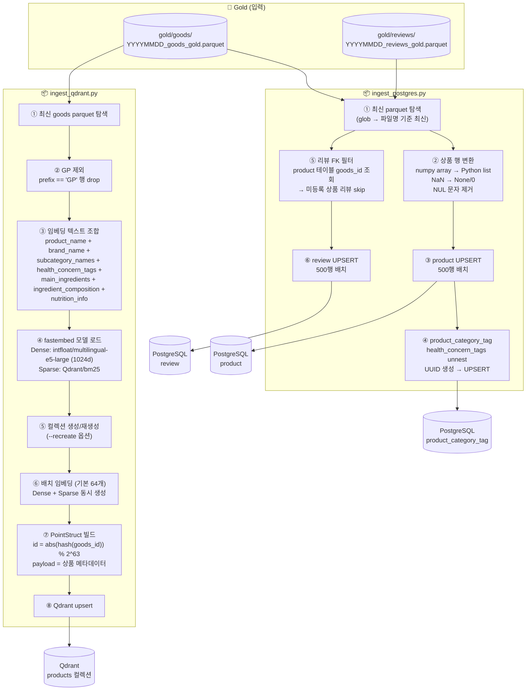

# Ingest 파이프라인 명세

> **범위**: Gold parquet → PostgreSQL / Qdrant 적재 단계 처리 로직 및 의존성
> 스크립트 위치: `scripts/ingest_postgres.py`, `scripts/ingest_qdrant.py`

---

## 1. 파이프라인 흐름



---

## 2. ingest_postgres.py

### 입력 / 출력

| 구분 | 항목 |
|---|---|
| 입력 | `output/gold/goods/*_goods_gold.parquet` (최신 파일) |
| 입력 | `output/gold/reviews/*_reviews_gold.parquet` (최신 파일) |
| 출력 | PostgreSQL `product` 테이블 |
| 출력 | PostgreSQL `product_category_tag` 테이블 |
| 출력 | PostgreSQL `review` 테이블 |

### 처리 로직

#### 상품 적재
1. **파일 탐색**: glob 정렬 후 마지막 파일 선택
2. **행 변환**:
   - `numpy array` → `Python list` (`to_list`)
   - `NaN` → `None` 또는 `0` (컬럼 타입별)
   - NUL 문자(`\x00`) 제거 (`clean_str`)
   - `dict/list` 컬럼 → `psycopg2.extras.Json`
3. **product UPSERT**: `ON CONFLICT (goods_id) DO UPDATE` — 500행 배치
4. **product_category_tag UPSERT**: `health_concern_tags` 배열 unnest, UUID 생성, `ON CONFLICT (product_id, tag) DO NOTHING`

#### 리뷰 적재
1. **FK 필터**: `product` 테이블 `goods_id` 조회 → 등록된 상품 리뷰만 적재
2. **review UPSERT**: `ON CONFLICT (review_id) DO UPDATE` — sentiment/ABSA 필드만 갱신

### 옵션

| 옵션 | 설명 |
|---|---|
| `--only goods` | 상품만 적재 |
| `--only reviews` | 리뷰만 적재 |
| `--truncate` | 기존 데이터 삭제(`TRUNCATE ... RESTART IDENTITY CASCADE`) 후 재적재 |

### 실행 명령

```bash
# Docker (권장)
docker compose -f infra/docker-compose.yml run --rm \
    -v $(pwd)/output:/app/output \
    -v $(pwd)/scripts:/app/scripts \
    django python scripts/ingest_postgres.py

# 로컬 conda (docker-compose.override.yml의 postgres 포트 5432:5432 필요)
POSTGRES_HOST=localhost conda run -n final-project python scripts/ingest_postgres.py --truncate
```

### 의존성

| 의존 대상 | 내용 |
|---|---|
| `gold/goods.py` 출력 | `popularity_score`, `sentiment_avg`, `repeat_rate`, `health_concern_tags`, OCR 필드 포함 |
| `gold/reviews.py` 출력 | `sentiment_score`, `sentiment_label`, `absa_result` 포함 |
| PostgreSQL `product` 테이블 | 리뷰 적재 시 FK 필터 기준 |
| `infra/.env` | DB 접속 정보 |

---

## 3. ingest_qdrant.py

### 입력 / 출력

| 구분 | 항목 |
|---|---|
| 입력 | `output/gold/goods/*_goods_gold.parquet` (최신 파일) |
| 출력 | Qdrant `products` 컬렉션 |

### 처리 로직

1. **GP 제외**: `prefix == 'GP'` 행 drop (4,902 → 3,618)
2. **임베딩 텍스트 조합** (`build_product_text`):
   ```
   product_name + brand_name + subcategory_names +
   health_concern_tags + main_ingredients +
   ingredient_composition(k v 직렬화) + nutrition_info(k v 직렬화)
   ```
3. **모델 로드** (fastembed):
   - Dense: `intfloat/multilingual-e5-large` (1024d)
   - Sparse: `Qdrant/bm25` (IDF modifier)
4. **컬렉션 설정**: `--recreate` 시 기존 컬렉션 삭제 후 재생성
5. **배치 임베딩 + upsert** (기본 64개):
   - Dense + Sparse 동시 생성
   - Point ID: `abs(hash(goods_id)) % 2^63`
6. **payload**: 상품 메타데이터 (추천/검색 필터링용 필드)

### Qdrant 컬렉션 설정

| 항목 | 값 |
|---|---|
| 컬렉션명 | `products` |
| Dense 벡터 | `intfloat/multilingual-e5-large`, 1024d, Cosine, HNSW(m=16, ef=100) |
| Sparse 벡터 | `Qdrant/bm25`, IDF modifier, on_disk=False |

### payload 필드

| 필드 | 설명 |
|---|---|
| `goods_id`, `product_name`, `brand_name`, `prefix` | 식별/표시 |
| `price`, `discount_price` | 가격 |
| `sold_out`, `soldout_reliable` | 재고 상태 |
| `pet_type`, `category`, `subcategory` | 분류 필터링 |
| `health_concern_tags`, `main_ingredients` | 건강/성분 필터링 |
| `ingredient_text_ocr` | OCR 원문 (텍스트 검색용) |
| `popularity_score`, `sentiment_avg`, `repeat_rate` | 추천 신호 (null 가능) |
| `thumbnail_url`, `product_url` | UI 표시 |

### 옵션

| 옵션 | 설명 |
|---|---|
| `--recreate` | 컬렉션 삭제 후 재생성 (스키마 변경 시 필수) |
| `--batch N` | 배치 크기 (기본 64) |

### 실행 명령

```bash
# Docker (권장)
docker compose -f infra/docker-compose.yml run --rm \
    -v $(pwd)/output:/app/output \
    -v $(pwd)/scripts:/app/scripts \
    fastapi python scripts/ingest_qdrant.py --recreate

# 로컬 conda (docker-compose.override.yml의 qdrant 포트 6333:6333 필요)
conda run -n final-project python scripts/ingest_qdrant.py --recreate
```

### 의존성

| 의존 대상 | 내용 |
|---|---|
| `gold/goods.py` 출력 | `subcategory_names`, `health_concern_tags`, `main_ingredients` 등 임베딩 텍스트 소스 |
| fastembed | `intfloat/multilingual-e5-large`, `Qdrant/bm25` 모델 (최초 실행 시 다운로드) |
| Qdrant 서비스 | `QDRANT_URL` 환경변수 (기본 `http://localhost:6333`) |

---

## 4. 실행 순서 및 의존 관계

```
ingest_postgres.py (goods) → ingest_postgres.py (reviews)   # reviews는 product FK 필요
ingest_qdrant.py                                             # postgres와 독립 실행 가능
```

> `--truncate` 옵션 사용 시: goods → reviews 순서 필수 (FK 제약)
> Qdrant는 PostgreSQL과 무관하게 병렬 실행 가능

---

## 5. 환경변수 참조

| 변수 | 기본값 | 사용처 |
|---|---|---|
| `POSTGRES_HOST` | `postgres` | ingest_postgres |
| `POSTGRES_PORT` | `5432` | ingest_postgres |
| `POSTGRES_DB` | `tailtalk_db` | ingest_postgres |
| `POSTGRES_USER` | `mungnyang` | ingest_postgres |
| `POSTGRES_PASSWORD` | `final1234` | ingest_postgres |
| `QDRANT_URL` | `http://localhost:6333` | ingest_qdrant |
| `QDRANT_API_KEY` | (없음) | ingest_qdrant |

> 로컬 실행 시 `POSTGRES_HOST=localhost` 오버라이드 필요 (Docker 네트워크 외부)
