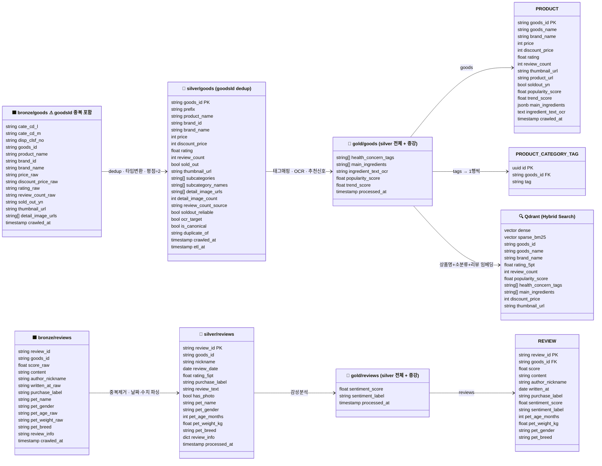

# S3 Medallion 스키마 정의

> **범위**: Bronze → Silver → Gold S3 Parquet 레이어 컬럼 정의
> 각 레이어는 `s3://bucket/{layer}/{table}/` 경로에 Parquet로 저장

---

## 개요

---

## Bronze

### `bronze/goods/`

소분류 순회 시 수집되는 원시 상품 데이터. **소분류 간 중복 행 포함** (같은 goodsId가 여러 행).

| 컬럼 | 타입 | 출처 | 예시 |
|---|---|---|---|
| `cate_cd_l` | string | API param | `12565` |
| `cate_cd_m` | string | API param | `100000437` |
| `disp_clsf_no` | string | API param | `100000474` |
| `goods_id` | string | `data-goodsid` | `GI251094382` |
| `product_name` | string | `data-productname` | `케어캣 올라이프 고양이 건식사료 20kg` |
| `brand_id` | string | `data-brandid` | `2246` |
| `brand_name` | string | `data-brandname` | `케어캣` |
| `price_raw` | string | `data-price` | `44900` |
| `discount_price_raw` | string | `data-discountprice` | `42000` |
| `rating_raw` | string | `data-goodsstarsavgcnt` | `9.4` (10점 만점) |
| `review_count_raw` | string | `data-scorecnt` | `801` |
| `sold_out_yn` | string | `data-soldoutyn` | `N` |
| `thumbnail_url` | string | `.thumb-img[src]` | CDN URL |
| `detail_image_urls` | string[]\|null | `#getGoodsDetailArea img[src*='editor/goods_desc/']` | 성분·영양표 이미지 URL 목록. 식품류(GI/GP)만 존재; 완구·용품(PI)은 null |
| `crawled_at` | timestamp | 수집 시각 | |

> **detail_image_urls 수집 방법**: `indexGoodsDetail` 페이지에서 `img[src*='editor/goods_desc/']` 로 추출. OCR 전처리 대상. 평균 0-5장, 없으면 빈 배열 `[]`.

### `bronze/reviews/`

`getGoodsEntireCommentList` 응답 HTML 파싱 결과. 가공 없이 원시 저장.

| 컬럼 | 타입 | 출처 | 예시 |
|---|---|---|---|
| `review_id` | string | `data-goods-estm-no` | `1198680` |
| `goods_id` | string | 수집 대상 goods_id | `GI251094382` |
| `score_raw` | float\|null | `.stars.sm` class 파싱 (`p_5_0` → 5.0) | `5.0` |
| `content` | string | `.msgs` | 본문 텍스트 |
| `author_nickname` | string | `.writer-info .ids` | `호로록피` |
| `written_at_raw` | string | `.writer-info .date` | `2026.03.06` |
| `purchase_label` | string\|null | `.purchase-label` class | `first` / `repeat` / null |
| `pet_name` | string\|null | `div.spec > em.b` | `시루` |
| `pet_gender` | string\|null | `div.spec > em.b > i.g` | `암컷` |
| `pet_age_raw` | string\|null | `div.spec > em:nth-of-type(2)` | `7개월` |
| `pet_weight_raw` | string\|null | `div.spec > em:nth-of-type(3)` | `2.5kg` |
| `pet_breed` | string\|null | `div.spec > em:nth-of-type(4)` | `브리티시쇼트헤어` |
| `review_info` | string\|null | `ul.satis` 키-값 JSON 문자열 | `{"사용성":"잘 쓰고 있어요"}` |
| `crawled_at` | timestamp | 수집 시각 | |

---

## Silver

### `silver/goods/`

Bronze goods에서 goodsId 기준 dedup, 타입 변환, 평점 정규화, OCR·dedup 플래그 추가.

| 컬럼 | 타입 | Bronze → Silver 처리 |
|---|---|---|
| `goods_id` | string (PK) | dedup 기준 |
| `prefix` | string | `goods_id` 앞 2자리 (`GI`/`GP`/`GO`/`GS`/`PI`) |
| `product_name` | string | 그대로 |
| `brand_id` | string | 그대로 |
| `brand_name` | string | 그대로 |
| `price` | int | `price_raw` → int |
| `discount_price` | int | `discount_price_raw` → int |
| `rating` | float | `rating_raw` ÷ 2 (9.4 → 4.7) |
| `review_count` | int | `review_count_raw` → int |
| `sold_out` | bool | `sold_out_yn` == `Y` |
| `thumbnail_url` | string | 그대로 |
| `subcategories` | string[] | 해당 goodsId가 속한 소분류 코드 전체 (중복 소거) |
| `subcategory_names` | string[] | 소분류명 목록 (예: `["강아지_사료_어덜트(1~7세)"]`) |
| `detail_image_urls` | string[] | Bronze `detail_image_urls` dedup (OCR 입력용) |
| `detail_image_count` | int | `detail_image_urls` 길이 |
| `review_count_source` | string | `direct` (단품 직접 집계) / `aggregated` (GP 하위 합산) |
| `soldout_reliable` | bool | `GO` 상품은 `False` (품절 여부 불신뢰) |
| `ocr_target` | bool | 사료·간식·습식관·덴탈관·건강관리 카테고리 여부 (Gold OCR 대상 판단) |
| `is_canonical` | bool | dedup 대표 상품 여부 (리뷰 수집 대상) |
| `duplicate_of` | string\|null | 비정규 상품의 대표 `goods_id` (정규 상품은 null) |
| `crawled_at` | timestamp | Bronze 수집 시각 |
| `etl_at` | timestamp | Silver ETL 처리 시각 |

### `silver/reviews/`

Bronze reviews에서 중복 제거, 타입 변환, 날짜·수치 파싱.

| 컬럼 | 타입 | Bronze → Silver 처리 |
|---|---|---|
| `review_id` | string (PK) | `goods_estm_no` 그대로 |
| `goods_id` | string | 그대로 |
| `nickname` | string | 그대로 |
| `review_date` | date | `review_date_raw` "YYYY.MM.DD" → date |
| `rating_5pt` | float | `star_class_raw` "p_5_0" → 5.0 파싱 |
| `purchase_label` | string\|null | `purchase_label_raw` 그대로 |
| `review_text` | string | HTML 특수문자 정규화, 공백 정리 |
| `has_photo` | bool | 그대로 |
| `pet_name` | string\|null | 그대로 |
| `pet_gender` | string\|null | 그대로 |
| `pet_age_months` | int\|null | `pet_age_raw` 파싱: `7개월`→7, `3살`→36 |
| `pet_weight_kg` | float\|null | `pet_weight_raw` 파싱: `2.5kg`→2.5 |
| `pet_breed` | string\|null | 그대로 |
| `review_info` | dict\|null | `review_info_json` → dict (없으면 `{}`) |
| `processed_at` | timestamp | |

---

## Gold

### `gold/goods/`

Silver goods에 추천 신호 및 증강 컬럼 추가.

| 컬럼 | 타입 | 도출 방법 |
|---|---|---|
| *(silver 컬럼 전체 포함)* | | |
| `health_concern_tags` | string[] | `disp_clsf_nos` → 키워드 매핑 규칙 (아래 표 참고) |
| `main_ingredients` | string[] | 상품명에서 원료 키워드 추출 (치킨\|연어\|오리\|소고기\|참치\|양고기\|오리\|칠면조 등) |
| `ingredient_text_ocr` | string\|null | `silver.detail_image_urls` 이미지 OCR 결과 원문 (식품류만 존재) |
| `popularity_score` | float | `log(review_count + 1) × rating_5pt` |
| `trend_score` | float | 최근 30일 리뷰 수 / 전체 리뷰 수 (`silver/reviews` sysRegDtm 기준) |
| `processed_at` | timestamp | |

**health_concern_tags 매핑 규칙** (disp_clsf_no 소분류명 기반):

| 태그 | 매핑 소분류명 키워드 |
|---|---|
| `관절` | 관절 |
| `피부` | 피부, 피모, 모질 |
| `소화` | 위장, 소화 |
| `체중` | 체중조절 |
| `요로` | 요로기계 |
| `눈물` | 눈, 눈물 |
| `헤어볼` | 헤어볼 |
| `치아` | 치아, 구강, 덴탈 |
| `면역` | 면역력 |

### `gold/reviews/`

Silver reviews에 감성 분석 결과 추가.

| 컬럼 | 타입 | 도출 방법 |
|---|---|---|
| *(silver 컬럼 전체 포함)* | | |
| `sentiment_score` | float | 한국어 감성 분석 모델 (0.0~1.0) |
| `sentiment_label` | string | `positive` / `negative` / `neutral` |
| `processed_at` | timestamp | |

---

## Gold → PostgreSQL 매핑

| Gold 컬럼 | PostgreSQL 테이블.컬럼 |
|---|---|
| `goods_id` | `PRODUCT.goods_id` |
| `product_name` | `PRODUCT.goods_name` |
| `brand_name` | `PRODUCT.brand_name` |
| `price` | `PRODUCT.price` |
| `discount_price` | `PRODUCT.discount_price` |
| `rating_5pt` | `PRODUCT.rating` |
| `review_count` | `PRODUCT.review_count` |
| `thumbnail_url` | `PRODUCT.thumbnail_url` |
| `product_url` | `PRODUCT.product_url` |
| `sold_out` | `PRODUCT.soldout_yn` |
| `popularity_score` | `PRODUCT.popularity_score` |
| `trend_score` | `PRODUCT.trend_score` |
| `main_ingredients` | `PRODUCT.main_ingredients` (JSONB) |
| `ingredient_text_ocr` | `PRODUCT.ingredient_text_ocr` |
| `health_concern_tags[i]` | `PRODUCT_CATEGORY_TAG.tag` (1행씩 insert) |
| `review_id` | `REVIEW.review_id` |
| `goods_id` | `REVIEW.goods_id` |
| `rating_5pt` | `REVIEW.score` |
| `review_text` | `REVIEW.content` |
| `nickname` | `REVIEW.author_nickname` |
| `review_date` | `REVIEW.written_at` |
| `purchase_label` | `REVIEW.purchase_label` |
| `sentiment_score` | `REVIEW.sentiment_score` |
| `sentiment_label` | `REVIEW.sentiment_label` |
| `pet_age_months` | `REVIEW.pet_age_months` |
| `pet_weight_kg` | `REVIEW.pet_weight_kg` |
| `pet_gender` | `REVIEW.pet_gender` |
| `pet_breed` | `REVIEW.pet_breed` |

## Gold → Qdrant 매핑

| 항목 | 내용 |
|---|---|
| **임베딩 대상 텍스트** | `상품명 + 소분류명 + 리뷰 텍스트 상위 N개 concat` |
| **payload** | `goods_id`, `goods_name`, `brand_name`, `rating_5pt`, `review_count`, `popularity_score`, `health_concern_tags`, `main_ingredients`, `discount_price`, `thumbnail_url` |
| **Dense vector** | 한국어 임베딩 모델 (TBD) |
| **Sparse vector** | BM25 |
| **검색 방식** | Hybrid Search (Dense + Sparse + RRF) |
