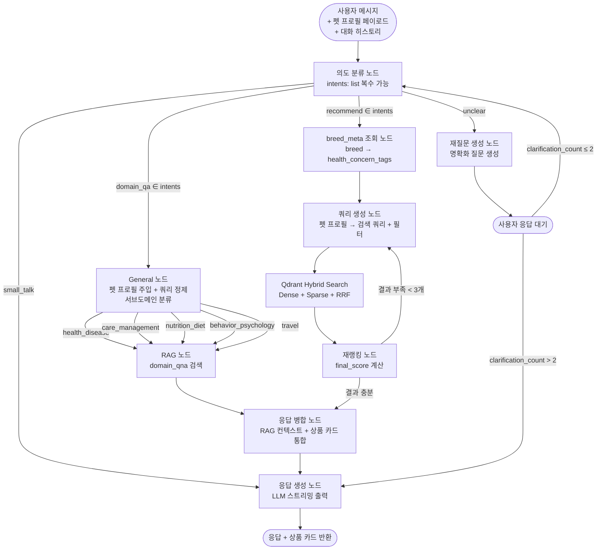

# 피처 엔지니어링 및 추천 시스템 아키텍처

> **연계 문서**
> - `07_gold_eda.md`: Gold 데이터 현황
> - `03_medallion_schema.md`: ETL 파이프라인 스키마
> - `docs/planning/04_data_model_detail.md`: DB 스키마

---

## 1. 피처 정의

### 1-1. 원본 필드

**상품 (goods)**

| 필드 | 타입 | 설명 | 활용 |
|---|---|---|---|
| `goods_id` | str | 상품 고유 ID | 키 |
| `prefix` | str | GI/GP/GO/GS/PI | GP = 기획전 전용, Qdrant 미적재 |
| `product_name` | str | 상품명 | 임베딩 |
| `brand_name` | str | 브랜드명 | 임베딩, 필터링 |
| `price` / `discount_price` | int | 정가 / 할인가 | 예산 필터링, payload |
| `rating` / `rating_5pt` | float | 10점 / 5점 평점 | popularity_score |
| `review_count` | int | 리뷰 수 | popularity_score |
| `review_count_source` | str | direct / aggregated | GO 상품 집계 구분 |
| `sold_out` | bool | 품절 여부 | Qdrant 필터링 |
| `soldout_reliable` | bool | GO 상품 False | 필터 신뢰도 판단 |
| `subcategory_names` | list[str] | `{pet_type}_{category}_{subcategory}` 태그 | 임베딩 |
| `pet_type` | list[str] | 강아지/고양이 (Silver 파싱) | Qdrant 필터, payload |
| `category` | list[str] | 사료/간식/용품/... (Silver 파싱) | Qdrant 필터, payload |
| `subcategory` | list[str] | 전연령/퍼피/시니어/... (Silver 파싱) | Qdrant 필터, payload |
| `health_concern_tags` | list[str] | 건강 관심사 태그 (Gold 파생) | 임베딩, Qdrant 필터 |
| `main_ingredients` | list[str] | 주요 원료 키워드 배열 (OCR 추출) | 임베딩, 알레르기 필터 |
| `ingredient_composition` | dict\|null | `{원료명: 함량%}` (OCR LLM 파싱) | 상품 상세 표시 (PostgreSQL 전용) |
| `nutrition_info` | dict\|null | `{영양성분명: 수치}` (OCR LLM 파싱) | 상품 상세 표시 (PostgreSQL 전용) |
| `ingredient_text_ocr` | str\|null | OCR 원문 (식품류만) | 알레르기 키워드 매칭 (payload 저장, 임베딩 제외) |
| `popularity_score` | float | log(review+1)×rating_5pt | 재랭킹 |
| `sentiment_avg` | float | 상품별 sentiment_score 평균 (Gold 집계) | 재랭킹 품질 지표 |
| `repeat_rate` | float | 재구매 리뷰 비율 (Gold 집계) | 재랭킹 implicit signal |
| `thumbnail_url` | str | 상품 이미지 URL | 상품 카드 |
| `product_url` | str | 상품 상세 페이지 URL | 상품 카드 링크 |

**리뷰 (reviews)**

| 필드 | 타입 | 설명 | 활용 |
|---|---|---|---|
| `review_id` | str | 리뷰 고유 ID | 키 |
| `goods_id` | str | 상품 ID | 상품-리뷰 조인 |
| `review_date` | date | 작성일 (2014~2026) | — |
| `rating_5pt` | float | 별점 (0~5) | popularity_score |
| `purchase_label` | str | first / repeat | repeat_rate 계산 |
| `review_text` | str | 리뷰 본문 | 감성 분석 입력 |
| `pet_gender` | str | 수컷 / 암컷 | 펫 프로필 필터 |
| `pet_age_months` | int | 펫 나이(월) | 연령 필터 |
| `pet_weight_kg` | float | 펫 체중 (이상값 주의) | 체중 기반 추천 |
| `pet_breed` | str | 품종 | 품종 기반 추천 |
| `review_info` | dict | 체크박스 항목 (현재 null) | Phase 2 활용 |
| `sentiment_label` | str | positive / negative | 품질 지표 |
| `sentiment_score` | float | 감성 확신도 0~1 | sentiment_avg 집계 입력 |
| `absa_result` | dict | ABSA 속성별 결과 | 속성 기반 필터/추천 |

### 1-2. 파생 피처

#### popularity_score
```
popularity_score = log(review_count + 1) × rating_5pt
```
- `review_count_source = aggregated` (GO)인 경우 goods API의 `review_count` 그대로 사용
- review_count = 0이면 popularity_score = 0

#### sentiment_avg (상품 단위 집계)
```
sentiment_avg = mean(sentiment_score per goods_id)
```
- rating 편향(5점 77%) 보완용 실질 품질 지표
- `gold/goods.py`에서 sentiment basic.parquet + silver reviews 조인으로 집계

#### repeat_rate (상품 단위)
```
repeat_rate = repeat 리뷰 수 / 전체 리뷰 수
```
- `purchase_label = repeat` 비율 — 재구매 implicit signal
- `gold/goods.py`에서 silver reviews `purchase_label` 집계

#### absa_aspect_score (속성 단위 집계)
```
absa_aspect_score[aspect] = (긍정 수 - 부정 수) / (긍정 + 부정 + 1)
```
- 속성: 기호성, 가격/구매, 배송/포장, 제품 성상, 냄새, 소화/배변, 성분/원료, 생체반응
- 의도 분류에서 특정 속성 감지 시 해당 score로 재랭킹 가중

---

## 2. Implicit / Explicit 데이터

### 2-1. Explicit 데이터

| 데이터 | 수집 시점 | DB 저장 위치 | 활용 방식 |
|---|---|---|---|
| 펫 품종 / 나이 / 체중 | 회원가입 / 펫 등록 | `PET` | 품종 메타 연계 → health_concern_tags 자동 매핑 |
| PET_HEALTH_CONCERN | 펫 등록 / 설정 | `PET_HEALTH_CONCERN` | health_concern_tags 필터링 |
| PET_ALLERGY | 펫 등록 / 설정 | `PET_ALLERGY` | main_ingredients / ingredient_text_ocr 키워드 제외 필터 |
| PET_FOOD_PREFERENCE | 펫 등록 / 설정 | `PET_FOOD_PREFERENCE` | 사료 형태(dry/wet) 필터 |
| 챗봇 직접 요청 | 대화 중 | `CHAT_MESSAGE` | 의도 분류 → 검색 쿼리 생성 |

### 2-2. Implicit 데이터

| 데이터 | 수집 시점 | DB 저장 위치 | 활용 방식 |
|---|---|---|---|
| 상품 카드 클릭 | 챗봇 응답 후 | `USER_INTERACTION` | CTR 기반 선호 추정 |
| 장바구니 담기 | 상품 카드 → 장바구니 | `CART` | 구매 의향 신호 |
| 구매 완료 | 결제 | `ORDER` | 가장 강한 implicit 신호 |
| 재구매 (`purchase_label=repeat`) | 리뷰 작성 | `REVIEW` | `repeat_rate` 파생 피처 |
| 대화 히스토리 | 챗봇 세션 | `CHAT_MESSAGE` | 관심 카테고리/속성 추출 |

### 2-3. Phase 2 — CF 확장

Phase 1에서 implicit 데이터가 충분히 축적된 후 협업 필터링(CF) 레이어를 추가한다.

```
축적 목표:
  USER_INTERACTION: 10,000건 이상
  ORDER: 1,000건 이상
  → 사용자-상품 행렬 sparsity 허용 수준 확인 후 CF 적용
```

| 방식 | 특징 | 적용 조건 |
|---|---|---|
| ALS (Implicit) | 암시적 피드백 Matrix Factorization | ORDER / INTERACTION 10K+ |
| BPR | 구매 vs 미구매 쌍 학습 | ORDER 1K+ |
| Item2Vec | 구매 시퀀스 기반 상품 임베딩 | 사용자당 평균 구매 3회+ |
| LightGCN | 그래프 기반, 고성능 | 대규모 데이터 (50K+ interaction) |

---

## 3. 추천 시스템 아키텍처

### 3-1. LangGraph State 구조

LangGraph는 **순환(cyclic) 그래프** 구조. 의도 불명확 시 재질문 루프(≤2회), 검색 결과 부족 시 필터 완화 재검색 루프를 포함한다.

```python
class ChatState(TypedDict):
    # 사용자 입력
    messages: list[BaseMessage]          # 대화 히스토리
    user_input: str                      # 현재 턴 사용자 메시지

    # 사용자 / 펫 정보
    # 프론트엔드 Zustand 상태 → API 요청 페이로드에 포함 → FastAPI가 State에 주입 (DB 조회 없음)
    user_id: str | None                  # None = 게스트
    pet_profile: dict | None             # 품종, 나이, 체중, 성별
    health_concerns: list[str]           # PET_HEALTH_CONCERN
    allergies: list[str]                 # PET_ALLERGY
    food_preferences: list[str]          # PET_FOOD_PREFERENCE

    # 의도 분류 결과
    intents: list[str]                   # 복수 가능: ["domain_qa", "recommend"] 동시 발화 지원
                                         # 단독: ["recommend"] / ["domain_qa"] / ["small_talk"] / ["unclear"]
    domain_intent: str | None            # General 노드 서브분류: health_disease / care_management /
                                         #   nutrition_diet / behavior_psychology / travel
    clarification_count: int             # 재질문 횟수 (최대 2회)
    detected_aspect: str | None          # ABSA 속성 (기호성, 소화/배변 등)
    budget: int | None                   # 예산 (챗봇에서 언급 시)

    # 검색 / 추천 결과
    search_query: str | None
    filters: dict | None
    search_results: list[dict]
    reranked_results: list[dict]

    # 최종 출력
    response: str
    product_cards: list[dict]
```

### 3-2. 전체 흐름 (LangGraph 순환 구조)

> **펫 프로필 전달**: 프론트엔드 Zustand → API 요청 페이로드 → ChatState 주입. DB 조회 없음.
>
> **병렬 실행**: `domain_qa + recommend` 동시 감지 시 LangGraph `Send` API로 fan-out. MERGE 노드에서 fan-in.



**intent → Qdrant category 필터 매핑**

| intent | QnA category 필터 | 설명 |
|---|---|---|
| `health_disease` | 건강 및 질병 | 질병, 증상, 응급 상황 |
| `care_management` | 사육 및 관리 | 용품, 위생, 생활 환경 |
| `nutrition_diet` | 영양 및 식단 | 사료, 간식, 영양소 |
| `behavior_psychology` | 행동 및 심리 | 훈련, 분리불안, 습관 |
| `travel` | 여행 및 이동 | 이동장, 비행기, 여행 |
| `recommend` | — | 상품 추천 플로우 (Qdrant products 검색) |

**순환 엣지 설명**

| 순환 | 조건 | 설명 |
|---|---|---|
| `CLARIFY → INTENT` | clarification_count ≤ 2 | 불명확 의도 → 재질문 → 사용자 답변 → 의도 재분류 |
| `CLARIFY → RAG` | clarification_count > 2 | 2회 재질문 후에도 불명확 → 일반 답변으로 fallback |
| `RERANK → QUERY` | 검색 결과 < 3개 | 필터 조건 완화 후 재검색 |

### 3-3. Qdrant Hybrid Search

#### 컬렉션 설계

| 컬렉션 | 임베딩 텍스트 | payload 필드 |
|---|---|---|
| `products` | `product_name + brand_name + subcategory_names + health_concern_tags + main_ingredients + ingredient_composition(직렬화) + nutrition_info(직렬화)` | goods_id, brand_name, prefix, price, discount_price, sold_out, soldout_reliable, pet_type, category, subcategory, health_concern_tags, main_ingredients, ingredient_text_ocr, popularity_score, sentiment_avg, repeat_rate, thumbnail_url, product_url |
| `domain_qna` | `질문 + 답변` | pet_type, category, source |
| `breed_meta` | `품종명 + 수의 영양학적 메타 디스크립션` | pet_type, breed_name, group, health_keywords |

> **GP 상품 (prefix=GP) 제외**: Qdrant `products` 컬렉션 미적재. PostgreSQL에만 저장, 프론트엔드 기획전 카드 섹션에서 별도 노출.
>
> **`ingredient_composition` / `nutrition_info`**: PostgreSQL에만 저장 (상품 상세 모달 표시용). Qdrant 미적재.
>
> **`ingredient_text_ocr`**: payload에만 포함 (알레르기 키워드 매칭용). 임베딩 텍스트 제외 — OCR 원문은 노이즈가 많으므로 구조화된 `main_ingredients` / `ingredient_composition` 사용.
>
> **`ingredient_composition` / `nutrition_info` 직렬화**: Gold parquet엔 dict 그대로 저장. Qdrant 인제스트 스크립트(`ingest_qdrant.py`)에서 임베딩 텍스트 조합 시 직렬화.
> ```python
> ingr_comp = " ".join(f"{k} {v}" for k, v in (ingredient_composition or {}).items())
> nutrition  = " ".join(f"{k} {v}" for k, v in (nutrition_info or {}).items())
> # 식품류(ocr_target=True)에만 존재, null 상품은 빈 문자열로 처리
> ```

#### 검색 방식

```
Dense:  multilingual-e5-large (또는 bge-m3) — 의미 유사도
Sparse: BM25 (Qdrant 내장) — 키워드 정밀 매칭
융합:   RRF (Reciprocal Rank Fusion) — Dense + Sparse 점수 통합
```

#### 필터링 조건 (Qdrant payload filter)

```python
# 우선순위 순
1. sold_out = False  AND  (soldout_reliable = True)
2. health_concern_tags ⊇ PET_HEALTH_CONCERN
3. main_ingredients ∩ PET_ALLERGY = ∅  (+ ingredient_text_ocr 키워드 보완)
4. category 매칭 PET_FOOD_PREFERENCE  OR  pet_type 매칭 (강아지/고양이)
5. price ≤ 예산 상한  (챗봇에서 언급 시만 적용)
```

### 3-4. 재랭킹 수식

```
final_score = α × rrf_score
            + β × normalize(popularity_score)
            + γ × sentiment_avg
            + ε × absa_aspect_score[detected_aspect]  # 의도 분류에서 속성 추출 시

기본 가중치 (Phase 1):
  α = 0.5   검색 적합도
  β = 0.25  인기도
  γ = 0.25  감성 품질
  ε = 0.1   ABSA 속성 (미감지 시 ε = 0)
```

> - `sentiment_avg` null 상품: γ = 0, β로 보완
> - 가중치는 A/B 테스트로 튜닝 예정

### 3-5. Cold-start 처리

| 케이스 | 전략 |
|---|---|
| 게스트 / 펫 프로필 없음 | 카테고리 인기 기반 추천 (popularity_score 상위) |
| 펫 프로필 있음, 구매 이력 없음 | 품종 메타 → health_concern_tags 자동 매핑 → Qdrant 필터 검색 |
| 신규 상품 (리뷰 0건) | popularity_score = 0 → rrf_score(α)만으로 랭킹 |
