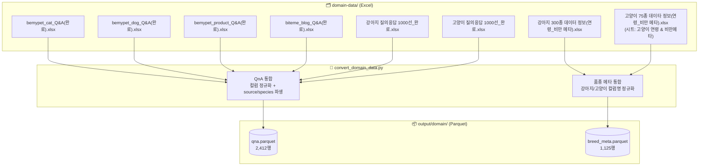
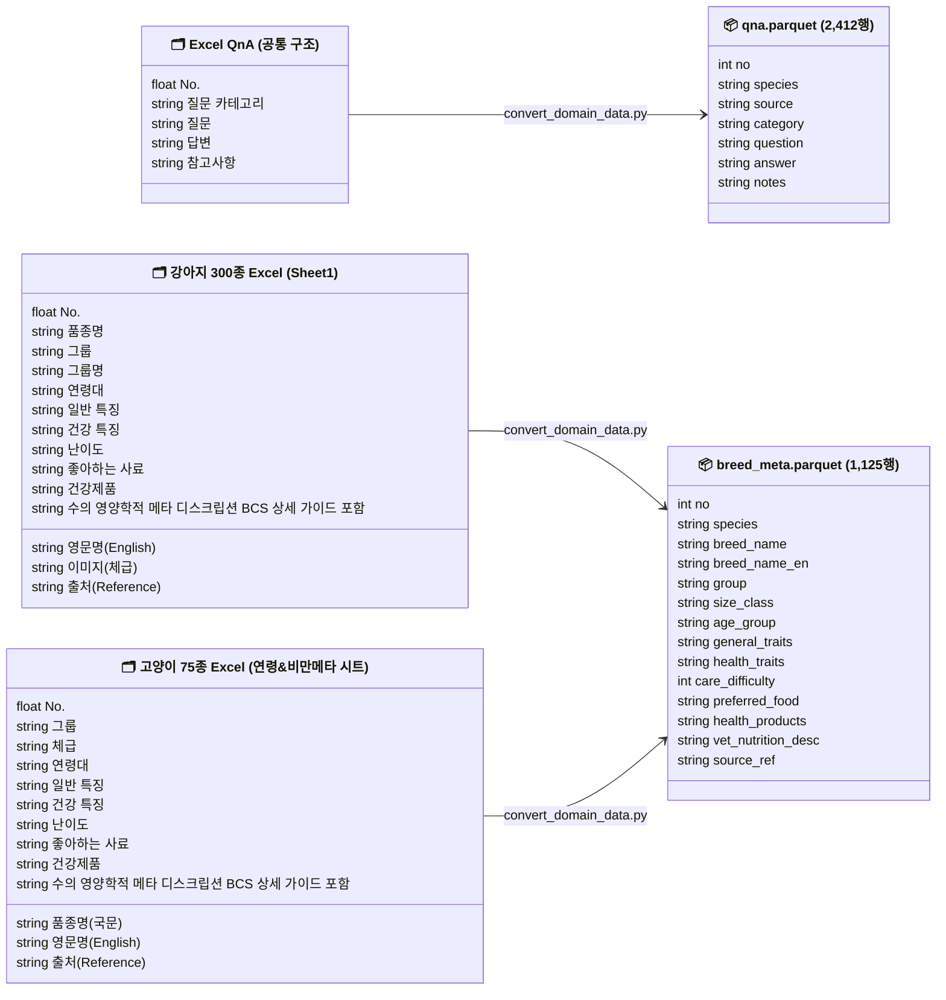

# 도메인 데이터 전처리 스키마 정의

> **범위**: `domain-data/` Excel → `output/domain/` Parquet 변환
> **스크립트**: `scripts/domain/convert_domain_data.py`
>
> 연계 문서: `docs/domain/02_domain_rag_pipeline.md` (Parquet → Qdrant 적재)

---

## 파이프라인 흐름



---

## 스키마 상세



---

## QnA 전처리

### 소스 파일별 메타

| 파일 | species | source | 행수 |
|---|---|---|---|
| `bemypet_cat_Q&A(완료).xlsx` | cat | bemypet | 116 |
| `bemypet_dog_Q&A(완료).xlsx` | dog | bemypet | 129 |
| `bemypet_product_Q&A(완료).xlsx` | both | bemypet | 116 |
| `biteme_blog_Q&A(완료).xlsx` | both | biteme | 51 |
| `강아지 질의응답 1000선_완료.xlsx` | dog | manual | 1,000 |
| `고양이 질의응답 1000선_완료.xlsx` | cat | manual | 1,000 |
| **합계** | | | **2,412** |

### 컬럼 변환

| 원본 컬럼 | 출력 컬럼 | 처리 |
|---|---|---|
| `No.` | `no` | float64 → int, 전체 통합 후 1부터 재부여 |
| `질문 카테고리` | `category` | 그대로 |
| `질문` | `question` | 그대로 |
| `답변` | `answer` | 그대로 |
| `참고사항` | `notes` | 그대로 |
| *(없음)* | `species` | 파일명 기준 파생: cat / dog / both |
| *(없음)* | `source` | 파일명 기준 파생: bemypet / biteme / manual |

### 품질 현황 (사전 확인)

| 항목 | 현황 |
|---|---|
| `=IMAGE()` 수식 행 | 없음 (전 파일 0건) |
| `답변` null | 없음 |
| `No.` dtype | float64 → int 변환 필요 |

### 카테고리 분포 (통합 기준)

| 카테고리 | 건수 |
|---|---|
| 사육 및 관리 | 710 |
| 건강 및 질병 | 576 |
| 영양 및 식단 | 563 |
| 행동 및 심리 | 554 |
| 여행 및 이동 | 8 |
| 미분류 | 1 |

---

## 품종 메타 전처리

### 소스 파일 구조

| 파일 | 읽을 시트 | 구조 | 행수 |
|---|---|---|---|
| `강아지 300종 데이터 정보(연령_비만 메타).xlsx` | Sheet1 (기본) | 300종 × 3연령대 (퍼피/어덜트/시니어) | 900 |
| `고양이 75종 데이타 정보(연령_비만 메타).xlsx` | `고양이 연령 & 비만메타` | 75종 × 3연령대 (키튼/어덜트/시니어) | 225 |
| **합계** | | | **1,125** |

> 고양이 파일은 시트 4개 중 `고양이 연령 & 비만메타` 시트만 사용. 기본 시트(75행)는 연령대 없는 요약본이므로 제외.

### 컬럼 정규화 매핑

| 출력 컬럼 | 강아지 원본 | 고양이 원본 | 비고 |
|---|---|---|---|
| `no` | `No.` | `No.` | float → int |
| `species` | *(없음)* | *(없음)* | `dog` / `cat` 파생 |
| `breed_name` | `품종명` | `품종명(국문)` | |
| `breed_name_en` | `영문명(English)` | `영문명(English)` | |
| `group` | `그룹` (단모종/장모종/특이종, GPT-4o-mini 분류 적용) | `그룹` (단모종/장모종/특이종) | 강아지 기존 숫자코드·`그룹명` 제거 |
| `size_class` | `이미지(체급)` → list | `체급` → list | 복합형 정규화: `소형/중형` → `["S","M"]` 등 |
| `age_group` | `연령대` (퍼피/어덜트/시니어) | `연령대` (키튼/어덜트/시니어) | |
| `general_traits` | `일반 특징` | `일반 특징` | |
| `health_traits` | `건강 특징` | `건강 특징` | |
| `care_difficulty` | `난이도` | `난이도` | |
| `preferred_food` | `좋아하는 사료` | `좋아하는 사료` | |
| `health_products` | `건강제품` | `건강제품` | |
| `vet_nutrition_desc` | `수의 영양학적 메타 디스크립션 (BCS 상세 가이드 포함)` | `수의 영양학적 메타 디스크립션 (BCS 상세 가이드 포함)` | |
| `source_ref` | `출처(Reference)` | `출처(Reference)` | |

> `이미지` 컬럼 (고양이 기본 시트)은 전부 NaN → 사용 시트에서는 `체급` 컬럼으로 대체됨.

---

## 실행

```bash
conda run -n final-project python scripts/domain/convert_domain_data.py
# 출력: output/domain/qna.parquet
#        output/domain/breed_meta.parquet
```
