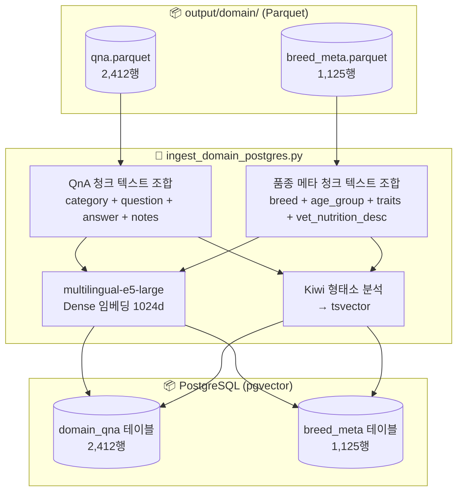
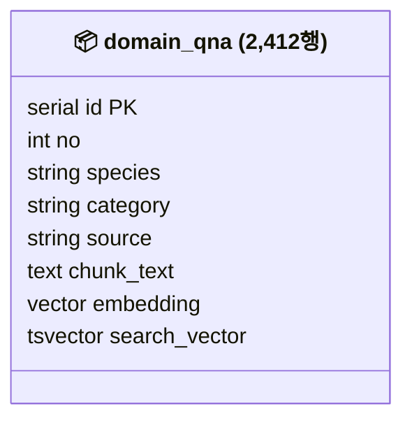
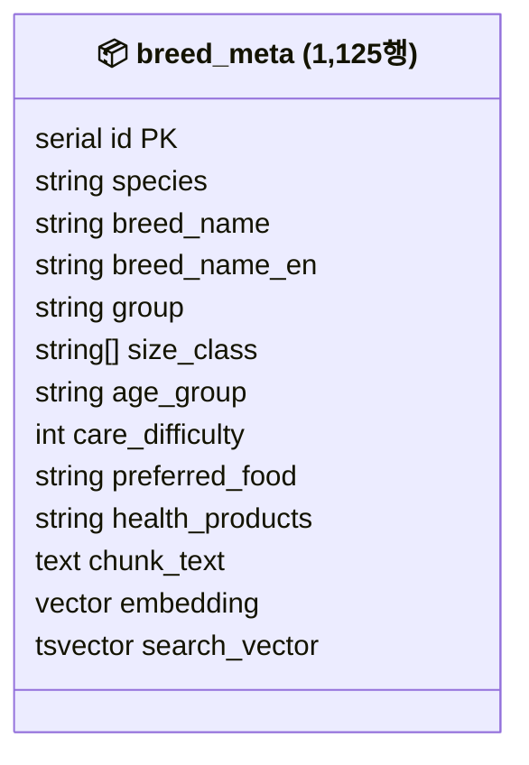

# 도메인 데이터 RAG 파이프라인 명세

> **범위**: `output/domain/` Parquet → 청크 텍스트 조합 → 임베딩 → PostgreSQL(pgvector) 적재
> **스크립트**: `scripts/domain/ingest_domain_postgres.py`
>
> 연계 문서: `docs/domain/01_domain_preprocessing.md` (Excel → Parquet 전처리)
> 연계 문서: `docs/planning/07_recommendation_architecture.md` (LangGraph 내 테이블 활용 맥락)

---

## 파이프라인 흐름



---

## 청크 텍스트 설계

벡터 임베딩에 입력되는 텍스트. 구조화된 레이블 형식으로 작성해 자연어 질문과의 의미 유사도를 높인다.

### domain_qna 청크

```
[카테고리] {category}
[질문] {question}
[답변] {answer}
[참고] {notes}
```

예시:
```
[카테고리] 건강 및 질병
[질문] 강아지가 초콜릿을 먹었어요. 어떻게 해야 하나요?
[답변] 초콜릿의 테오브로민 성분은 강아지가 대사하지 못해 심박수 급증, 경련 등을 유발합니다. 즉시 수의사에게 연락하세요.
[참고] 다크 초콜릿일수록 위험도가 높습니다.
```

### breed_meta 청크

```
[품종] {breed_name} ({breed_name_en}) — {species} / {group}
[연령대] {age_group}
[일반 특징] {general_traits}
[건강 특징] {health_traits}
[좋아하는 사료] {preferred_food}
[건강제품] {health_products}
[수의 영양학적 메타] {vet_nutrition_desc}
```

예시 (강아지 어덜트):
```
[품종] 말티즈 (Maltese) — 강아지 / 반려견·토이독
[연령대] 어덜트
[일반 특징] 애교가 많고 사람을 좋아하며 활발하다. 털 빠짐이 적어 알레르기 보호자에게 적합.
[건강 특징] 슬개골 탈구, 눈물 자국, 치주 질환 취약.
[좋아하는 사료] 소형견 전용 고단백 건식 사료
[건강제품] 관절 보조제, 눈물 제거제, 덴탈 껌
[수의 영양학적 메타] BCS 3/5 목표. 어덜트 기준 단백질 25% 이상, 지방 8~15% 권장...
```

예시 (고양이 키튼):
```
[품종] 코리안 숏헤어 (Korean Shorthair) — 고양이 / 단모종
[연령대] 키튼
[일반 특징] 적응력이 강하고 독립적이며 다양한 환경에서 잘 지낸다.
[건강 특징] 비교적 건강하나 비만 관리 필요.
[좋아하는 사료] 키튼 전용 고단백 사료
[건강제품] 종합 영양제
[수의 영양학적 메타] BCS 3/5 목표. 키튼 기준 단백질 30% 이상, DHA 함유 권장...
```

> **1행 = 1청크 유지 이유**: 강아지/고양이 모두 연령대(퍼피·키튼 / 어덜트 / 시니어)별 영양·사료 권장사항이 다르다(BCS 가이드 포함). 연령대별 청크를 유지해야 "퍼피 골든 리트리버에게 맞는 사료"처럼 연령이 명시된 질문에 정확히 매칭된다.

---

## PostgreSQL 테이블 스키마

### domain_qna



| 항목 | 값 |
|---|---|
| Dense 벡터 | pgvector, multilingual-e5-large (1024d), HNSW 인덱스 |
| Sparse 검색 | Kiwi + tsvector, GIN 인덱스 |
| 검색 방식 | Hybrid Search (pgvector Cosine + ts_rank + RRF) |
| 총 행 수 | 2,412 |

**컬럼 상세**

| 컬럼 | 타입 | 값 예시 | 용도 |
|---|---|---|---|
| `no` | int | 1, 2, ... | 식별자 |
| `species` | str | `dog` / `cat` / `both` | 펫 종 필터 |
| `category` | str | `건강 및 질병` | 서브도메인 필터 |
| `source` | str | `bemypet` / `biteme` / `manual` | 출처 구분 |
| `chunk_text` | text | 청크 원본 텍스트 | 디버깅/재생성용 |
| `embedding` | vector(1024) | Dense 벡터 | 의미 유사도 검색 |
| `search_vector` | tsvector | Kiwi 토큰화 결과 | 한국어 키워드 검색 |

### breed_meta



| 항목 | 값 |
|---|---|
| Dense 벡터 | pgvector, multilingual-e5-large (1024d), HNSW 인덱스 |
| Sparse 검색 | Kiwi + tsvector, GIN 인덱스 |
| 검색 방식 | **SQL WHERE** (breed_name + age_group exact match) |
| 총 행 수 | 1,125 (강아지 900 + 고양이 225) |

> `breed_name`은 pet 등록 시 정규화된 값이므로 벡터 유사도 검색 불필요. SQL `WHERE breed_name = ? AND age_group = ?` exact match 조회.

**컬럼 상세**

| 컬럼 | 타입 | 값 예시 | 용도 |
|---|---|---|---|
| `species` | str | `dog` / `cat` | 펫 종 필터 |
| `breed_name` | str | `말티즈` | 품종 매칭 |
| `breed_name_en` | str | `Maltese` | 영문 품종 매칭 |
| `group` | str | `단모종` / `장모종` / `특이종` | 강아지/고양이 동일 분류 체계 |
| `size_class` | text[] | `["S"]` / `["S","M"]` | 체급 필터 (`@>` 연산) |
| `age_group` | str | `퍼피`/`어덜트`/`시니어` (강아지)<br>`키튼`/`어덜트`/`시니어` (고양이) | 연령대 필터 |
| `care_difficulty` | int | 1~5 | 관리 난이도 |
| `preferred_food` | str\|null | `소형견 전용 고단백 건식 사료` | 추천 참고 |
| `health_products` | str\|null | `관절 보조제, 눈물 제거제` | 추천 참고 |
| `chunk_text` | text | 청크 원본 텍스트 | 디버깅/재생성용 |
| `embedding` | vector(1024) | Dense 벡터 | 의미 유사도 검색 |
| `search_vector` | tsvector | Kiwi 토큰화 결과 | 한국어 키워드 검색 |

---

## 실행

```bash
# Parquet → PostgreSQL 전체 적재
conda run -n final-project python scripts/domain/ingest_domain_postgres.py --table all

# 개별 테이블
conda run -n final-project python scripts/domain/ingest_domain_postgres.py --table qna
conda run -n final-project python scripts/domain/ingest_domain_postgres.py --table breed

# 테이블 재생성 (기존 데이터 삭제 후 재적재)
conda run -n final-project python scripts/domain/ingest_domain_postgres.py --table all --truncate
```

---

## LangGraph 활용 맥락

| 테이블 | 호출 노드 | 검색 필터 조건 |
|---|---|---|
| `domain_qna` | General 노드 (RAG) | `WHERE species IN (펫 종, 'both') AND category = 서브도메인 분류 결과` + pgvector Hybrid Search |
| `breed_meta` | PROFILE 노드 | `WHERE species = ? AND breed_name = ? AND age_group = ?` exact match → `health_products` / `preferred_food`를 ChatState `health_concerns` 자동 매핑에 활용. Hybrid Search 미사용. |
