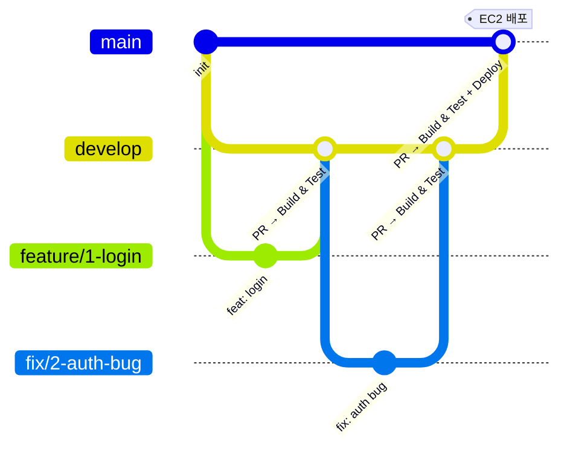

# GitHub Actions CI/CD 가이드

> **워크플로우 파일**: `.github/workflows/ci-cd.yml`
> **Jenkins 마이그레이션 예정**: `infra/Jenkinsfile` 참고

---

## 1. 브랜치 전략

작업 브랜치 네이밍: `feature/<이슈번호>-<설명>`, `fix/<이슈번호>-<설명>`, `hotfix/<설명>`, `docs/<이슈번호>-<설명>`



- `develop`: 기본 브랜치. feature/* PR 대상. Build & Test만 실행.
- `main`: 배포 전용. `develop` → PR로만 머지. 직접 push 금지.

---

## 2. 트리거 조건

| 이벤트 | 브랜치 | 실행 Job |
|---|---|---|
| `pull_request` | `develop` | Build & Test |
| `push` | `develop` | Build & Test |
| `pull_request` | `main` | Build & Test |
| `push` | `main` | Build & Test → Deploy to EC2 |

---

## 3. Job 흐름

### Build & Test

```
1. Checkout (actions/checkout@v4)
2. Docker Buildx 설정
3. infra/.env 생성 (GitHub Secrets에서 주입)
4. docker compose -f infra/docker-compose.yml build
5. docker compose run --rm django python manage.py test
6. docker compose down -v (정리)
```

### Deploy to EC2 (main push 시만)

```
1. Build & Test 완료 후 실행
2. appleboy/ssh-action으로 EC2 SSH 접속
3. git pull origin main
4. docker compose -f infra/docker-compose.yml up -d --build
5. python manage.py migrate --noinput
6. python manage.py collectstatic --noinput
```

---

## 4. GitHub Secrets 등록

`upstream 레포 → Settings → Secrets and variables → Actions → New repository secret`

| Secret | 설명 |
|---|---|
| `DJANGO_SECRET_KEY` | Django 시크릿 키 |
| `POSTGRES_DB` | DB 이름 |
| `POSTGRES_USER` | DB 유저 |
| `POSTGRES_PASSWORD` | DB 패스워드 |
| `EC2_HOST` | EC2 퍼블릭 IP (Elastic IP) |
| `EC2_USER` | EC2 접속 유저 (`ubuntu`) |
| `EC2_SSH_KEY` | EC2 키페어 private key 전체 내용 |

---

## 5. EC2 사전 준비

GitHub Actions Deploy Job 실행 전에 EC2에 아래가 준비되어 있어야 한다.

```bash
# Docker 설치
sudo apt-get update
sudo apt-get install -y docker.io docker-compose-plugin
sudo usermod -aG docker ubuntu

# 레포 클론
git clone https://github.com/skn-ai22-251029/SKN22-Final-2Team-WEB.git ~/SKN22-Final-2Team-WEB
cd ~/SKN22-Final-2Team-WEB

# .env 설정
cp infra/.env.example infra/.env
vi infra/.env  # POSTGRES_PASSWORD, DJANGO_SECRET_KEY 입력
```

> EC2 초기 설정 상세: `docs/infra/02_backend_setup.md`

---

## 6. 로컬에서 워크플로우 검증 (act)

```bash
# act 설치 (macOS)
brew install act

# 워크플로우 실행
act push -W .github/workflows/ci-cd.yml
```
