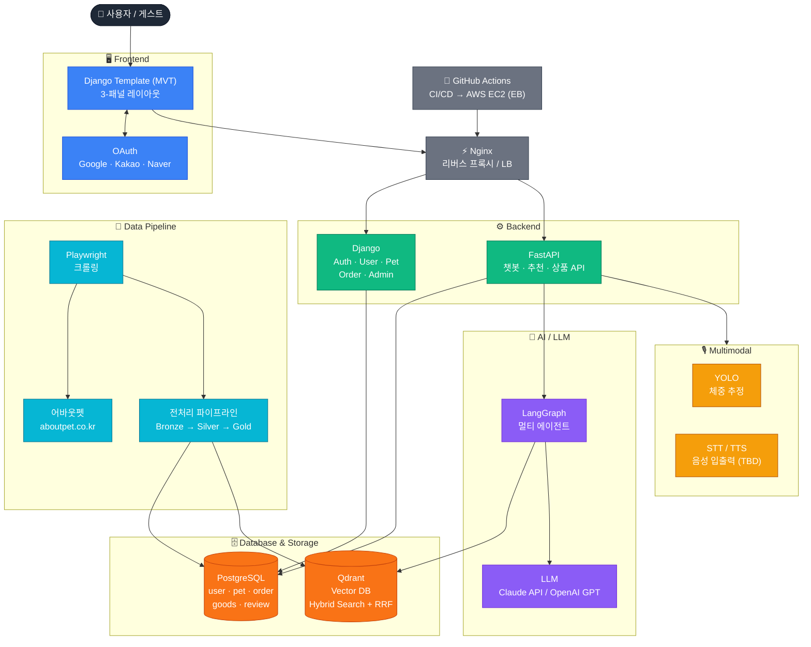

# 시스템 구성

> **프로젝트**: SKN22 Final Project · 2팀
> **작성일**: 2026-03-06

---

## 0. 전체 시스템 아키텍처 (Mermaid)



---

## 1. 전체 아키텍처

```
[사용자 / 게스트]
      │
      ▼
[Frontend]  Django Template (MVT) + Vanilla JS
  OAuth (Google / Kakao / Naver)
      │
      ▼
[Nginx]  리버스 프록시 / 로드 밸런싱
      │
      ├──► [Django]   Auth · User · Pet · Order · Admin API
      │         └── JWT 인증 / PostgreSQL
      │
      └──► [FastAPI]  챗봇 · 추천 · 상품 마이크로서비스 (RESTful)
                │
                ├── [LangGraph]  멀티 에이전트 오케스트레이션
                │       ├── 의도 분류 에이전트
                │       ├── 상품 검색 에이전트  ──► Qdrant (Hybrid Search + RRF)
                │       ├── 추천 에이전트
                │       └── 응답 생성 에이전트  ──► LLM (Claude API / OpenAI GPT)
                │
                ├── [PostgreSQL]  관계형 데이터
                │       user · pet · order · goods · review
                │
                └── [Qdrant]  Vector DB
                        Dense + Sparse Hybrid Search + RRF
```

---

## 2. 데이터 파이프라인

```
[어바웃펫 크롤링]
  Playwright
      │
      ▼
[Bronze]  원시 크롤링 데이터 (로컬 Parquet)
      │
      ▼
[Silver]  정제 · 정규화 (HTML 제거, 인코딩, 중복 제거)
      │
      ▼
[Gold]    분석 및 추천 신호 파생
  (OCR, 감성 분석, ABSA, popularity_score, 건강 관심사 태그)
      │
      ├──► PostgreSQL  (관계형 서빙 DB)
      └──► Qdrant      (벡터 임베딩 인덱싱)
```

---

## 3. Infra / DevOps

```
[AWS]
  ├── EC2                앱 서버 (Elastic Beanstalk로 프로비저닝)
  └── IAM                최소 권한 원칙

[Docker Compose 서비스 구성]
  ├── django       Django 백엔드 + Template 렌더링
  ├── fastapi      FastAPI 마이크로서비스
  ├── nginx        리버스 프록시 / LB
  ├── postgres     PostgreSQL 16
  └── qdrant       Vector DB

[CI/CD]  GitHub Actions
  └── PR → main: Build & Test
  └── push → main: DockerHub push → AWS EC2 (Elastic Beanstalk) 배포
```

---

## 4. Multimodal

```
[이미지 입력]
  MIME Type 검증 (프론트) → YOLO 분석 (체중 추정)  ※ S3 연동 미구현 (TBD)

[음성 입력 / 출력]  (구현 여부 TBD)
  STT: 마이크 입력 → 텍스트 변환 → 챗봇 전달
  TTS: LLM 응답 → 음성 출력
```
