# 데이터 모델 상세 명세

> ERD 및 엔티티별 컬럼 상세 정의

---

## ERD (Mermaid)

```mermaid
erDiagram

    USER {
        int     id              PK  "Django 기본 auto increment"
        string  email
        datetime created_at
        boolean is_active
        string  password        "Django AbstractBaseUser 필수 필드 — unusable password로 설정"
        datetime last_login     "Django 자동 관리"
        boolean is_superuser    "Django PermissionsMixin 필드"
        boolean is_staff        "Django Admin 접근 제어"
    }

    USER_PROFILE {
        int     user_id           PK "FK 1:1 → USER.id"
        string  nickname
        int     age               "nullable"
        string  gender            "nullable"
        string  address           "nullable — 기본 배송지"
        string  phone             "nullable"
        boolean marketing_consent
        string  profile_image_url "nullable"
        datetime updated_at
    }

    SOCIAL_ACCOUNT {
        int     id                PK
        int     user_id           FK
        string  provider          "google|naver|kakao"
        string  provider_user_id
        string  email             "blank 허용"
        jsonb   extra_data
        datetime created_at
        datetime updated_at
    }

    PET {
        uuid    pet_id          PK
        int     user_id         FK
        string  name
        string  species         "cat|dog"
        string  breed           "nullable"
        string  gender          "male|female"
        int     age_years
        int     age_months
        float   weight_kg       "nullable"
        boolean neutered        "nullable"
        date    vaccination_date "nullable"
        string  budget_range
        string  special_notes   "nullable"
        datetime created_at
        datetime updated_at
    }

    PET_HEALTH_CONCERN {
        uuid    id              PK
        uuid    pet_id          FK
        string  concern         "skin|joint|digestion|weight|urinary|eye|hairball|dental|immunity"
    }

    PET_ALLERGY {
        uuid    id              PK
        uuid    pet_id          FK
        string  ingredient
    }

    PET_FOOD_PREFERENCE {
        uuid    id              PK
        uuid    pet_id          FK
        string  food_type       "dry|wet_can|wet_pouch|freeze_dried|raw"
    }

    PRODUCT {
        string  goods_id               PK
        string  goods_name
        string  brand_name
        int     price
        int     discount_price
        numeric rating                 "5점 만점 (Gold: rating_raw/2)"
        int     review_count
        string  thumbnail_url
        string  product_url
        boolean soldout_yn
        boolean soldout_reliable       "GO 상품 등 옵션별 품절 구조는 false"
        string[]  pet_type             "강아지|고양이 (Silver 파싱)"
        string[]  category             "사료|간식|용품|... (Silver 파싱)"
        string[]  subcategory          "전연령|퍼피|시니어|... (Silver 파싱)"
        string[]  health_concern_tags  "관절|피부|소화|체중|요로|눈물|헤어볼|치아|면역"
        numeric popularity_score       "log(review_count+1) × rating"
        numeric sentiment_avg          "GP 제외 상품 감성 평균 (nullable)"
        numeric repeat_rate            "재구매 비율 (nullable)"
        jsonb   main_ingredients       "OCR 추출 원료 키워드 배열 (nullable, 식품류만)"
        jsonb   ingredient_composition "원료명별 함량 (nullable, 식품류만)"
        jsonb   nutrition_info         "영양성분 수치 (nullable, 식품류만)"
        text    ingredient_text_ocr    "상세 이미지 OCR 원문 (nullable, 식품류만)"
        datetime crawled_at
    }

    PRODUCT_CATEGORY_TAG {
        uuid    id              PK
        string  product_id      FK
        string  tag             "health concern 태그 (관절|피부|소화|체중|요로|눈물|헤어볼|치아|면역)"
    }

    PRODUCT_ADMIN_CONFIG {
        uuid    id              PK
        string  product_id      FK  "1:1"
        numeric admin_weight    "추천 가중치 (기본 1.0, >1.0 부스트)"
        boolean pinned          "최상단 고정 여부"
        string  memo            "nullable"
        datetime updated_at
    }

    REVIEW {
        string  review_id           PK  "goods_estm_no (어바웃펫 후기 번호)"
        string  product_id          FK
        numeric score               "5점 만점"
        string  content
        string  author_nickname
        date    written_at
        string  purchase_label      "first|repeat|null"
        numeric sentiment_score     "0.0~1.0 (Gold: 전체 문장 감성)"
        string  sentiment_label     "positive|negative|neutral"
        jsonb   absa_result         "Gold: {sentence, 기호성, 생체반응, 소화/배변, 제품 성상, 성분/원료, 냄새, 가격/구매, 배송/포장, 종합_확신도}"
        int     pet_age_months      "nullable (7개월→7, 3살→36)"
        numeric pet_weight_kg       "nullable"
        string  pet_gender          "nullable (수컷|암컷)"
        string  pet_breed           "nullable"
    }

    CHAT_SESSION {
        uuid    session_id      PK
        int     user_id         FK  "not null — 로그인 필수"
        uuid    target_pet_id   FK  "nullable"
        string  title
        datetime created_at
        datetime updated_at
    }

    CHAT_MESSAGE {
        uuid    message_id      PK
        uuid    session_id      FK
        string  role            "user|assistant"
        string  content
        datetime created_at
    }

    CART {
        uuid    cart_id         PK
        int     user_id         FK  "not null — 로그인 필수"
        datetime updated_at
    }

    CART_ITEM {
        uuid    cart_item_id    PK
        uuid    cart_id         FK
        string  product_id      FK
        int     quantity
        datetime added_at
    }

    ORDER {
        uuid    order_id          PK
        int     user_id           FK
        string  recipient_name    "주문 시 스냅샷"
        string  delivery_address  "주문 시 스냅샷"
        int     total_price
        string  status            "pending|completed|cancelled"
        datetime created_at
    }

    ORDER_ITEM {
        uuid    order_item_id   PK
        uuid    order_id        FK
        string  product_id      FK
        int     quantity
        int     price_at_order
    }

    PET_USED_PRODUCT {
        uuid    id              PK
        uuid    pet_id          FK
        string  product_id      FK
    }

    USER_INTERACTION {
        uuid    id               PK
        int     user_id          FK
        string  product_id       FK
        uuid    session_id       "nullable. FK 미적용"
        string  interaction_type "click|cart|purchase|reject"
        int     weight           "click=1|cart=3|purchase=5|reject=-1"
        datetime created_at
    }

    USER            ||--o{ PET                  : "1:N"
    USER            ||--o|  USER_PROFILE         : "1:1(optional before onboarding)"
    USER            ||--o{ SOCIAL_ACCOUNT       : "1:N"
    USER            ||--o{ CHAT_SESSION          : "1:N"
    USER            ||--o|  CART                 : "1:1"
    USER            ||--o{ ORDER                 : "1:N"

    PET             ||--o{ PET_HEALTH_CONCERN    : "1:N"
    PET             ||--o{ PET_ALLERGY           : "1:N"
    PET             ||--o{ PET_FOOD_PREFERENCE   : "1:N"
    PET             ||--o{ PET_USED_PRODUCT      : "1:N"

    CHAT_SESSION    ||--o{ CHAT_MESSAGE          : "1:N"
    CHAT_SESSION    }o--o|  PET                  : "N:1(optional)"

    PRODUCT         ||--o{ PRODUCT_CATEGORY_TAG  : "1:N"
    PRODUCT         ||--o|  PRODUCT_ADMIN_CONFIG  : "1:1(optional)"
    PRODUCT         ||--o{ REVIEW               : "1:N"
    PRODUCT         ||--o{ CART_ITEM             : "1:N"
    PRODUCT         ||--o{ ORDER_ITEM            : "1:N"
    PRODUCT         ||--o{ PET_USED_PRODUCT      : "1:N"

    CART            ||--o{ CART_ITEM             : "1:N"
    ORDER           ||--o{ ORDER_ITEM            : "1:N"

    USER            ||--o{ USER_INTERACTION      : "1:N"
    PRODUCT         ||--o{ USER_INTERACTION      : "1:N"
    CHAT_SESSION    ||--o{ USER_INTERACTION      : "1:N"
```



---

## 1. User

> Django `AbstractBaseUser` + `PermissionsMixin` 기반 커스텀 유저 모델.
> 현재 구현에는 이메일/비밀번호 로그인과 OAuth 로그인이 모두 존재한다.
> OAuth 계정 연결 정보는 프로젝트 커스텀 `social_account` 테이블에서 관리한다.

```json
{
  "id":             "int",      // PK. Django 기본 auto increment
  "email":          "string",
  "created_at":     "datetime",
  "is_active":      "boolean",

  // Django AbstractBaseUser 자동 관리 필드 (직접 사용 X)
  "password":       "string",
  "last_login":     "datetime | null",  // Django 로그인 시 자동 갱신
  "is_superuser":   "boolean",  // Django Admin 권한
  "is_staff":       "boolean"   // Django Admin 접근 제어
}
```

### USER_PROFILE

> 사용자 기본 프로필을 저장하는 1:1 엔티티.
> 현재 구현의 소셜 로그인 흐름에서는 최초 로그인 시점에 함께 생성될 수 있다.

```json
{
  "user_id":           "int",            // PK, FK → USER.id (1:1)
  "nickname":          "string",
  "age":               "int | null",
  "gender":            "string | null",
  "address":           "string | null",
  "phone":             "string | null",
  "marketing_consent": "boolean",
  "profile_image_url": "string | null",
  "updated_at":        "datetime"
}
```

### SOCIAL_ACCOUNT

> OAuth provider 계정과 우리 서비스 `user`를 연결하는 테이블.
> `provider + provider_user_id` 조합에 유니크 제약이 걸려 있다.

```json
{
  "id":               "bigint",
  "user_id":          "int",            // FK → USER.id
  "provider":         "google | naver | kakao",
  "provider_user_id": "string",
  "email":            "string",         // blank 허용
  "extra_data":       "object",         // provider 원본 프로필 payload
  "created_at":       "datetime",
  "updated_at":       "datetime"
}
```

## 2. Pet Profile

```json
{
  "pet_id":               "uuid",
  "user_id":              "int",
  "name":                 "string",
  "species":              "cat | dog",
  "breed":                "string | null",
  "gender":               "male | female",
  "age_years":            "int",
  "age_months":           "int",          // 월령 보정용. age_years=1, age_months=3 → 15개월
  "weight_kg":            "float | null",
  "neutered":             "true | false | null",
  "vaccination_date":     "date | null",
  "health_concerns":      ["skin", "joint", "digestion", "weight", "urinary", "eye", "hairball", "dental", "immunity"],  // PET_HEALTH_CONCERN
  "allergies":            ["string"],     // PET_ALLERGY. 원료명 자유 입력
  "food_type_preference": ["dry", "wet_can", "wet_pouch", "freeze_dried", "raw"],  // PET_FOOD_PREFERENCE
  "used_product_ids":     ["string"],     // PET_USED_PRODUCT. 현재 사용 중인 상품
  "special_notes":        "string | null",
  "created_at":           "datetime",
  "updated_at":           "datetime"
}
```

## 3. Chat Session

```json
{
  "session_id":    "uuid",
  "user_id":       "int",
  "title":         "string",
  "target_pet_id": "uuid | null",
  "messages": [
    {
      "message_id":     "uuid",
      "role":          "user | assistant",
      "content":       "string",
      "created_at":    "datetime"
    }
  ],
  "created_at": "datetime",
  "updated_at": "datetime"
}
```

## 4. Product

```json
{
  "goods_id":               "string",          // PK. 어바웃펫 상품 ID (GI/GP/GS/PI 접두사)
  "goods_name":             "string",
  "brand_name":             "string",
  "price":                  "int",             // 정가 원
  "discount_price":         "int",             // 할인가 원
  "rating":                 "numeric",         // 5점 만점
  "review_count":           "int",
  "thumbnail_url":          "string",
  "product_url":            "string",
  "soldout_yn":             "boolean",
  "soldout_reliable":       "boolean",         // GO 상품 등 옵션별 품절 구조는 false
  "pet_type":               "string[]",        // 강아지|고양이 (Silver 파싱)
  "category":               "string[]",        // 사료|간식|용품|... (Silver 파싱)
  "subcategory":            "string[]",        // 전연령|퍼피|시니어|... (Silver 파싱)
  "health_concern_tags":    "string[]",        // 관절|피부|소화|체중|요로|눈물|헤어볼|치아|면역
  "popularity_score":       "numeric",         // log(review_count+1) × rating
  "sentiment_avg":          "numeric | null",  // GP 제외 상품 감성 평균
  "repeat_rate":            "numeric | null",  // 재구매 비율
  "main_ingredients":       "string[] | null", // OCR 추출 원료 키워드 배열 (식품류만)
  "ingredient_composition": "object | null",   // {원료명: 함량%} (식품류만)
  "nutrition_info":         "object | null",   // {영양성분명: 수치} (식품류만)
  "ingredient_text_ocr":    "string | null",   // 상세 이미지 OCR 원문 (식품류만)
  "crawled_at":             "datetime"
}
```

### PRODUCT_CATEGORY_TAG

```json
{
  "id":         "uuid",
  "product_id": "string",  // FK → PRODUCT (Django ORM 기준 컬럼명)
  "tag":        "string"   // Gold 파생: LLM 분류 (OCR 텍스트 기반, 식품류만) — 관절|피부|소화|체중|요로|눈물|헤어볼|치아|면역
}
```

### PRODUCT_ADMIN_CONFIG

> `product`와 1:1로 연결되는 어드민 설정 테이블.

```json
{
  "id":           "uuid",
  "product_id":   "string",        // FK → PRODUCT (1:1)
  "admin_weight": "numeric",       // default 1.0
  "pinned":       "boolean",
  "memo":         "string | null",
  "updated_at":   "datetime"
}
```

---

## 5. Review

```json
{
  "review_id":       "string",        // PK. goods_estm_no (어바웃펫 후기 번호)
  "goods_id":        "string",        // FK → PRODUCT
  "score":           "float",         // 5점 만점
  "content":         "string",
  "author_nickname": "string",
  "written_at":      "date",
  "purchase_label":  "string | null", // first | repeat
  "sentiment_score": "float | null",  // 0.0~1.0 전체 문장 감성
  "sentiment_label": "string | null", // positive | negative | neutral
  "absa_result":     "object | null", // {sentence, 기호성, 생체반응, 소화/배변, 제품 성상, 성분/원료, 냄새, 가격/구매, 배송/포장, 종합_확신도}
  "pet_age_months":  "int | null",    // 7개월→7, 3살→36
  "pet_weight_kg":   "float | null",
  "pet_gender":      "string | null", // 수컷 | 암컷
  "pet_breed":       "string | null"
}
```

---

## 6. User Interaction

```json
{
  "id":               "uuid",
  "user_id":          "int",              // FK → USER.id
  "goods_id":         "string",           // FK → PRODUCT
  "session_id":       "uuid | null",      // 현재는 UUID만 저장, FK 제약 없음
  "interaction_type": "click | cart | purchase | reject",
  "weight":           "int",              // click=1 | cart=3 | purchase=5 | reject=-1
  "created_at":       "datetime"
}
```

---

## 7. Cart

```json
{
  "cart_id":    "uuid",
  "user_id":    "int",     // FK → USER.id, 1:1
  "items": [
    {
      "cart_item_id":   "uuid",
      "goods_id":      "string",
      "quantity":      "int",
      "added_at":      "datetime"
    }
  ],
  "updated_at": "datetime"
}
```

## 8. Order

```json
{
  "order_id":         "uuid",
  "user_id":          "int",
  "recipient_name":   "string",
  "delivery_address": "string",
  "items":            ["OrderItem"],
  "total_price":      "int",
  "status":           "pending | completed | cancelled",
  "created_at":       "datetime"
}
```
