# 데이터 모델 상세 명세

> ERD 및 엔티티별 컬럼 상세 정의

---

## ERD (Mermaid)

```mermaid
erDiagram

    USER {
        uuid    user_id         PK
        string  email
        string  password_hash   "nullable"
        string  oauth_provider  "google|kakao|naver|null"
        string  name
        int     age             "nullable"
        string  gender          "nullable"
        string  address         "nullable"
        string  profile_image_url "nullable"
        datetime created_at
    }

    USER_PREFERENCE {
        uuid    preference_id   PK
        uuid    user_id         FK
        string  response_style  "concise|detailed"
        int     card_count      "1|3|5"
        boolean save_history
        string  language        "ko|en"
    }

    PET {
        uuid    pet_id          PK
        uuid    user_id         FK
        string  name
        string  species         "cat|dog"
        string  breed           "nullable"
        string  gender          "male|female"
        int     age_years
        int     age_months
        float   weight_kg       "nullable"
        boolean neutered        "nullable"
        date    vaccination_date "nullable"
        string  budget_range
        string  special_notes   "nullable"
        datetime created_at
        datetime updated_at
    }

    PET_HEALTH_CONCERN {
        uuid    id              PK
        uuid    pet_id          FK
        string  concern         "skin|joint|digestion|weight|urinary|eye|hairball|dental|immunity"
    }

    PET_ALLERGY {
        uuid    id              PK
        uuid    pet_id          FK
        string  ingredient
    }

    PET_FOOD_PREFERENCE {
        uuid    id              PK
        uuid    pet_id          FK
        string  food_type       "dry|wet_can|wet_pouch|freeze_dried|raw"
    }

    PRODUCT {
        string  goods_id            PK
        string  goods_name
        string  brand_name
        int     price
        int     discount_price
        float   rating              "5점 만점 (Gold: rating_raw/2)"
        int     review_count
        string  thumbnail_url
        string  product_url
        boolean soldout_yn
        float   popularity_score    "log(review_count+1) × rating"
        float   trend_score         "최근 30일 리뷰 수 / 전체 리뷰 수"
        jsonb   main_ingredients    "상품명 파싱 + OCR 추출 성분 키워드 배열"
        text    ingredient_text_ocr "상세 이미지 OCR 원문 (nullable)"
        datetime crawled_at
    }

    PRODUCT_CATEGORY_TAG {
        uuid    id              PK
        string  goods_id        FK
        string  tag             "health concern 태그 (관절|피부|소화|체중|요로|눈물|헤어볼|치아|면역)"
    }

    REVIEW {
        uuid    review_id           PK
        string  goods_id            FK
        float   score               "5점 만점"
        string  content
        string  author_nickname
        datetime written_at
        string  purchase_label      "first|repeat|null"
        float   sentiment_score     "0.0~1.0 (Gold: 감성 분석)"
        string  sentiment_label     "positive|negative|neutral"
        int     pet_age_months      "nullable (7개월→7, 3살→36)"
        float   pet_weight_kg       "nullable"
        string  pet_gender          "nullable (수컷|암컷)"
        string  pet_breed           "nullable"
    }

    CHAT_SESSION {
        uuid    session_id      PK
        uuid    user_id         FK  "nullable(guest)"
        uuid    target_pet_id   FK  "nullable"
        string  title
        datetime created_at
        datetime updated_at
    }

    CHAT_MESSAGE {
        uuid    message_id      PK
        uuid    session_id      FK
        string  role            "user|assistant"
        string  content
        datetime created_at
    }

    MESSAGE_PRODUCT_CARD {
        uuid    id              PK
        uuid    message_id      FK
        string  goods_id        FK
        string  reason
    }

    CART {
        uuid    cart_id         PK
        uuid    user_id         FK  "nullable(guest=session)"
        datetime updated_at
    }

    CART_ITEM {
        uuid    cart_item_id    PK
        uuid    cart_id         FK
        string  goods_id        FK
        int     quantity
        datetime added_at
    }

    ORDER {
        uuid    order_id        PK
        uuid    user_id         FK
        int     total_price
        string  status          "pending|completed|cancelled"
        datetime created_at
    }

    ORDER_ITEM {
        uuid    order_item_id   PK
        uuid    order_id        FK
        string  goods_id        FK
        int     quantity
        int     price_at_order
    }

    PET_USED_PRODUCT {
        uuid    id              PK
        uuid    pet_id          FK
        string  goods_id        FK
    }

    USER_INTERACTION {
        uuid    id               PK
        uuid    user_id          FK  "nullable(guest)"
        string  goods_id         FK
        uuid    session_id       FK  "nullable"
        string  interaction_type "click|cart|purchase|reject"
        int     weight           "click=1|cart=3|purchase=5|reject=-1"
        datetime created_at
    }

    USER            ||--o{ PET                  : "1:N"
    USER            ||--||  USER_PREFERENCE      : "1:1"
    USER            ||--o{ CHAT_SESSION          : "1:N"
    USER            ||--o|  CART                 : "1:1"
    USER            ||--o{ ORDER                 : "1:N"

    PET             ||--o{ PET_HEALTH_CONCERN    : "1:N"
    PET             ||--o{ PET_ALLERGY           : "1:N"
    PET             ||--o{ PET_FOOD_PREFERENCE   : "1:N"
    PET             ||--o{ PET_USED_PRODUCT      : "1:N"

    CHAT_SESSION    ||--o{ CHAT_MESSAGE          : "1:N"
    CHAT_SESSION    }o--o|  PET                  : "N:1(optional)"

    CHAT_MESSAGE    ||--o{ MESSAGE_PRODUCT_CARD  : "1:N"

    PRODUCT         ||--o{ PRODUCT_CATEGORY_TAG  : "1:N"
    PRODUCT         ||--o{ REVIEW               : "1:N"
    PRODUCT         ||--o{ MESSAGE_PRODUCT_CARD  : "1:N"
    PRODUCT         ||--o{ CART_ITEM             : "1:N"
    PRODUCT         ||--o{ ORDER_ITEM            : "1:N"
    PRODUCT         ||--o{ PET_USED_PRODUCT      : "1:N"

    CART            ||--o{ CART_ITEM             : "1:N"
    ORDER           ||--o{ ORDER_ITEM            : "1:N"

    USER            ||--o{ USER_INTERACTION      : "1:N"
    PRODUCT         ||--o{ USER_INTERACTION      : "1:N"
    CHAT_SESSION    ||--o{ USER_INTERACTION      : "1:N"
```



---

## 6.1 User

```json
{
  "user_id": "uuid",
  "email": "string",
  "password_hash": "string | null",
  "oauth_provider": "google | kakao | naver | null",
  "name": "string",
  "age": "int | null",
  "gender": "string | null",
  "address": "string | null",
  "profile_image_url": "string | null",
  "created_at": "datetime",
  "preferences": {
    "response_style": "concise | detailed",
    "card_count": 1 | 3 | 5,
    "save_history": true | false,
    "language": "ko | en"
  }
}
```

## 6.2 Pet Profile

```json
{
  "pet_id": "uuid",
  "user_id": "uuid",
  "name": "string",
  "species": "cat | dog",
  "breed": "string | null",
  "gender": "male | female",
  "age_years": "int",
  "age_months": "int",
  "weight_kg": "float | null",
  "neutered": "true | false | null",
  "vaccination_date": "date | null",
  "health_concerns": ["skin", "joint", "digestion", "weight", "urinary", "eye", "hairball", "dental", "immunity"],
  "allergies": ["string"],
  "food_type_preference": ["dry", "wet_can", "wet_pouch", "freeze_dried", "raw"],
  "used_product_ids": ["string"],
  "special_notes": "string | null",
  "created_at": "datetime",
  "updated_at": "datetime"
}
```

## 6.3 Chat Session

```json
{
  "session_id": "uuid",
  "user_id": "uuid | null",
  "title": "string",
  "target_pet_id": "uuid | null",
  "messages": [
    {
      "role": "user | assistant",
      "content": "string",
      "product_cards": ["ProductCard"],
      "created_at": "datetime"
    }
  ],
  "created_at": "datetime",
  "updated_at": "datetime"
}
```

## 6.3-A Product

> S3 Medallion Gold 레이어 → PostgreSQL 적재 기준. 컬럼 출처는 괄호 표기.

```json
{
  "goods_id":             "string          -- PK. 어바웃펫 상품 ID (GI/GP/GS/PI 접두사)",
  "goods_name":           "string          -- 상품명 (Bronze: data-productname)",
  "brand_name":           "string          -- 브랜드명 (Bronze: data-brandname)",
  "price":                "int             -- 정가 원 (Bronze: data-price)",
  "discount_price":       "int             -- 할인가 원 (Bronze: data-discountprice)",
  "rating":               "float           -- 5점 만점 (Silver: data-goodsstarsavgcnt ÷ 2)",
  "review_count":         "int             -- 전체 리뷰 수 (Bronze: data-scorecnt)",
  "thumbnail_url":        "string          -- 대표 썸네일 CDN URL",
  "product_url":          "string          -- /goods/indexGoodsDetail?goodsId=...",
  "soldout_yn":           "boolean         -- 품절 여부 (Bronze: data-soldoutyn)",
  "popularity_score":     "float           -- Gold 파생: log(review_count+1) × rating",
  "trend_score":          "float           -- Gold 파생: 최근 30일 리뷰 수 / 전체 리뷰 수",
  "main_ingredients":     "string[]        -- Gold 파생: 상품명 키워드 추출 + OCR (치킨|연어|오리|소고기 등)",
  "ingredient_text_ocr":  "string | null   -- Gold 파생: indexGoodsDetail img[src*='editor/goods_desc/'] OCR 원문 (식품류만)",
  "crawled_at":           "datetime"
}
```

### PRODUCT_CATEGORY_TAG

```json
{
  "id":       "uuid",
  "goods_id": "string  -- FK → PRODUCT",
  "tag":      "string  -- Gold 파생: disp_clsf_no → 헬스 태그 매핑 (관절|피부|소화|체중|요로|눈물|헤어볼|치아|면역)"
}
```

---

## 6.3-B Review

> S3 Medallion Gold 레이어 → PostgreSQL 적재 기준.

```json
{
  "review_id":        "string          -- PK. goods_estm_no (어바웃펫 후기 번호)",
  "goods_id":         "string          -- FK → PRODUCT",
  "score":            "float           -- 5점 만점 (Silver: star_class p_X_Y 파싱)",
  "content":          "string          -- 후기 본문 (Silver: HTML 정제)",
  "author_nickname":  "string          -- 작성자 닉네임",
  "written_at":       "date            -- 작성일 (Silver: YYYY.MM.DD 파싱)",
  "purchase_label":   "string | null   -- first | repeat (Bronze 직접 수집)",
  "sentiment_score":  "float | null    -- Gold 파생: 0.0~1.0 한국어 감성 분석",
  "sentiment_label":  "string | null   -- Gold 파생: positive | negative | neutral",
  "pet_age_months":   "int | null      -- Silver 파싱: 7개월→7, 3살→36",
  "pet_weight_kg":    "float | null    -- Silver 파싱: 2.5kg→2.5",
  "pet_gender":       "string | null   -- 수컷 | 암컷",
  "pet_breed":        "string | null   -- 품종명 (등록 시에만)"
}
```

---

## 6.3-C User Interaction (Phase 2 — CF 준비)

> Day 1부터 로깅. CF 모델 학습 전에도 데이터 축적 목적.

```json
{
  "id":               "uuid",
  "user_id":          "uuid | null  -- guest = null",
  "goods_id":         "string       -- FK → PRODUCT",
  "session_id":       "uuid | null  -- FK → CHAT_SESSION",
  "interaction_type": "click | cart | purchase | reject",
  "weight":           "int          -- click=1 | cart=3 | purchase=5 | reject=-1",
  "created_at":       "datetime"
}
```

---

## 6.4 Product Card

```json
{
  "goods_id": "string",
  "goods_name": "string",
  "brand_name": "string",
  "price": "int",
  "discount_price": "int",
  "rating": "float",
  "review_count": "int",
  "thumbnail_url": "string",
  "product_url": "string",
  "category_tags": ["string"],
  "reason": "string"
}
```

## 6.5 Cart

```json
{
  "cart_id": "uuid",
  "user_id": "uuid | null",
  "items": [
    {
      "goods_id": "string",
      "goods_name": "string",
      "price": "int",
      "thumbnail_url": "string",
      "quantity": "int",
      "added_at": "datetime"
    }
  ],
  "updated_at": "datetime"
}
```

## 6.6 Order

```json
{
  "order_id": "uuid",
  "user_id": "uuid",
  "items": ["CartItem"],
  "total_price": "int",
  "status": "pending | completed | cancelled",
  "created_at": "datetime"
}
```
