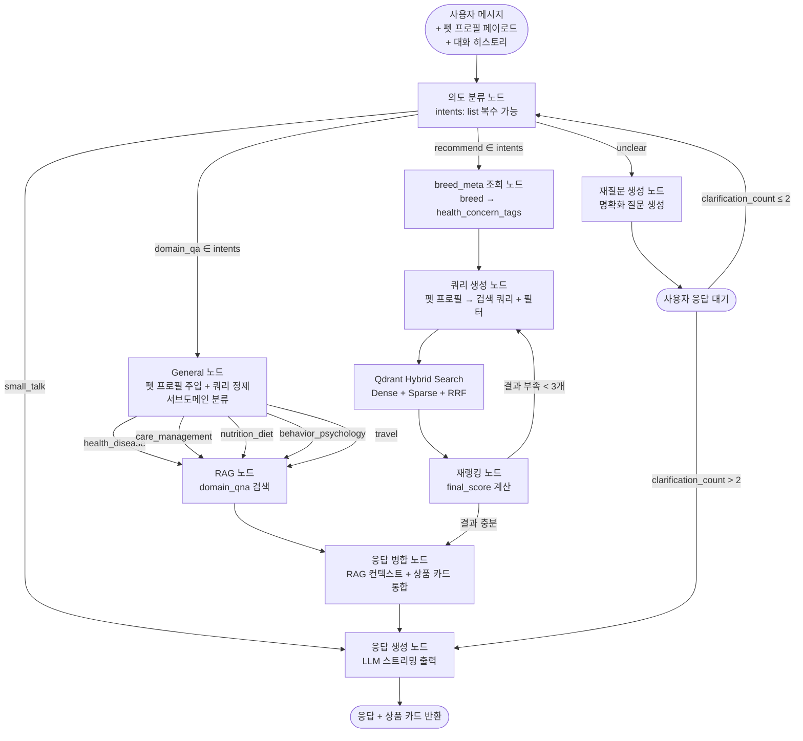

# 추천 시스템 아키텍처

> **Phase 1**: RAG + Content-based Filtering (서비스 런칭)
> **Phase 2**: CF 레이어 추가 (사용자 상호작용 데이터 축적 후)
>
> 상세 피처 정의 및 LangGraph State 구조: `docs/data/08_feature_engineering_and_recommendation.md`

---

## Phase 1 — LangGraph 기반 추천

### 추천 흐름

LangGraph **순환(cyclic) 그래프** 구조. 의도 불명확 시 재질문 루프, 검색 결과 부족 시 필터 완화 후 재검색 루프를 포함한다.

> **펫 프로필 전달 방식**: 프론트엔드 Zustand 상태 → API 요청 페이로드에 포함 → FastAPI가 ChatState에 주입. DB 조회 없음.
>
> **병렬 실행**: `domain_qa + recommend` 동시 감지 시 LangGraph `Send` API로 fan-out. MERGE 노드에서 fan-in.



### 노드 구성 및 라우팅

**intent 분류 → 라우팅 (복수 가능)**

| intent | 다음 노드 | 설명 |
|---|---|---|
| `recommend` | PROFILE | 상품 추천 플로우. `domain_qa`와 동시 발화 가능 |
| `domain_qa` | GENERAL | 도메인 QA 플로우. `recommend`와 동시 발화 가능 |
| `small_talk` | RESPOND | 일반 대화. 단독 발화만 |
| `unclear` | CLARIFY | 어떤 intent도 확신 불가 시. 재질문 후 INTENT 재시도 |

**General 노드 역할 (domain_qa 전용)**

| 단계 | 설명 |
|---|---|
| 펫 프로필 주입 | ChatState의 pet_profile (요청 페이로드 출처)을 쿼리 컨텍스트에 반영 |
| 쿼리 정제 | "이거 먹어도 돼요?" → "말티즈 5kg 3살 수컷이 [식품명]을 먹어도 되는지" |
| 서브도메인 분류 | health_disease / care_management / nutrition_diet / behavior_psychology / travel |
| 정보 보완 | 프로필 없으면 세션 컨텍스트에서 추론 |

**MERGE 노드 동작**

| 수신 결과 | 출력 |
|---|---|
| RAG만 | 도메인 답변만 |
| 상품 카드만 | 상품 추천만 |
| RAG + 상품 카드 | 도메인 답변 + 상품 카드 통합 |

**서브도메인 → Qdrant domain_qna category 필터 매핑**

| 서브도메인 | QnA category 필터 | 설명 |
|---|---|---|
| `health_disease` | 건강 및 질병 | 질병, 증상, 응급 상황 |
| `care_management` | 사육 및 관리 | 용품, 위생, 생활 환경 |
| `nutrition_diet` | 영양 및 식단 | 사료, 간식, 영양소 |
| `behavior_psychology` | 행동 및 심리 | 훈련, 분리불안, 습관 |
| `travel` | 여행 및 이동 | 이동장, 비행기, 여행 |

**순환 엣지**

| 순환 | 조건 | 설명 |
|---|---|---|
| `CLARIFY → INTENT` | clarification_count ≤ 2 | 재질문 후 사용자 답변으로 의도 재분류 |
| `CLARIFY → RESPOND` | clarification_count > 2 | 2회 재질문 후에도 불명확 → 컨텍스트 기반 best-effort 응답 |
| `RERANK → QUERY` | 검색 결과 < 3개 | 필터 조건 완화 후 재검색 |

### Qdrant 임베딩 대상

```python
product_text = " ".join([
    product_name, brand_name,
    " ".join(subcategory_names or []),
    " ".join(health_concern_tags or []),
    " ".join(main_ingredients or []),
    " ".join(f"{k} {v}" for k, v in (ingredient_composition or {}).items()),
    " ".join(f"{k} {v}" for k, v in (nutrition_info or {}).items()),
])
# embed(product_text) → dense vector (multilingual-e5-large, 1024d)
# BM25(product_text)  → sparse vector
```

- `ingredient_composition` / `nutrition_info`: dict → `"원료명 함량% ..."` 직렬화 (ingest_qdrant.py에서 처리)
- `ingredient_text_ocr`: payload 저장 전용 (알레르기 키워드 매칭). 임베딩 제외 — OCR 노이즈 많음
- **GP 상품 (prefix=GP) 제외**: 기획전 카드 섹션 전용, Qdrant 미적재

### Phase 1 랭킹 수식

```
final_score = α × rrf_score
            + β × normalize(popularity_score)
            + γ × sentiment_avg
            + ε × absa_aspect_score[detected_aspect]  # 속성 감지 시만 적용

기본 가중치 (튜닝 필요):
  α = 0.5   검색 적합도 (Qdrant RRF)
  β = 0.25  인기도 (log(review_count+1) × rating_5pt)
  γ = 0.25  감성 품질 (상품별 sentiment_score 평균)
  ε = 0.1   ABSA 속성 (미감지 시 ε = 0)
```

> - `sentiment_avg` null 상품: γ = 0, β로 보완
> - 가중치는 A/B 테스트로 튜닝 예정

---

## Phase 2 — CF 레이어 추가

### 전제 조건

- 서비스 런칭 후 실사용자 상호작용 데이터 최소 **수천 건** 이상 축적
- 신규 유저(상호작용 < N건)는 CF_score 미적용 (cold-start fallback = Phase 1 그대로)

### 수집할 상호작용 데이터 (Day 1부터 로깅)

| 이벤트 | 신호 방향 | 가중치 |
|--------|---------|-------|
| 상품 카드 클릭 | 약한 긍정 | 1 |
| 장바구니 담기 | 강한 긍정 | 3 |
| 구매 완료 | 가장 강한 긍정 | 5 |
| "이거 말고 다른 거" 요청 | 약한 거절 | -1 |
| 대화 종료 후 미구매 | 중립 | 0 |

```sql
-- Phase 2 준비: schema.sql에 추가 예정
CREATE TABLE user_interaction (
    id               UUID         PRIMARY KEY DEFAULT gen_random_uuid(),
    user_id          UUID         REFERENCES "user"(user_id) ON DELETE SET NULL,
    goods_id         VARCHAR(20)  REFERENCES product(goods_id) ON DELETE CASCADE,
    session_id       UUID         REFERENCES chat_session(session_id) ON DELETE SET NULL,
    interaction_type VARCHAR(20)  NOT NULL
                     CHECK (interaction_type IN ('click', 'cart', 'purchase', 'reject')),
    weight           SMALLINT     NOT NULL DEFAULT 1,
    created_at       TIMESTAMPTZ  NOT NULL DEFAULT NOW()
);

CREATE INDEX idx_ui_user_id  ON user_interaction(user_id);
CREATE INDEX idx_ui_goods_id ON user_interaction(goods_id);
```

### CF 모델 후보

| 모델 | 특징 | 선택 기준 |
|------|------|---------|
| **Implicit ALS** | 암묵적 피드백 특화, 빠른 학습 | 상호작용 데이터만 있을 때 |
| **LightFM** | Content feature 결합 가능 | 상품 메타데이터(성분/태그) 활용 시 |

### Phase 2 랭킹 수식

```
final_score = α × rrf_score
            + β × normalize(popularity_score)
            + γ × sentiment_avg
            + ε × absa_aspect_score[detected_aspect]
            + ζ × CF_score             # ← 추가

# cold-start 처리
ζ = 0    if user_interaction_count < THRESHOLD
ζ = 0.2  otherwise
```

### CF 확장을 위한 설계 원칙

1. **랭킹 레이어를 함수로 추상화** — `rank(candidates, context) → scored_list`
   - Phase 1: CF_score 항 = 0으로 호출
   - Phase 2: CF_score 주입

2. **상호작용 로깅은 Day 1부터** — CF 모델 학습 전에도 데이터 쌓기

3. **A/B 테스트 준비** — 유저 세그먼트별 가중치 실험 가능하도록 config 분리

---

## 단계별 로드맵

```
[현재] Bronze 크롤링 → Silver ETL → Gold (OCR, 감성분석, 피처 집계)
                                            │
                                            ▼
[Phase 1] PostgreSQL + Qdrant 적재 → LangGraph 구현 → 서비스 배포
                                            │
                                            ▼ (런칭 후 수개월)
[Phase 2] user_interaction 로그 축적 → CF 모델 학습 → 랭킹 레이어에 CF_score 추가
```
