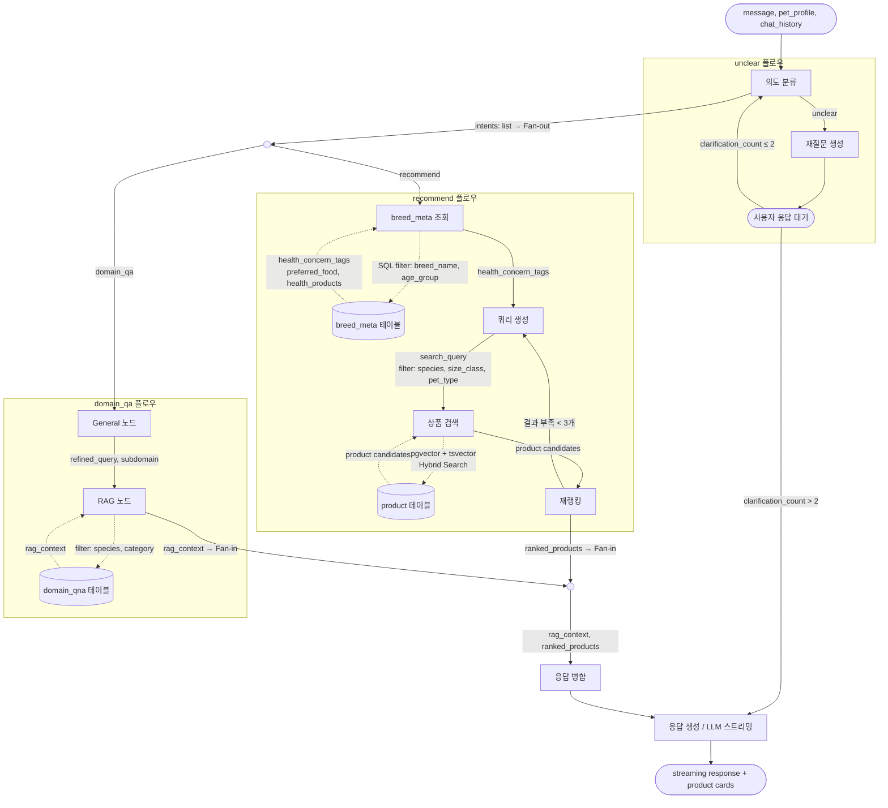

# 추천 시스템 아키텍처

> **Phase 1**: RAG + Content-based Filtering (서비스 런칭)
> **Phase 2**: CF 레이어 추가 (사용자 상호작용 데이터 축적 후)
>
> 연계 문서: `docs/data/05_feature_engineering.md` (피처 정의, Implicit/Explicit 데이터)

---

## 1. LangGraph State 구조

```python
class ChatState(TypedDict):
    # 사용자 입력
    messages: list[BaseMessage]          # 대화 히스토리
    user_input: str                      # 현재 턴 사용자 메시지

    # 사용자 / 펫 정보
    # 프론트엔드 → API 요청 페이로드에 포함 → FastAPI가 State에 주입
    user_id: str | None                  # 로그인 필수, None은 미인증 상태
    pet_profile: dict | None             # 품종, 나이, 체중, 성별
    health_concerns: list[str]           # PET_HEALTH_CONCERN
    allergies: list[str]                 # PET_ALLERGY
    food_preferences: list[str]          # PET_FOOD_PREFERENCE

    # 의도 분류 결과
    intents: list[str]                   # 복수 가능: ["domain_qa", "recommend"] 동시 발화 지원
                                         # 단독: ["recommend"] / ["domain_qa"] / ["unclear"]
                                         # small_talk 없음 — 잡담·무관 입력도 unclear로 처리 (도메인 유도)
    domain_intent: str | None            # General 노드 서브분류: health_disease / care_management /
                                         #   nutrition_diet / behavior_psychology / travel
    clarification_count: int             # 재질문 횟수 (최대 2회)
    detected_aspect: str | None          # ABSA 속성 (기호성, 소화/배변 등)
    budget: int | None                   # 예산 (챗봇에서 언급 시)

    # 검색 / 추천 결과
    search_query: str | None
    filters: dict | None
    search_results: list[dict]
    reranked_results: list[dict]

    # 최종 출력
    response: str
    product_cards: list[dict]
```

---

## 2. Phase 1 — LangGraph 기반 추천

### 2-1. 전체 흐름

LangGraph **순환(cyclic) 그래프** 구조. 의도 불명확 시 재질문 루프, 검색 결과 부족 시 필터 완화 후 재검색 루프를 포함한다.

> **펫 프로필 전달 방식**: API 요청 페이로드에 포함 → FastAPI가 ChatState에 주입. DB 조회 없음.
>
> **병렬 실행**: `domain_qa + recommend` 동시 감지 시 LangGraph `Send` API로 fan-out. MERGE 노드에서 fan-in.



### 2-2. 노드 구성 및 라우팅

**intent 분류 → 라우팅 (복수 가능)**

| intent | 다음 노드 | 설명 |
|---|---|---|
| `recommend` | PROFILE | 상품 추천 플로우. `domain_qa`와 동시 발화 가능 |
| `domain_qa` | GENERAL | 도메인 QA 플로우. `recommend`와 동시 발화 가능 |
| `unclear` | CLARIFY | `recommend` / `domain_qa` 외 모든 입력 (잡담·무관 포함). 도메인으로 유도 후 INTENT 재시도. 2회 초과 시 best-effort 응답 |

**General 노드 역할 (domain_qa 전용)**

| 단계 | 설명 |
|---|---|
| 펫 프로필 주입 | ChatState의 pet_profile (요청 페이로드 출처)을 쿼리 컨텍스트에 반영 |
| 쿼리 정제 | "이거 먹어도 돼요?" → "말티즈 5kg 3살 수컷이 [식품명]을 먹어도 되는지" |
| 서브도메인 분류 | health_disease / care_management / nutrition_diet / behavior_psychology / travel |
| 정보 보완 | 프로필 없으면 세션 컨텍스트에서 추론 |

**MERGE 노드 동작**

| 수신 결과 | 출력 |
|---|---|
| RAG만 | 도메인 답변만 |
| 상품 카드만 | 상품 추천만 |
| RAG + 상품 카드 | 도메인 답변 + 상품 카드 통합 |

**서브도메인 → domain_qna category 필터 매핑**

| 서브도메인 | QnA category 필터 | 설명 |
|---|---|---|
| `health_disease` | 건강 및 질병 | 질병, 증상, 응급 상황 |
| `care_management` | 사육 및 관리 | 용품, 위생, 생활 환경 |
| `nutrition_diet` | 영양 및 식단 | 사료, 간식, 영양소 |
| `behavior_psychology` | 행동 및 심리 | 훈련, 분리불안, 습관 |
| `travel` | 여행 및 이동 | 이동장, 비행기, 여행 |

**순환 엣지**

| 순환 | 조건 | 설명 |
|---|---|---|
| `CLARIFY → INTENT` | clarification_count ≤ 2 | 재질문 후 사용자 답변으로 의도 재분류 |
| `CLARIFY → RESPOND` | clarification_count > 2 | 2회 재질문 후에도 불명확 / 잡담 지속 시 → 컨텍스트 기반 best-effort 응답 |
| `RERANK → QUERY` | 검색 결과 < 3개 | 필터 조건 완화 후 재검색 |

### 2-3. Hybrid Search (pgvector + tsvector)

**상품 검색**: PostgreSQL `product` 테이블에서 pgvector Dense + Kiwi tsvector + RRF로 검색.

**도메인 검색**: `domain_qna`, `breed_meta` 테이블에서 pgvector Dense + tsvector로 검색.

> **GP 상품 (prefix='GP') 제외**: `embedding = NULL`로 저장. 벡터 검색 대상에서 자동 제외.
>
> **`ingredient_composition` / `nutrition_info`**: `product` 테이블에 JSONB로 저장 (상품 상세 모달). 인제스트 시 직렬화하여 `embedding_text`에 포함.
>
> **`ingredient_text_ocr`**: `product` 테이블에 저장 (알레르기 키워드 매칭). `embedding_text` 제외 — OCR 원문 노이즈.

**임베딩 텍스트 조합 (`ingest_postgres.py`)**

```python
product_text = " ".join([
    product_name, brand_name,
    " ".join(subcategory_names or []),
    " ".join(health_concern_tags or []),
    " ".join(main_ingredients or []),
    " ".join(f"{k} {v}" for k, v in (ingredient_composition or {}).items()),
    " ".join(f"{k} {v}" for k, v in (nutrition_info or {}).items()),
])
# embed(product_text) → dense vector (multilingual-e5-large, 1024d) → product.embedding
# Kiwi(product_text) → 형태소 토큰 → to_tsvector('simple', 토큰) → product.search_vector
```

**검색 방식**

```
Dense:  pgvector (multilingual-e5-large, 1024d) — 의미 유사도 (HNSW 인덱스)
Sparse: Kiwi + tsvector (PostgreSQL 내장) — 한국어 키워드 정밀 매칭 (GIN 인덱스)
융합:   RRF (Reciprocal Rank Fusion) — Dense + Sparse 점수 통합
```

**필터링 조건 (우선순위 순, SQL WHERE)**

```python
1. sold_out = False  AND  (soldout_reliable = True OR soldout_reliable = False 허용 시)
2. health_concern_tags @> ARRAY[PET_HEALTH_CONCERN]
3. main_ingredients ∩ PET_ALLERGY = ∅  (+ ingredient_text_ocr 키워드 보완)
4. category 매칭 PET_FOOD_PREFERENCE  OR  pet_type 매칭 (강아지/고양이)
5. price ≤ 예산 상한  (챗봇에서 언급 시만 적용)
```

> `health_concern_tags` null 상품(ocr_target 외 기준 전체 72%): 조건 2 스킵, `pet_type` + `category` 필터만 적용.

### 2-4. 재랭킹 수식

```
final_score = α × rrf_score
            + β × normalize(popularity_score)
            + γ × sentiment_avg
            + δ × repeat_rate
            + ε × absa_aspect_score[detected_aspect]  # 속성 감지 시만 적용

기본 가중치 (Phase 1, 튜닝 필요):
  α = 0.50  검색 적합도 (pgvector + tsvector RRF)
  β = 0.25  인기도 (log(review_count+1) × rating_5pt)
  γ = 0.15  감성 품질 (상품별 sentiment_score 평균)
  δ = 0.10  재구매율 (repeat 리뷰 비율)
  ε = 0.10  ABSA 속성 (미감지 시 ε = 0)
```

> α + β + γ + δ = 1.0 기준 정규화. 가중치는 A/B 테스트로 튜닝 예정.

**피처 가용 조건별 Fallback**

실적재 기준 null 비율: `sentiment_avg` / `repeat_rate` 각 52.6% (1,903/3,618), `popularity_score` 7.2% (259/3,618).

| 케이스 | 조건 | 적용 가중치 | 해당 비율 |
|---|---|---|---|
| **A** (풀 스코어링) | `sentiment_avg` ✓, `repeat_rate` ✓, `popularity_score` ✓ | α·β·γ·δ 모두 적용 | 47.4% (1,715/3,618) |
| **B** (리뷰 없음) | `sentiment_avg` null, `repeat_rate` null | γ = 0, δ = 0 → β를 0.35로 상향 (`popularity_score`로 품질 proxy 대체) | 52.6% (1,903/3,618) |
| **C** (신상품) | `sentiment_avg` null, `repeat_rate` null, `popularity_score` null | γ = 0, δ = 0, β = 0 → α = 1.0 (RRF만) | 259건 중 일부 |
| **D** (ABSA 감지) | `detected_aspect` ≠ None | ε 추가 적용, α·β 소폭 하향 조정 | 의도 분류 시 동적 적용 |

**rating 단독 사용 금지**

- `rating_5pt` 분포: 5점 77.4%, 평균 4.73 → 단독으로 품질 식별 불가.
- `popularity_score = log(review_count + 1) × rating_5pt` 형태로만 사용 (리뷰 수로 편향 보정).
- 재랭킹 수식에서 `rating` 직접 항으로 사용 금지.

### 2-5. Cold-start 처리

| 케이스 | 전략 |
|---|---|
| 펫 프로필 없음 (온보딩 미완료) | 카테고리 인기 기반 추천 (`popularity_score` 상위) — Fallback B/C 기준 |
| 펫 프로필 있음, 구매 이력 없음 | 품종 메타 → `health_concern_tags` 자동 매핑 → SQL WHERE 필터 검색 |
| 신규 상품 (리뷰 0건) | Fallback C: `rrf_score`(α)만으로 랭킹 |
| `health_concern_tags` null 상품 | 조건 2 필터 스킵, `pet_type` + `category` 필터만 적용 |

---

## 3. Phase 2 — CF 레이어 추가

### 전제 조건

- 서비스 런칭 후 실사용자 상호작용 데이터 최소 **수천 건** 이상 축적
- 신규 유저(상호작용 < N건)는 CF_score 미적용 (cold-start fallback = Phase 1 그대로)

### 수집할 상호작용 데이터 (Day 1부터 로깅)

| 이벤트 | 신호 방향 | 가중치 |
|--------|---------|-------|
| 상품 카드 클릭 | 약한 긍정 | 1 |
| 장바구니 담기 | 강한 긍정 | 3 |
| 구매 완료 | 가장 강한 긍정 | 5 |
| "이거 말고 다른 거" 요청 | 약한 거절 | -1 |
| 대화 종료 후 미구매 | 중립 | 0 |

```sql
-- Phase 2 준비: schema.sql에 추가 예정
CREATE TABLE user_interaction (
    id               UUID         PRIMARY KEY DEFAULT gen_random_uuid(),
    user_id          UUID         REFERENCES "user"(user_id) ON DELETE SET NULL,
    goods_id         VARCHAR(20)  REFERENCES product(goods_id) ON DELETE CASCADE,
    session_id       UUID         REFERENCES chat_session(session_id) ON DELETE SET NULL,
    interaction_type VARCHAR(20)  NOT NULL
                     CHECK (interaction_type IN ('click', 'cart', 'purchase', 'reject')),
    weight           SMALLINT     NOT NULL DEFAULT 1,
    created_at       TIMESTAMPTZ  NOT NULL DEFAULT NOW()
);

CREATE INDEX idx_ui_user_id  ON user_interaction(user_id);
CREATE INDEX idx_ui_goods_id ON user_interaction(goods_id);
```

### CF 모델 후보

| 모델 | 특징 | 선택 기준 |
|------|------|---------|
| **Implicit ALS** | 암묵적 피드백 특화, 빠른 학습 | 상호작용 데이터만 있을 때 |
| **LightFM** | Content feature 결합 가능 | 상품 메타데이터(성분/태그) 활용 시 |

### Phase 2 랭킹 수식

```
final_score = α × rrf_score
            + β × normalize(popularity_score)
            + γ × sentiment_avg
            + δ × repeat_rate
            + ε × absa_aspect_score[detected_aspect]
            + ζ × CF_score             # ← 추가

# cold-start 처리
ζ = 0    if user_interaction_count < THRESHOLD
ζ = 0.2  otherwise
```

### CF 확장을 위한 설계 원칙

1. **랭킹 레이어를 함수로 추상화** — `rank(candidates, context) → scored_list`
   - Phase 1: CF_score 항 = 0으로 호출
   - Phase 2: CF_score 주입

2. **상호작용 로깅은 Day 1부터** — CF 모델 학습 전에도 데이터 쌓기

3. **A/B 테스트 준비** — 유저 세그먼트별 가중치 실험 가능하도록 config 분리

---

## 4. 단계별 로드맵

```
[현재] Bronze 크롤링 → Silver ETL → Gold (OCR, 감성분석, 피처 집계)
                                            │
                                            ▼
[Phase 1] PostgreSQL (pgvector + tsvector) 적재 → LangGraph 구현 → 서비스 배포
                                            │
                                            ▼ (런칭 후 수개월)
[Phase 2] user_interaction 로그 축적 → CF 모델 학습 → 랭킹 레이어에 CF_score 추가
```
