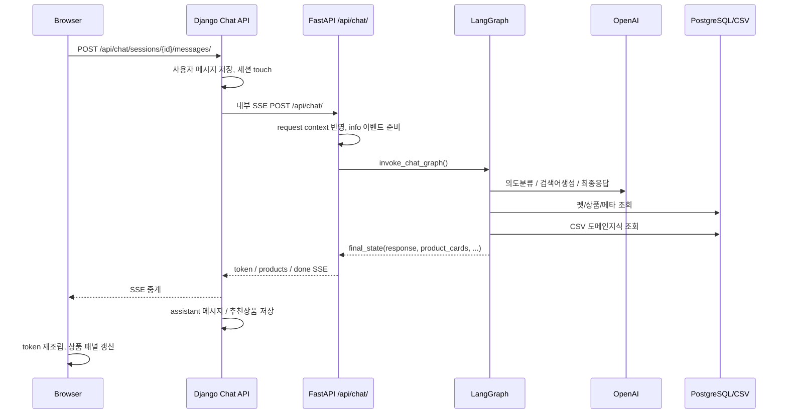

# 현재 코드 기준 질문 1건 처리 흐름 추적 및 리팩토링 계획

## 목적

이 문서는 현재 코드 기준으로 사용자 질문 1건이 실제로 어떻게 처리되는지 추적하고,
아래 책임이 한 파일 안에 함께 섞여 있는 지점을 식별하기 위한 문서다.

- LLM 호출
- DB/CSV 조회
- 프롬프트 생성
- 응답 조립
- 운영 로그
- 대화 기록 저장

기존 `MAINTAINABLE_STRUCTURE_RECOMMENDATION.md`가 구조 권장안 중심이라면,
이 문서는 "실제 런타임 경로"와 "현실적인 분리 순서"에 집중한다.

기준 시점:

- 웹 저장소 현재 작업 트리
- Django 채팅 프록시 + FastAPI `final_ai` 현재 구조

---

## 1. 실제 질문 1건 처리 흐름

### 1-1. 한눈에 보는 흐름

### 1-2. 브라우저 -> Django

브라우저는 FastAPI를 직접 호출하지 않는다.

- 진입 페이지: `services/django/templates/chat/index.html`
- 실제 메시지 전송: `/api/chat/sessions/{session_id}/messages/`
- 브라우저는 `token`, `products`, `done` SSE 이벤트를 직접 읽어 UI를 갱신한다.

핵심 의미:

- 사용자 권한과 대화 세션의 진실 공급원은 Django다.
- FastAPI는 "내부 AI 실행기"로만 사용된다.

### 1-3. Django API에서 사용자 메시지 저장 후 FastAPI payload 생성

핵심 파일:

- `services/django/chat/api/views.py`
- `services/django/chat/dto/chat_payload.py`

실제 동작:

1. `session_messages_proxy_view()`가 로그인 여부와 세션 소유권을 확인한다.
2. 사용자 메시지를 `ChatMessage(role="user")`로 즉시 저장한다.
3. `touch_session()`으로 세션 갱신 시간을 올린다.
4. `build_chat_payload()`로 FastAPI용 payload를 다시 조립한다.
5. 이 시점에 `user_id`, `thread_id`, `target_pet_id`가 Django 기준으로 강제된다.

핵심 의미:

- 브라우저가 준 값 그대로 FastAPI로 보내지 않는다.
- Django가 "권한 보정 + 안전한 내부 payload 생성"을 수행한다.

### 1-4. Django가 FastAPI로 내부 SSE 프록시 요청

핵심 파일:

- `services/django/chat/services/chat_stream_service.py`
- `services/django/chat/clients/fastapi_chat_client.py`

실제 동작:

1. `persist_streamed_response()`가 `capture` 딕셔너리를 준비한다.
2. 내부에서 `stream_fastapi_response()`를 호출한다.
3. Django는 `X-Internal-Service-Token`, `X-User-Id`를 붙여 FastAPI `/api/chat/`에 POST한다.
4. FastAPI 응답 SSE를 브라우저로 그대로 중계한다.
5. 동시에 `capture_sse_event()`로 `token`, `products`, `error`, `done`를 다시 읽어 저장용 상태를 축적한다.

핵심 의미:

- Django는 단순 reverse proxy가 아니다.
- transport, SSE 해석, 후속 저장 준비가 함께 들어 있다.

### 1-5. FastAPI 라우터가 request context를 붙이고 채팅 스트림 시작

핵심 파일:

- `services/fastapi/final_ai/api/routers/chat.py`
- `services/fastapi/final_ai/application/chat/dto.py`
- `services/fastapi/final_ai/application/chat/service.py`

실제 동작:

1. `/api/chat/` 라우터가 `RequestAuthContext`를 의존성으로 받아 request metadata를 구성한다.
2. `_apply_request_context()`가 `request_id`, `user_id`, `thread_id`를 `ChatRequest`에 반영한다.
3. `build_chat_execution_request()`가 graph 입력 state와 config metadata를 만든다.
4. `stream_chat_events()`가 펫 이름을 조회해 `info` 이벤트를 먼저 보낸다.
5. 이후 `invoke_chat_graph()`를 별도 thread에서 실행한다.

핵심 의미:

- 현재 FastAPI는 "HTTP 라우터"와 "실제 대화 스트림 오케스트레이션"이 완전히 분리되진 않았다.
- 그래프 실행 전 UX용 `info` 메시지와 metadata 로깅이 이미 여기서 수행된다.

### 1-6. Graph가 의도분류 후 branch 실행

핵심 파일:

- `services/fastapi/final_ai/graph/builder.py`
- `services/fastapi/final_ai/graph/nodes/*.py`

현재 실제 branch:

1. `intent`
2. 조건에 따라
   - `clarify`
   - `general -> rag`
   - `profile -> query -> search -> rerank`
   - domain + recommend 복합이면 fan-out 후 `merge`
3. `respond`

`route_intent()`는 아래 값으로 분기를 결정한다.

- `intents`
- `filters.pet_type`
- `filters.category`
- `pet_profile.species`
- `form_hint`
- `filter_relaxation_count`

### 1-7. 실제 LLM 호출 지점

현재 질문 1건 처리 중 LLM은 아래 파일에서 직접 호출된다.

- `services/fastapi/final_ai/domain/intent/service.py`
  - 의도 분류
- `services/fastapi/final_ai/domain/domain_qa/query_service.py`
  - 도메인 질의 재작성
- `services/fastapi/final_ai/domain/recommendation/query_service.py`
  - 상품 검색 질의 생성
- `services/fastapi/final_ai/domain/response/compose_service.py`
  - 최종 한국어 답변 생성

즉 현재는 "그래프 노드 -> 도메인 서비스 -> 곧바로 OpenAI 호출" 구조다.

### 1-8. 실제 DB/CSV 조회 지점

현재 질문 1건 처리 중 조회는 아래 경로로 일어난다.

- Django
  - `ChatMessage.objects.create()`
  - `ChatSession` 조회/갱신
  - `Product.objects.in_bulk()` 및 `ChatMessageRecommendation.bulk_create()`
- FastAPI
  - `domain/profile/service.py` -> `pet_repository.py`
  - `domain/recommendation/profile_service.py` -> `pet_repository.py`
  - `domain/recommendation/search_service.py` -> `hybrid_search.py`, `product_repository.py`
  - `domain/domain_qa/retrieval_service.py` -> `domain_repository.py`
  - `domain/response/compose_service.py` -> `get_user_pets()`

즉 "추천 실행"만 해도 펫 정보, 품종 메타, 상품 검색, 보충 상품, 도메인 CSV까지 여러 저장소가 동시에 개입한다.

### 1-9. FastAPI가 최종 응답을 SSE로 변환

핵심 파일:

- `services/fastapi/final_ai/application/chat/service.py`
- `services/fastapi/final_ai/api/presenters/sse.py`

실제 동작:

1. Graph 결과의 `response` 문자열을 `_stream_response_tokens()`가 공백 단위로 분해한다.
2. `token` 이벤트를 순서대로 보낸다.
3. `product_cards`를 `products` 이벤트로 보낸다.
4. 마지막에 `done` 이벤트를 보낸다.

핵심 의미:

- 실제 토큰 스트리밍이 아니라 "완성된 응답 문자열을 2차 분해"한 pseudo-stream이다.
- 응답 생성과 스트림 표현이 아직 강하게 묶여 있다.

### 1-10. Django가 assistant 응답과 추천상품을 저장

핵심 파일:

- `services/django/chat/services/chat_stream_service.py`
- `services/django/chat/services/chat_message_service.py`

실제 동작:

1. FastAPI SSE가 끝나면 `capture` 상태를 확인한다.
2. `assistant_text` 또는 `error_message`를 assistant 메시지로 저장한다.
3. `product_cards`가 있으면 `ChatMessageRecommendation`으로 연결 저장한다.
4. 세션을 다시 `touch` 한다.

핵심 의미:

- 브라우저는 이미 SSE를 받아 UI를 만들었지만,
- Django도 같은 SSE를 다시 읽어 저장용 결과를 재구성한다.

---

## 2. 이 흐름에서 질문 1건과 직접 관련 없는 경로

현재 질문 1건 처리의 핵심 경로는 `/api/chat/` 이다.

아래 라우터는 현재 "질문 1건 처리 주 경로"에는 직접 참여하지 않는다.

- `services/fastapi/final_ai/api/routers/recommend.py`
- `services/fastapi/final_ai/api/routers/products.py`

즉, 추천도 현재는 별도 `/api/recommend`가 아니라 `/api/chat/` 내부 graph 흐름 안에서 처리된다.

---

## 3. 책임 혼재 지점 지도

### 3-1. 혼재 매트릭스

`Y`는 그 책임이 해당 파일 안에 직접 들어 있다는 뜻이다.

| 파일 | LLM 호출 | DB/CSV 조회 | 프롬프트 생성 | 응답 조립 | 운영 로그 | 대화 기록 저장 | 메모 |
| --- | --- | --- | --- | --- | --- | --- | --- |
| `services/django/chat/api/views.py` | N | Y | N | Y | N | Y | HTTP, 권한, 세션 CRUD, 메시지 생성, 스트림 시작점이 한 모듈에 모여 있음 |
| `services/django/chat/clients/fastapi_chat_client.py` | N | N | N | Y | N | N | HTTP transport + SSE decode + error mapping + capture mutation |
| `services/django/chat/services/chat_stream_service.py` | N | Y | N | Y | N | Y | 스트림 relay 결과를 다시 저장용 assistant 결과로 조립 |
| `services/fastapi/final_ai/application/chat/service.py` | N | Y | N | Y | Y | N | info 이벤트, graph 실행, disconnect 처리, token 분해, 에러 매핑이 같이 있음 |
| `services/fastapi/final_ai/domain/intent/service.py` | Y | Y | Y | Y | Y | N | 의도분류, 펫 전환, 필터 보정, 후속 큐, 상태머신이 한 파일에 집중 |
| `services/fastapi/final_ai/domain/recommendation/profile_service.py` | N | Y | N | Y | Y | N | DB 조회 + 품종 메타 조합 + 나이/예산/미스매치 정책 |
| `services/fastapi/final_ai/domain/recommendation/query_service.py` | Y | N | Y | Y | Y | N | 검색 질의 프롬프트 + LLM 호출 + fallback 정책 |
| `services/fastapi/final_ai/domain/recommendation/search_service.py` | N | Y | N | Y | Y | N | hybrid search 호출 + 상품 룰 필터 + GP 보충 + 재시도 상태 |
| `services/fastapi/final_ai/domain/domain_qa/query_service.py` | Y | N | Y | N | Y | N | 작은 편이지만 프롬프트와 LLM 호출이 바로 붙어 있음 |
| `services/fastapi/final_ai/domain/response/compose_service.py` | Y | Y | Y | Y | Y | N | 최종 답변 prompt, 펫/대기정보 조회, fallback, response 생성이 같이 있음 |
| `services/fastapi/final_ai/infrastructure/search/hybrid_search.py` | N | Y | N | Y | Y | N | 임베딩, SQL, loose fallback, RRF score까지 한 파일 |

### 3-2. 가장 먼저 쪼개야 하는 파일

우선순위 기준으로 보면 아래 6개가 핵심이다.

1. `services/django/chat/services/chat_stream_service.py`
2. `services/django/chat/clients/fastapi_chat_client.py`
3. `services/fastapi/final_ai/application/chat/service.py`
4. `services/fastapi/final_ai/domain/intent/service.py`
5. `services/fastapi/final_ai/domain/recommendation/search_service.py`
6. `services/fastapi/final_ai/domain/response/compose_service.py`

이유:

- 질문 1건의 hot path에 항상 걸린다.
- 장애 시 영향 범위가 넓다.
- 테스트 없이 수정하기 가장 위험한 파일들이다.

---

## 4. 파일별 역할표

### 4-1. Django 쪽

| 파일 | 현재 역할 | 질문 1건 처리에서 하는 일 | 이상적인 역할 |
| --- | --- | --- | --- |
| `services/django/chat/api/views.py` | 채팅 API 컨트롤러 | 인증, 세션 조회, 사용자 메시지 저장, payload 생성, 스트림 반환 | HTTP 입출력과 권한 확인만 담당 |
| `services/django/chat/dto/chat_payload.py` | 내부 요청 DTO 빌더 | FastAPI용 안전 payload 생성 | 유지 가능 |
| `services/django/chat/clients/fastapi_chat_client.py` | 내부 FastAPI SSE 클라이언트 | 내부 헤더, httpx stream, SSE 이벤트 parse, 에러 변환 | transport + SSE decode 전용 |
| `services/django/chat/services/chat_stream_service.py` | 스트림 저장 오케스트레이터 | capture 누적, assistant 저장, 추천상품 저장 | 스트림 결과 저장 orchestration 전용 |
| `services/django/chat/services/chat_message_service.py` | 추천상품 저장 | `product_cards -> ChatMessageRecommendation` 변환 | 유지 가능 |
| `services/django/chat/services/chat_session_service.py` | 세션 메타 갱신 | `touch_session`, 메타 갱신 | 유지 가능 |
| `services/django/chat/selectors/chat_selector.py` | 세션 접근 selector | 세션 소유권 조회 | 유지 가능 |

### 4-2. FastAPI 쪽

| 파일 | 현재 역할 | 질문 1건 처리에서 하는 일 | 이상적인 역할 |
| --- | --- | --- | --- |
| `services/fastapi/final_ai/api/routers/chat.py` | 채팅 엔드포인트 | request context 반영, 스트림 응답 시작 | thin controller |
| `services/fastapi/final_ai/application/chat/dto.py` | graph 실행 입력 DTO | initial_state/config 구성 | 유지 가능 |
| `services/fastapi/final_ai/application/chat/service.py` | 채팅 스트림 오케스트레이터 | info 이벤트, graph 실행, token 분해, products/done 송신 | stream orchestration 전용 |
| `services/fastapi/final_ai/application/chat/graph_service.py` | graph invoke adapter | compiled graph 호출 | 유지 가능 |
| `services/fastapi/final_ai/graph/builder.py` | graph topology | node wiring, route policy | topology + routing only |
| `services/fastapi/final_ai/domain/intent/service.py` | 의도분류 핵심 서비스 | prompt, LLM, 펫 전환, 필터 해석, 후속 요청 상태 | classifier / pet-switch policy / filter resolver로 분리 |
| `services/fastapi/final_ai/domain/recommendation/profile_service.py` | 추천용 프로필 조합 | 펫 DB 조회, 품종 메타, 나이/예산/미스매치 계산 | profile assembler + policy 분리 |
| `services/fastapi/final_ai/domain/recommendation/query_service.py` | 검색어 생성 | prompt, LLM, fallback 검색어 | prompt builder + LLM adapter + fallback 분리 |
| `services/fastapi/final_ai/domain/recommendation/search_service.py` | 검색 결과 필터링 | hybrid search, form/allergy/age 필터, GP 보충 | search orchestrator + filter policies 분리 |
| `services/fastapi/final_ai/domain/recommendation/rerank_service.py` | 재랭킹 | 점수 계산, retry flag | 유지 가능, scoring helper만 추가 |
| `services/fastapi/final_ai/domain/domain_qa/query_service.py` | domain 질의 재작성 | prompt + LLM 호출 | 유지 가능, prompt builder만 분리 |
| `services/fastapi/final_ai/domain/domain_qa/retrieval_service.py` | domain context 조회 | CSV 검색 결과를 context로 변환 | 유지 가능 |
| `services/fastapi/final_ai/domain/response/compose_service.py` | 최종 답변 생성 | prompt, 펫/대기정보 조회, fallback, 최종 response | response prompt builder + response generator + fallback policy 분리 |
| `services/fastapi/final_ai/infrastructure/search/hybrid_search.py` | hybrid search infra | embedding, SQL, loose fallback, RRF | SQL adapter / ranking combiner / fallback searcher 분리 |

---

## 5. 지금 구조가 유지보수에서 위험한 이유

### 5-1. SSE를 세 군데에서 재조립한다

현재 응답은 아래 세 레이어에서 각각 다시 해석된다.

- FastAPI `application/chat/service.py`
  - 완성된 `response`를 `token` 이벤트로 다시 분해
- Django `clients/fastapi_chat_client.py`
  - FastAPI SSE를 다시 읽어 `capture` 누적
- 브라우저 `templates/chat/index.html`
  - `token`을 다시 이어붙여 최종 문장 생성

결과:

- 스트림 포맷이 바뀌면 세 군데가 같이 깨질 수 있다.
- assistant 저장 결과와 실제 UI 표시 결과가 달라질 여지가 있다.

### 5-2. "운영 로그"와 "사용자 대화 저장"이 명확히 분리되지 않았다

현재 두 종류의 기록이 섞여 있다.

- 운영 로그
  - FastAPI 각 서비스에서 `logger.info`, `warning`, `exception`
- 사용자 대화 저장
  - Django `ChatMessage`, `ChatMessageRecommendation`

문제는 둘 다 각자의 경계에서 끝나지 않는다는 점이다.

- FastAPI는 비즈니스 로직 중간중간에서 직접 로그를 남긴다.
- Django는 transport 중계 중간에 저장용 결과를 다시 만들고 DB에 쓴다.

즉 "관측"과 "사용자 기록"이 모두 orchestration 안에 섞여 있다.

### 5-3. 그래프 노드가 오케스트레이터라기보다 실행 본체에 가깝다

현재 graph node는 얇은 위임자에 가까워졌지만,
실제 도메인 서비스는 아직 아래 책임을 동시에 가진다.

- 상태 전이
- 프롬프트 생성
- LLM 호출
- DB/CSV 조회
- fallback 정책
- 로그

이 구조에서는 테스트가 "상태 + 외부 의존성 + 프롬프트 + 정책"을 동시에 준비해야 해서 비싸다.

---

## 6. 현실적인 리팩토링 원칙

이번 리팩토링은 big-bang rename 방식보다, 질문 1건 hot path를 기준으로 안전하게 나누는 것이 맞다.

원칙:

1. `/api/chat/` HTTP 계약과 SSE 계약은 먼저 고정한다.
2. Django의 "proxy/relay"와 "대화 저장"을 분리한다.
3. FastAPI의 "stream orchestration"과 "LLM/검색 use case"를 분리한다.
4. 프롬프트 문자열과 정책 코드를 먼저 분리하고, 그다음 LLM adapter를 공통화한다.
5. 검색 SQL과 후처리 정책을 같은 파일에 두지 않는다.
6. 각 단계마다 기존 테스트 + SSE smoke test를 유지한다.

---

## 7. 현실적인 단계별 계획

### Phase 1. Django 스트림 경계 정리

목표:

- Django를 "권한/세션/저장" 경계와 "FastAPI transport" 경계로 나눈다.

권장 작업:

- `services/django/chat/clients/fastapi_chat_client.py`
  - `transport client`와 `sse event decoder`를 분리
- 새 파일 추가
  - `services/django/chat/application/chat_proxy_service.py`
  - `services/django/chat/application/stream_capture_service.py`
  - `services/django/chat/application/conversation_persistence_service.py`

역할 분리 제안:

- `chat_proxy_service.py`
  - payload 생성 후 upstream stream 호출
- `stream_capture_service.py`
  - SSE event list -> `assistant_text`, `product_cards`, `error` 누적
- `conversation_persistence_service.py`
  - 최종 assistant draft 저장
  - 추천상품 연결 저장

완료 조건:

- `api/views.py`는 HTTP 검증과 service 호출만 남는다.
- `fastapi_chat_client.py`는 DB 저장 로직을 전혀 모른다.

### Phase 2. FastAPI 스트림 오케스트레이션 정리

목표:

- `application/chat/service.py`를 "graph 실행"과 "이벤트 스트리밍 표현"으로 나눈다.

권장 작업:

- 새 파일 추가
  - `services/fastapi/final_ai/application/chat/stream_orchestrator.py`
  - `services/fastapi/final_ai/application/chat/event_stream_service.py`

역할 분리 제안:

- `stream_orchestrator.py`
  - request metadata
  - graph invoke
  - cancel/disconnect 처리
- `event_stream_service.py`
  - `info`, `token`, `products`, `done` event sequence 생성
  - tokenization 정책 관리

완료 조건:

- `application/chat/service.py`가 없어지거나 얇은 facade만 남는다.
- token 스트림 정책이 graph invoke와 분리된다.

### Phase 3. intent 서비스 분해

목표:

- 현재 가장 복잡한 `domain/intent/service.py`를 3~4개 단위로 나눈다.

권장 작업:

- 새 파일 추가
  - `services/fastapi/final_ai/domain/intent/classifier.py`
  - `services/fastapi/final_ai/domain/intent/pet_switch_policy.py`
  - `services/fastapi/final_ai/domain/intent/filter_resolver.py`
  - `services/fastapi/final_ai/domain/intent/followup_queue_policy.py`

분리 기준:

- `classifier.py`
  - prompt 호출과 raw LLM result만 반환
- `pet_switch_policy.py`
  - `mentioned_pet_names`, `target_pet_id`, `pending_pet_ids` 처리
- `filter_resolver.py`
  - `category`, `subcategory`, `form_hint` 계산
- `followup_queue_policy.py`
  - `pending_categories`, next-request 처리

완료 조건:

- `classify_intent()`는 "조합자" 역할만 남는다.
- 펫 전환 정책 테스트를 독립적으로 쓸 수 있다.

### Phase 4. recommendation 검색 책임 분리

목표:

- `profile/query/search/rerank` 흐름을 use case 단위로 더 명확히 나눈다.

권장 작업:

- 새 파일 추가
  - `services/fastapi/final_ai/domain/recommendation/query_prompt_builder.py`
  - `services/fastapi/final_ai/domain/recommendation/filter_policy.py`
  - `services/fastapi/final_ai/domain/recommendation/gp_supplement_service.py`
  - `services/fastapi/final_ai/infrastructure/search/sql_product_search.py`
  - `services/fastapi/final_ai/infrastructure/search/rrf_ranker.py`

분리 기준:

- `query_service.py`
  - prompt builder 호출 + llm adapter 호출만
- `search_service.py`
  - 검색 orchestration만
- `filter_policy.py`
  - 알레르기, 연령, form factor 필터만
- `gp_supplement_service.py`
  - GP 보충만
- `hybrid_search.py`
  - 최종적으로 SQL adapter + fusion 로직으로 축소

완료 조건:

- SQL 검색과 비즈니스 필터가 같은 파일에 있지 않다.
- 배열 필터/제형 필터 같은 회귀를 정책 단위 테스트로 막을 수 있다.

### Phase 5. response 조립 책임 분리

목표:

- 최종 응답 생성과 fallback 정책을 나눈다.

권장 작업:

- 새 파일 추가
  - `services/fastapi/final_ai/domain/response/context_builder.py`
  - `services/fastapi/final_ai/domain/response/prompt_builder.py`
  - `services/fastapi/final_ai/domain/response/fallback_policy.py`
  - `services/fastapi/final_ai/domain/response/generator.py`

분리 기준:

- `context_builder.py`
  - domain context + top products + pending pet names 조합
- `prompt_builder.py`
  - 최종 user message 생성
- `generator.py`
  - LLM 호출만
- `fallback_policy.py`
  - 예외 시 대체 문구 결정

완료 조건:

- `compose_service.py`가 사라지거나 facade만 남는다.
- 최종 응답 문안과 fallback 규칙을 독립 테스트 가능하다.

### Phase 6. 기록과 관측 분리

목표:

- 사용자 대화 저장과 운영 로그를 별개 흐름으로 명시한다.

권장 작업:

- Django
  - `conversation_persistence_service.py`로 최종 assistant 저장 집중
- FastAPI
  - `request_id`, `thread_id`, `user_id`, `target_pet_id`를 모든 주요 step 로그에 공통 필드로 유지
  - 필요하면 `chat_audit.py` 같은 전용 audit emitter 추가

완료 조건:

- "어떤 파일이 사용자 대화를 저장하는가"와
- "어떤 파일이 운영 로그를 남기는가"가 분리되어 설명 가능해야 한다.

---

## 8. 우선순위와 예상 효과

### 바로 효과가 큰 순서

1. Django `fastapi_chat_client.py` + `chat_stream_service.py` 분리
2. FastAPI `application/chat/service.py` 분리
3. FastAPI `domain/intent/service.py` 분리
4. FastAPI `domain/recommendation/search_service.py` + `hybrid_search.py` 분리
5. FastAPI `domain/response/compose_service.py` 분리

### 이 순서가 현실적인 이유

- 질문 1건의 hot path를 끊지 않는다.
- API 계약 변경 없이 내부 구조만 먼저 정리할 수 있다.
- 이미 추가된 테스트 체계에 맞춰 단계별 검증이 가능하다.

---

## 9. 단계별 검증 기준

각 단계마다 최소 아래 검증을 유지해야 한다.

- Django 채팅 API 테스트
  - 세션 소유권
  - 사용자 메시지 저장
  - SSE 응답 Content-Type
- FastAPI 채팅 테스트
  - `/api/chat/` SSE 이벤트 순서
  - graph route 테스트
  - filter normalization 테스트
  - search filter 회귀 테스트
- 수동 smoke test
  - `127.0.0.1:8000`에서 질문 1건 입력
  - `token -> products -> done` 이벤트 확인
  - Django DB에 assistant 메시지와 추천상품 저장 확인

---

## 10. 결론

현재 구조는 예전보다 많이 정리됐지만,
질문 1건 hot path 기준으로 보면 아직 아래 문제가 남아 있다.

- Django는 proxy + SSE capture + 대화 저장을 동시에 한다.
- FastAPI는 stream orchestration + graph invoke + UX event 조립이 같이 있다.
- intent / search / response 서비스는 여전히 LLM, 정책, 상태 전이, 조회가 한 파일에 섞여 있다.

따라서 다음 리팩토링의 핵심은 "폴더명 정리"보다 아래 두 가지다.

1. 질문 1건 처리 중간 결과를 DTO/contract로 명시하기
2. transport, orchestration, domain policy, persistence를 실제 코드 경계로 분리하기

이 문서 기준으로 진행하면, 현재 서비스를 깨지 않고도 단계적으로 질문 처리 경로를 정리할 수 있다.
