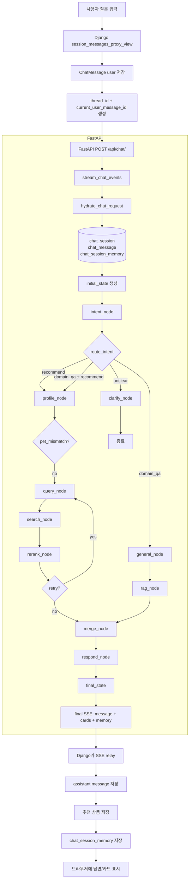

# 6차 멘토링 8번 대응 자료

## 목적
- `6차멘토링.md`의 `8. 다음 주까지 준비해야 할 사항`에 맞춰, 현재 구조 기준으로 발표 자료 초안을 정리한다.
- 과거 `recommend.py` 중심 설명이 아니라, 현재 `Django + FastAPI + LangGraph + DB memory` 구조를 기준으로 설명한다.
- 멘토링에서 요구한 `질문 -> 과정 -> 응답`, `최종 쿼리`, `데이터셋`, `최종 스코어`를 실제 코드 구조에 맞게 연결한다.

---

## 1. 먼저 정리해야 하는 핵심 전제

- 현재 추천/응답 생성은 더 이상 `recommend.py` 한 파일에서 처리되지 않는다.
- 지금 구조는 책임이 다음처럼 분리되어 있다.
  - Django: 세션/메시지 저장, 인증, SSE 프록시
  - FastAPI: 세션 문맥 hydrate, LangGraph 실행, 검색/리랭크/응답 생성
  - PostgreSQL: `chat_session`, `chat_message`, `chat_session_memory`, 상품/펫/도메인 데이터 저장
- 멀티턴은 `MemorySaver`가 아니라 `chat_session_memory` 기반으로 유지된다.

즉, 발표에서는 `recommend.py 내부 함수 설명`이 아니라 아래 구조를 설명해야 한다.

```text
질문 입력
-> Django가 user message 저장
-> FastAPI가 DB에서 이전 대화와 dialog_state를 복원
-> LangGraph 각 노드가 state를 갱신
-> 검색 후보 생성 및 리랭크
-> 최종 응답 생성
-> Django가 assistant message와 session memory 저장
```

---

## 2. 예전 `recommend.py` 역할과 현재 DDD 구조 매핑

| 예전 역할 | 현재 위치 | 설명 |
| --- | --- | --- |
| 추천 진입 | `services/fastapi/final_ai/api/routers/chat.py` | 채팅 API 진입점 |
| 채팅 오케스트레이션 | `services/fastapi/final_ai/application/chat/service.py` | hydrate, graph invoke, SSE |
| 세션 문맥 복원 | `services/fastapi/final_ai/application/chat/context.py` | DB 기반 멀티턴 문맥 hydrate |
| 추천 프로필 보강 | `services/fastapi/final_ai/domain/recommendation/profile_service.py` | 펫 정보, 품종 메타, 건강정보 보강 |
| 검색어 생성 | `services/fastapi/final_ai/domain/recommendation/query_service.py` | LLM 기반 검색 쿼리 생성 |
| 상품 검색 | `services/fastapi/final_ai/domain/recommendation/search_service.py` | hybrid search + 후처리 |
| 재정렬 | `services/fastapi/final_ai/domain/recommendation/rerank_service.py` | 최종 추천 순서 계산 |
| 답변 생성 | `services/fastapi/final_ai/domain/response/compose_service.py` | 최종 응답 문장 생성 |
| 그래프 조립 | `services/fastapi/final_ai/graph/builder.py` | 노드 실행 순서/분기 정의 |
| 세션 메모리 저장 | `services/django/chat/services/chat_stream_service.py` | Django가 final SSE 받아 DB에 저장 |

발표 포인트:
- `recommend.py`가 사라진 것이 아니라, 그 안에 있던 책임이 `Application / Domain / Graph / Infrastructure`로 분리된 것이다.

---

## 3. 현재 전체 파이프라인



---

## 4. 멘토링 8번 요구사항 기준 정리

## 4-1. 질문이 들어오면 어디서 시작되는가

진입점은 Django다.

- 사용자가 채팅을 보내면 Django `session_messages_proxy_view`가 먼저 요청을 받는다.
- Django는 user message를 `chat_message`에 먼저 저장한다.
- 그 다음 `thread_id(session_id)`와 `current_user_message_id`를 FastAPI로 넘긴다.

핵심 의미:
- FastAPI는 현재 질문 하나만 받는 것이 아니라,
- 방금 저장된 메시지를 기준으로 이전 대화와 세션 상태를 다시 읽는다.

발표에서 꼭 말해야 할 점:
- “프론트 -> FastAPI 직통”이 아니라 “프론트 -> Django -> FastAPI” 구조다.
- 세션과 메시지의 source of truth는 Django DB다.

---

## 4-2. 현재 구조에서 대화 문맥은 어떻게 만들어지는가

FastAPI는 `hydrate_chat_request()`에서 아래를 DB에서 읽는다.

- `chat_session`
- `chat_message`
- `chat_session_memory`

이때 복원하는 정보:
- 현재 질문 원문
- 최근 대화 기록 `conversation_history`
- 오래된 대화 요약 대상 `summary_candidates`
- 누적 요약 `memory_summary`
- 이전 턴 구조화 상태 `dialog_state`

즉, 멀티턴은 아래 두 층으로 유지된다.

1. 원문 대화 기록
- `chat_message`

2. 구조화된 상태 메모리
- `chat_session_memory.dialog_state`
- `chat_session_memory.summary_text`
- `chat_session_memory.last_compacted_message_id`

발표 포인트:
- 현재 구조에서 멀티턴은 “LLM이 알아서 기억하는 것”이 아니다.
- DB에 저장된 대화 기록과 구조화 상태를 다시 읽어서 이어가는 구조다.

---

## 4-3. 그래프에는 어떤 정보가 들어가는가

FastAPI는 최종적으로 아래와 같은 `initial_state`를 LangGraph에 넣는다.

```json
{
  "user_input": "다이어트 사료 추천해줘",
  "user_id": "3",
  "target_pet_id": "c0645a2c-...",
  "pet_profile": {
    "name": "당근",
    "species": "dog",
    "breed": "비숑 프리제",
    "age": "3세 0개월"
  },
  "health_concerns": [],
  "allergies": [],
  "food_preferences": [],
  "intents": ["recommend"],
  "filters": {
    "pet_type": "강아지",
    "category": "사료"
  },
  "conversation_history": [],
  "summary_candidates": [],
  "memory_summary": "",
  "pending_pet_ids": [],
  "pending_categories": [],
  "filter_relaxation_count": 0,
  "recommend_retry_pending": false
}
```

중요한 점:
- `intents`, `filters`, `pet_profile`은 현재 턴의 최종 결과가 아니라 이전 턴 상태일 수 있다.
- `intent_node`가 이 값을 참고해서 이번 질문의 의도를 다시 분류한다.

---

## 5. 질문 -> 과정 -> 응답

## 5-1. `intent_node`

역할:
- 현재 질문을 `recommend`, `domain_qa`, `unclear` 중 무엇인지 분류
- 펫 전환 여부 확인
- 카테고리/소분류/제형 힌트 추출
- 예산/제외 성분/후속 대기열 반영

입력으로 보는 값:
- `user_input`
- `conversation_history`
- `summary_candidates`
- `memory_summary`
- 이전 `intents`
- 이전 `filters`
- 이전 `pet_profile`

출력:
- 새 `intents`
- `filters`
- `target_pet_id`
- `pet_profile`
- `pending_pet_ids`
- `pending_categories`
- `is_pet_override`
- `form_hint`

발표 포인트:
- 이 단계는 “질문 이해” 단계다.
- 추천인지, 지식질문인지, 정보가 모자라 되물어야 하는지를 여기서 판단한다.

---

## 5-2. `profile_node`

역할:
- 현재 펫 문맥을 추천용으로 보강

이 단계에서 하는 일:
- DB의 실제 펫 프로필 조회
- 건강 관심사/알레르기/선호사료 조회
- 품종 메타 조회
- `age_group` 계산
- `health_traits`, `breed_context` 생성
- 필요 시 `pet_mismatch` 판정

입력으로 보는 값:
- `user_id`
- `target_pet_id`
- `pet_profile`
- `health_concerns`
- `allergies`
- `food_preferences`
- `is_pet_override`

출력:
- 보강된 `pet_profile`
- `health_concerns`
- `allergies`
- `food_preferences`
- `age_group`
- `breed_context`
- `health_traits`
- `budget`
- `pet_mismatch`

발표 포인트:
- 이 단계는 “검색에 필요한 반려동물 문맥을 완성하는 단계”다.

---

## 5-3. `query_node`

역할:
- 누적된 state를 실제 검색어로 압축

입력으로 보는 값:
- `user_input`
- `pet_profile`
- `age_group`
- `breed_context`
- `health_concerns`
- `allergies`
- `filters`
- `filter_relaxation_count`

출력:
- `search_query`
- 정제된 `filters`

예시:

```json
{
  "search_query": "비숑 프리제를 위한 저알러지 성장 사료와 유산균 건강제품 검색해줘.",
  "filters": {
    "pet_type": "강아지",
    "category": "사료"
  }
}
```

발표 포인트:
- 사용자의 원문이 그대로 DB 검색에 들어가는 것이 아니다.
- LLM이 문맥을 반영해 검색어를 다시 만든다.
- 따라서 이 단계 품질이 전체 추천 품질에 매우 큰 영향을 준다.

---

## 5-4. `search_node`

역할:
- 생성된 검색어와 필터로 상품 후보를 가져온다.

입력으로 보는 값:
- `search_query`
- `filters.pet_type`
- `filters.category`
- `filters.subcategory`
- `budget`
- `pet_profile.species`
- `age_group`
- `allergies`

처리 내용:
- PostgreSQL hybrid search 수행
- 샘플 상품 제거
- `캔/파우치` 제형 필터
- 연령대 필터
- 알레르기 성분 제외
- 필요 시 GP 상품 보충

출력:
- `search_results`

발표 포인트:
- 이 단계의 출력은 아직 최종 추천이 아니라 “후보군”이다.

---

## 5-5. `rerank_node`

역할:
- 후보군을 추천 순서로 다시 세운다.

입력으로 보는 값:
- `search_results`
- `intents`
- `detected_aspect`
- `health_concerns`
- `health_traits`
- `filter_relaxation_count`

활용하는 점수:
- hybrid search `_score`
- `popularity_score`
- `sentiment_avg`
- `repeat_rate`
- `health_concern_tags`

출력:
- `reranked_results`
- `filter_relaxation_count`
- `recommend_retry_pending`

핵심:
- 후보가 0건이거나 너무 적으면 검색 조건을 한 번 완화해서 다시 검색한다.

발표 포인트:
- 검색 결과가 곧바로 추천이 되는 게 아니라, 점수 재계산 단계를 한 번 더 거친다.

---

## 5-6. `merge_node`

역할:
- `reranked_results`를 프론트 카드 포맷으로 변환
- domain QA 문맥과 추천 결과를 최종 응답 단계로 넘길 수 있게 정리

출력:
- `product_cards`

발표 포인트:
- 이 단계에서 프론트가 실제로 그릴 카드 데이터가 만들어진다.

---

## 5-7. `respond_node`

역할:
- 도메인 문맥, 추천 상품, 멀티턴 메모리를 합쳐 최종 답변 문장을 생성

입력으로 보는 값:
- `user_input`
- `pet_profile`
- `filters`
- `health_concerns`
- `health_traits`
- `pending_pet_ids`
- `pending_categories`
- `memory_summary`
- `summary_candidates`
- `conversation_history`
- `domain_contexts`
- `reranked_results`

출력:
- `response`
- `messages`

발표 포인트:
- 최종 답변은 검색 결과만 보고 만드는 게 아니라,
- 현재 대화 상태와 이전 대화 문맥까지 같이 보고 만든다.

---

## 6. 멘토링에서 요구한 “최종 쿼리 -> 데이터셋 -> 점수” 정리

## 6-1. 최종 쿼리
- 생성 위치: `query_node`
- 생성 기준:
  - 사용자 질문
  - 펫 정보
  - 연령대
  - 품종 메타
  - 건강 관심사
  - 알레르기
  - 카테고리/소분류

즉, 최종 쿼리는 단순 문자열이 아니라 `state를 압축한 검색 질의`다.

## 6-2. 어떤 데이터셋이 나오는가
- `search_node` 출력: `search_results`
- 이 단계는 최대 50개 내외의 후보 상품군
- 후보 상품에는 다음 같은 값이 들어 있을 수 있다.
  - `_score`
  - `popularity_score`
  - `sentiment_avg`
  - `repeat_rate`
  - `health_concern_tags`
  - 상품 기본 정보

## 6-3. 최종 스코어는 어떻게 만들어지는가
- `rerank_node`에서 계산
- 기본적으로 다음 값들을 조합한다.
  - hybrid search score
  - popularity
  - sentiment
  - repeat rate
- 여기에 추가로 반영한다.
  - 사용자 건강 관심사와 상품 태그 일치 여부
  - 품종 건강 특성과 상품 태그 일치 여부

즉, 최종 추천 순서는 아래 두 축이 합쳐진 결과다.

1. 검색 적합도
2. 반려동물 문맥 적합도

---

## 7. 멀티턴은 현재 어떻게 동작하는가

현재 구조에서는 멀티턴이 “된다”. 다만 방식은 다음과 같다.

- 이전 대화 원문은 `chat_message`에 저장
- 다음 턴에 중요한 구조화 상태는 `chat_session_memory.dialog_state`에 저장
- 오래된 대화는 `memory_summary`로 압축
- `last_compacted_message_id`를 기준으로 중복 요약을 방지

즉, 멀티턴은 다음 세 가지가 합쳐져 유지된다.

1. 최근 원문 대화
2. 오래된 대화 요약
3. 구조화 상태 메모리

발표 포인트:
- “현재는 멀티턴이 안 된다”가 아니라,
- “현재는 DB 기반 멀티턴 구조로 바뀌었다”고 설명해야 한다.

---

## 8. 발표에서 꼭 보여줄 실제 trace

다음 주 발표 전에는 실제 질문 1개를 골라 아래를 순서대로 캡처해야 한다.

1. 사용자 질문
2. hydrate 후 `initial_state`
3. `intent_node` 결과
4. `profile_node` 결과
5. `query_node` 검색어
6. `search_results` 상위 후보
7. `reranked_results` 최종 추천
8. `response` 최종 답변
9. `chat_session_memory` 저장 결과

이렇게 해야 멘토링에서 요구한:
- 질문이 어떻게 들어오고
- 어떤 과정을 거쳐
- 어떤 응답이 나가는지

를 한 장의 흐름으로 보여줄 수 있다.

---

## 9. 현재 구조에서 같이 설명하면 좋은 리스크

### 9-1. 검색어 생성 품질
- 사용자의 핵심 키워드가 `query_node`에서 유실될 수 있다.
- 예: `다이어트`를 물었는데 품종 메타 키워드가 더 강하게 반영되는 경우

### 9-2. 품종 메타 과반영
- `breed_context`가 원질문보다 더 강하게 작동하면 추천 방향이 흔들릴 수 있다.

### 9-3. clarify 시나리오
- 카테고리/제형이 모호할 때 되묻는 흐름은 있지만, 더 촘촘한 시나리오가 필요할 수 있다.

### 9-4. 복합 질문 대응
- 추천과 domain QA가 섞인 질문은 fan-out 처리되지만, 결과 표현 방식은 더 다듬을 수 있다.

발표 포인트:
- 현재 구조는 많이 정리됐지만, 품질 고도화 포인트도 분명히 존재한다는 점을 같이 보여주는 것이 좋다.

---

## 10. 다음 주까지 실제 준비 체크리스트

- 현재 아키텍처 기준 전체 머메이드 흐름도 1장
- 실제 질문 1건 trace 자료 1세트
- 노드별 state 변화 요약표
- 검색어 생성 실패 사례 1건 이상
- 복합질문/unclear 사례 1건 이상
- 멀티턴 유지 구조 설명 자료
- 고도화 방안 3~4개
  - query 검증
  - 검색 결과 검증
  - 품종 메타와 원질문 우선순위 조정
  - clarify 시나리오 보강
